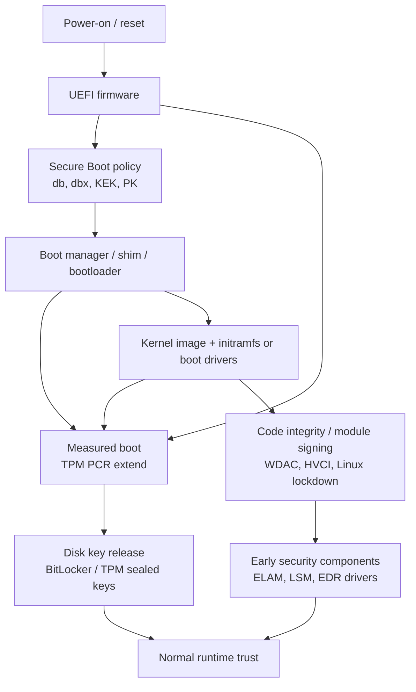
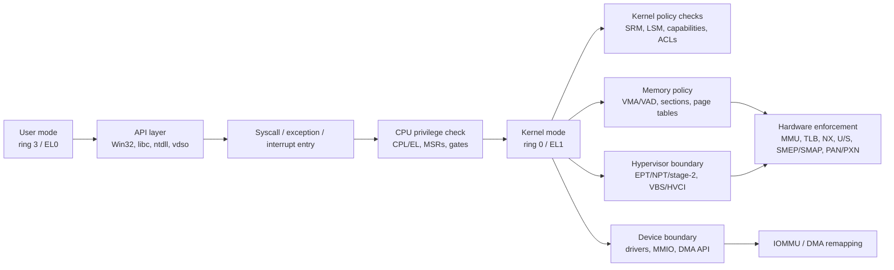
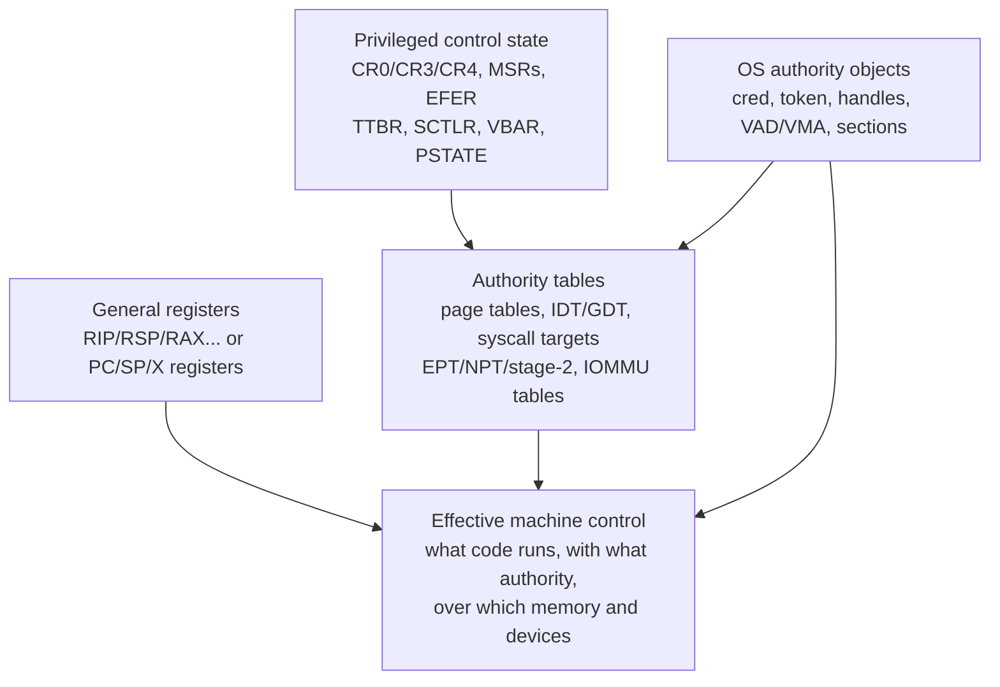

# Low-Level Security Component Responsibility Map

Value Score: 93/100
Role: Boundary/enforcer map
Proof Level: Conceptual, evidence-routed

Date: 2026-05-15

Purpose: make explicit which component is responsible for each low-level security mechanism, whether the mechanism is implemented in hardware, firmware, hypervisor code, kernel software, or user-mode software, and why that component is a high-value attacker target. This file is a cross-platform map for Linux, Windows, x86-64, and arm64. It is defensive/reversing oriented and intentionally avoids operational exploitation recipes.

x86 companion: [x86 privilege rings, descriptors, and syscall entry](<../05-topic-notes/x86-privilege-rings-descriptors-and-syscall-entry.md>) expands the CPL/DPL/RPL, GDT/LDT/IDT/TSS, syscall MSR, `swapgs`, CR register, SMEP/SMAP, and vulnerable-driver `wrmsr` details behind the CPU boundary rows below.

Critical terms companion: [Low-level security critical terms](<../05-topic-notes/low-level-security-critical-terms.md>) defines the dense terms this map cannot fully unpack inline: PPL state, SRM, handles versus object pointers, driver dispatch, IRPs, MDLs, ACPI tables, MSRs, gates, U/S, SMEP/SMAP, privileged control state, invalid PTE states, PCID/ASID, KPTI/KVA shadow, page-table residency, DMA pinning, and kernel-thread/process terminology.

## Core Rule

Policy and enforcement are not the same thing.

An operating system may decide policy in software, but the final barrier is often enforced by hardware or firmware state. A serious internals answer should identify all of these:

- Policy owner: who decides what is allowed.
- Checker: which code path checks the request.
- Enforcer: which hardware, firmware, hypervisor, or kernel mechanism makes violation fail.
- State object: which registers, tables, descriptors, object metadata, or configuration hold the truth.
- Attacker value: why corrupting, bypassing, reusing, or hiding that state matters.

> [!IMPORTANT]
> This is the highest-value interview pattern: policy owner, checker, final enforcer, truth state, attacker value, evidence. If you can apply that pattern to handles, VADs/PTEs, sections, IOCTLs, tokens, boot policy, and DMA, your answers will sound like mechanism reasoning rather than memorization.

## Implementation Legend

| Label | Meaning |
|---|---|
| Hardware | CPU, MMU, TLB, cache hierarchy, interrupt controller, IOMMU, device DMA engines, memory tagging, control-flow hardware. |
| Firmware | UEFI, platform firmware, TPM, device firmware, boot policy databases, ACPI tables. |
| Hypervisor | Hyper-V, KVM, or another VMM using VT-x/AMD-V/arm virtualization, EPT/NPT/stage-2 translation, virtual interrupt and device policy. |
| Kernel software | Linux kernel, Windows kernel/executive, drivers, kernel security modules, memory manager, I/O manager, scheduler, network stack. |
| User-mode software | Loaders, runtime libraries, service processes, security agents, script engines, brokers, management tools. |
| Policy/config | ACLs, security descriptors, LSM policy, WDAC policy, Secure Boot databases, registry/service config, sysctls, boot config. |

## Why Component Ownership Makes Sense

A mechanism belongs to the component that can turn a policy decision into state that the next lower layer will actually obey. This is the reason "implemented in hardware" and "owned by the kernel" can both be true for the same security boundary.

- **Hardware or IOMMU:** use this answer when an instruction, load, store, branch, interrupt, or DMA transaction must fail even if hostile code tries it. Only hardware sees every instruction fetch, memory reference, interrupt delivery, or device bus transaction. Software prepares tables and registers, but the CPU/IOMMU performs the final check at the moment of access.
- **Firmware and boot policy:** use this answer when code runs before the OS is in control. The kernel cannot validate its own starting conditions after the fact. Firmware and boot components decide which early bytes execute and which measurements become later evidence.
- **Hypervisor plus virtualization hardware:** use this answer when a guest kernel must be constrained by a lower layer. A guest kernel controls its own page tables and kernel objects, so isolation below the guest must live in VMCS/VMCB state, EPT/NPT/stage-2 tables, VM-exit policy, and hypervisor memory.
- **Kernel software plus policy objects:** use this answer when a named resource, process, thread, file, token, socket, or device operation is authorized. The kernel owns the object tables, credentials/tokens, security descriptors, file metadata, driver dispatch, and memory-manager state that decide who can operate on what.
- **User-mode software backed by kernel state:** use this answer when a process's image, imports, environment, heap, runtime policy, or telemetry event is interpreted. User mode often creates the semantic meaning, but the kernel still owns isolation, handles/fds, mappings, and protected event paths. A loader list or environment variable is not hardware truth unless it is tied back to mappings, handles, or policy.

So the useful question is not "is this hardware or software?" It is:

```text
Who writes the policy state, who checks it, who enforces it at the moment of violation, and what evidence proves the state really existed?
```

## Content Placement Rule

This file owns cross-layer responsibility: why a mechanism belongs to hardware, firmware, a hypervisor, kernel code, user-mode code, or policy/config, and how the decision becomes enforceable state. It should read like a map with causal explanations, not like an alphabetized glossary.

Use the companion files for deeper local detail:

- [Low-level security critical terms](<../05-topic-notes/low-level-security-critical-terms.md>) owns compact definitions and quick disambiguation.
- [x86 privilege rings, descriptors, and syscall entry](<../05-topic-notes/x86-privilege-rings-descriptors-and-syscall-entry.md>) owns bit-level x86 CPL/DPL/RPL, gates, syscall MSRs, `swapgs`, CR registers, SMEP/SMAP, and vulnerable-driver privileged-state bridges.
- [Paging, residency, page lists, and shared memory](<../05-topic-notes/paging-residency-page-lists-and-shared-memory.md>) owns PTE/PFN residency, page-list, backing-store, page-table, and stale-byte reasoning.
- Windows-specific I/O, Object Manager, SRM, PPL, driver, and telemetry details belong in the Windows mechanism notes unless the point is a cross-layer responsibility pattern.

If the same concept appears in multiple files, this map should keep the shortest bridge sentence and link to the owner. Duplication is acceptable only when it prevents a wrong mental model at a boundary.

## Ring0 Rootkit Lesson

The local `lord_of_the_ring0` notes and Ido Veltzman's public *Lord Of The Ring0* series are useful here because they show a different question from "how does user mode become ring0?" Most of those examples assume a driver is already running in kernel mode, then ask what kernel authority can do: expose IOCTLs, receive IRPs, alter dispatch tables, register callbacks, attach to a process address space, patch user memory, or tamper with kernel-observed telemetry.

That distinction matters for this map:

- **CPL transition mechanisms** explain how execution crosses a hardware privilege boundary: `syscall`, `sysenter`, interrupt/trap gates, call gates, faults, or a vulnerable kernel/driver path.
- **Ring0 post-entry mechanisms** explain what already privileged code can modify: `DRIVER_OBJECT->MajorFunction[]`, SSDT-like service dispatch, callback lists, process memory through kernel APIs, token/credential state, page tables, and telemetry providers.
- **Modern defense is layered:** PatchGuard/HVCI/VBS may protect selected dispatch tables, code pages, callbacks, MSRs, or executable-kernel-page creation, while SMEP/SMAP/KPTI constrain user-page execution and access. None of those remove the need to validate IOCTL buffers, handles, pointers, lengths, and caller authority.

So the correct answer is not "Ring0 controls everything." It is: ring0 controls the normal OS layer unless a hypervisor, firmware layer, IOMMU policy, code-integrity policy, or runtime integrity monitor constrains the specific state being targeted.

## Boot Trust Diagram



Read this as a chain of trust plus a chain of evidence. Secure Boot is a verification barrier. Measured boot is an evidence barrier. Disk encryption can bind key release to expected measurements. Early drivers and initramfs content matter because they run before normal runtime telemetry is fully established.

## Runtime Boundary Diagram



The important lesson is that "the kernel checked it" is incomplete. For memory, the check must become page-table state and TLB behavior. For devices, the check must become DMA mappings and IOMMU state. For virtualization, the guest kernel may not be the final authority.

## Register-Control Diagram



"He who controls the registers controls the machine" is only precise when "registers" includes privileged control state and the authority to make that state stick. User-mode control of general registers controls only the current user-mode context. Kernel, hypervisor, or firmware control of control registers, translation roots, interrupt vectors, and integrity policy controls much more.

## Mechanism Responsibility Map

Read each entry as a mechanism chain:

```text
request/event -> policy state -> checker code -> durable machine state -> final enforcer -> evidence
```

The point of this section is not to memorize component names. The point is to explain why the component boundary is real. For each mechanism, ask:

- Why does this component own the decision?
- How does the decision become lower-level state?
- What invariant must remain true?
- What breaks if the invariant is false?
- What independent evidence would prove the state?

### CPU, Entry, And Interrupt Boundaries

CPU privilege mechanisms exist because the currently executing instruction stream cannot be trusted to police itself. The kernel can choose entry points and tables, but the CPU must be the final referee for privilege transitions, privileged instructions, and trap delivery.

**CPU privilege level**

- **Why this owner makes sense:** The CPU is the only component that can stop ring 3/EL0 code from executing privileged instructions or directly entering kernel-only execution. The kernel owns the setup because it chooses the privileged code, stacks, and page-table policy that the CPU will use.
- **Under the hood:** On x86/x64, privilege is derived from architectural state such as CPL, segment state, control registers, MSRs, and page permissions. On arm64, exception levels and system registers play the same role. A user instruction that tries a privileged operation faults before the kernel's ordinary C logic is involved.
- **Linux/Windows anchors:** Linux entry paths such as syscall and exception entry, `entry_64`, and arm64 EL transitions. Windows user mode reaches the boundary through `ntdll` stubs, but kernel trap/dispatch code and CPU state enforce the transition.
- **Invariant and failure mode:** User mode must not directly run with kernel privilege or access supervisor-only pages. If that invariant fails, every higher-level policy object, handle, token, or credential check can be bypassed.
- **Evidence to check:** Trap frames, current mode, syscall/exception path, control-register state, PTE user/supervisor bits, and debugger views of the call stack and address-space root.

**Syscall entry target**

- **Why this owner makes sense:** User mode needs a controlled door into the kernel, but it must not choose the privileged destination. The kernel programs the architectural entry target; the CPU transfers control only through that target.
- **Under the hood:** x86/x64 uses mechanisms such as `syscall`, `sysenter`, and MSRs such as the `LSTAR`-style syscall target. arm64 uses `SVC` and exception vectors. Entry code switches to kernel-controlled context, handles user register state carefully, performs ABI dispatch, and then returns through a constrained exit path.
- **Linux/Windows anchors:** Linux has syscall entry code, syscall tables, trampolines, and KPTI-aware paths. Windows has `ntdll` syscall stubs in user mode and kernel service dispatch below them; the user-mode stub is not the authority.
- **Invariant and failure mode:** The first privileged instruction after a syscall must be a kernel-chosen entry routine that treats registers and user pointers as untrusted. A bad entry path turns an ordinary system call into a user/kernel control-flow or confused-argument bug.
- **Evidence to check:** Syscall target MSRs or vectors, syscall number dispatch, entry stack choice, KPTI trampoline mappings, and traces showing which kernel service path consumed the request.

**Interrupt and exception dispatch**

- **Why this owner makes sense:** Faults, timers, and device interrupts are asynchronous events. The CPU and interrupt controller must route them to trusted handlers; the kernel must configure those handlers and decide what deferred work runs later.
- **Under the hood:** The CPU saves a trap frame and vectors through the IDT or arm64 exception vector. APIC/GIC state, interrupt priority, per-CPU stacks, and handler tables decide where execution lands. The kernel then acknowledges the event, snapshots state, and often defers heavy work to softirq/tasklet/workqueue or DPC/work-item style paths.
- **Linux/Windows anchors:** Linux uses IDT/vector handling, IRQ handlers, softirqs, NAPI, workqueues, and task context for follow-up. Windows uses IDT entries, ISRs, DPCs, APCs where relevant, and work items.
- **Invariant and failure mode:** Device-controlled or fault-derived state must never be treated as trusted just because it arrived in kernel mode. If vector tables, handler pointers, interrupt state, or deferred-work queues are corrupted, untrusted timing and device input can steer privileged execution.
- **Evidence to check:** IDT/vector table state, interrupt controller routing, crash dump trap frames, ISR/DPC registrations, device queue state, and traces of deferred work.

### Memory Translation And Execution Policy

Memory policy exists at two levels. VMAs/VADs/sections describe what the OS intends for a range. PTEs, translation roots, TLB entries, and permission bits are what the CPU actually checks. A good answer must connect both levels.

**Virtual-to-physical translation**

- **Why this owner makes sense:** The kernel memory manager owns virtual address spaces because it allocates physical pages, chooses backing objects, handles faults, and writes page tables. The MMU owns final enforcement because every instruction fetch and memory access goes through translation.
- **Under the hood:** A virtual address is walked from a translation root such as CR3 or TTBR through page-table levels to a PTE. A valid PTE gives a physical frame plus permission bits. An invalid PTE can encode OS software state: demand-zero, file-backed, copy-on-write, transition/standby, swapped/pagefile-backed, or protection failure.
- **Linux/Windows anchors:** Linux ties `mm_struct`, VMAs, page tables, `struct page`, reverse maps, and page-fault code together. Windows ties VADs, section objects, prototype PTEs, PTEs, PFN database entries, and page-fault handling together.
- **Invariant and failure mode:** The current PTEs must match the range policy and backing object. If a PTE points to the wrong PFN or has the wrong permissions, the CPU will enforce the wrong reality even if the VAD/VMA still looks clean.
- **Evidence to check:** VMA/VAD view, PTE contents, PFN or `struct page` metadata, backing file/section/pagefile state, and page-fault traces. See [paging, residency, page lists, and shared memory](<../05-topic-notes/paging-residency-page-lists-and-shared-memory.md>).

**Translation root selection**

- **Why this owner makes sense:** The scheduler and memory manager decide which address space is active for a thread. The CPU enforces that choice by using the selected translation root for page walks.
- **Under the hood:** On a context switch, the kernel loads or selects an address-space root such as CR3 or TTBR, often with PCID/ASID tags so TLB entries can be kept without mixing processes. With KPTI or KVA shadow, the kernel may switch between user and kernel roots on entry and exit. Under a hypervisor, guest translation may still be constrained by EPT/NPT/stage-2 tables.
- **Linux/Windows anchors:** Linux `switch_mm` and architecture-specific ASID/PCID handling. Windows process address-space switches, DirectoryTableBase-style debugger views, KVA shadow, and Hyper-V/VBS constraints where enabled.
- **Invariant and failure mode:** A thread must not run with the wrong process's address-space root, and stale TLB entries must not be interpreted under the wrong address space. Failure collapses process isolation.
- **Evidence to check:** Current CR3/TTBR, process address-space metadata, PCID/ASID behavior, TLB invalidation events, KVA shadow state, and hypervisor second-stage mappings.

**Page permissions**

- **Why this owner makes sense:** The memory manager knows the intended protection for a range, but the CPU can only enforce the permission bits it sees during translation. That is why range policy has to become PTE and TLB state.
- **Under the hood:** A VMA/VAD/section records policy such as read, write, execute, copy-on-write, guard, private, mapped, or image-backed. The memory manager materializes that policy into PTE bits. The TLB then caches the resulting translation and permissions until invalidated.
- **Linux/Windows anchors:** Linux `mprotect`, VMA flags, PTE W/X/U/S bits, COW faults, and page-fault handlers. Windows `VirtualProtect`, VAD protection, section protection, image-section rules, PTE/prototype-PTE behavior, and guard pages.
- **Invariant and failure mode:** Range metadata and PTE permissions must agree. If metadata says non-executable but the PTE is executable, or metadata says private but the PFN/prototype state is shared incorrectly, the CPU will enforce the corrupted low-level state.
- **Evidence to check:** VMA/VAD protections, actual PTE bits, TLB flushes after protection changes, memory-query APIs, WinDbg `!pte`/`!vad`, `/proc/<pid>/maps`, and `smaps`.

**NX / DEP**

- **Why this owner makes sense:** The loader and memory manager decide which ranges should contain instructions. The CPU enforces that decision during instruction fetch.
- **Under the hood:** Executability is a page permission, not a property of a byte sequence. On x86/x64, the NX/XD bit is effective when the relevant CPU mode enables it; on arm64, UXN/PXN style attributes split user and privileged execute rights. A heap page containing valid opcodes still cannot be fetched as instructions if the translation forbids execution.
- **Linux/Windows anchors:** Linux uses ELF mapping policy, stack executable markings, W^X conventions, and PTE execute permissions. Windows uses DEP/NX, PE section protections, VAD/section protections, and loader-created image mappings.
- **Invariant and failure mode:** Writable data should not silently become executable. If an attacker can create RWX memory or flip NX on an existing data page, direct code injection becomes easier. NX does not stop ROP/JOP, data-only attacks, or abuse of an intentionally executable JIT range.
- **Evidence to check:** Image section flags, VMA/VAD protection, PTE execute-disable bits, JIT allocation transitions, process mitigation policy, and executable private memory scans.

**SMEP/SMAP or PAN/PXN/UXN**

- **Why this owner makes sense:** A kernel bug should not be able to turn user-controlled pages into kernel code or casual kernel data. Hardware can distinguish current privilege from page attributes on every access; kernel copy routines provide the deliberate exception path.
- **Under the hood:** SMEP blocks supervisor-mode instruction fetch from user pages. SMAP blocks supervisor-mode data access to user pages unless the kernel uses controlled copy/probe mechanisms that temporarily permit it. arm64 PAN/PXN/UXN style features serve the same goal with architecture-specific details.
- **Linux/Windows anchors:** Linux `copy_from_user`/`copy_to_user`, `uaccess` discipline, SMEP/SMAP or PAN/PXN/UXN state. Windows safe probing/copying of user buffers, user/supervisor PTEs, SMEP/SMAP where supported, and KPTI/KVA-shadow interactions.
- **Invariant and failure mode:** Kernel code must treat user pointers as untrusted and access them only through fault-aware routines. If this fails, a user pointer bug can become kernel control-flow hijack, arbitrary read/write, or crash.
- **Evidence to check:** CPU feature state, fault error codes, user/supervisor PTE bits, call sites using safe copy APIs, and crash dumps showing kernel access to user ranges.

**KPTI / kernel address hiding**

- **Why this owner makes sense:** The kernel traditionally mapped itself into every process for fast entry and exit. Speculative attacks made "mapped but inaccessible" less safe, so the kernel has to change the address-space layout itself.
- **Under the hood:** KPTI/KVA shadow uses separate user and kernel page-table views. The user view keeps only the minimal kernel/trampoline mappings needed for entry, then the entry path switches to the fuller kernel view. PCID/ASID support reduces the performance cost by avoiding unnecessary TLB destruction.
- **Linux/Windows anchors:** Linux KPTI trampoline mappings and CR3 switching. Windows KVA shadow and related kernel/user split mitigations on affected systems.
- **Invariant and failure mode:** Kernel mappings should not be broadly present in user page tables when the mitigation requires separation. If they are present, architectural permissions may still block normal reads, but speculative or disclosure paths get more useful material.
- **Evidence to check:** User versus kernel page-table roots, visible kernel mappings in user mode, KPTI/KVA-shadow mitigation state, PCID behavior, and microcode/OS mitigation settings.

**TLB coherency**

- **Why this owner makes sense:** The memory manager changes PTEs, but the CPU may keep old translations in the TLB. Security only changes when cached translations are invalidated or naturally become unusable.
- **Under the hood:** After unmapping a page, removing write/execute permission, moving page tables, or changing address-space roots, the kernel must invalidate affected TLB entries locally and on other CPUs that might have used the address space. x86 uses operations such as `invlpg` and shootdown IPIs; arm64 has architecture-specific TLBI flows.
- **Linux/Windows anchors:** Linux TLB gather/shootdown paths, PCID/ASID handling, and page-table update ordering. Windows TLB shootdowns, inter-processor interrupts, process/address-space invalidation, and memory-manager synchronization.
- **Invariant and failure mode:** No CPU should continue using a stale translation after the kernel has revoked or repurposed it. Stale TLB bugs can preserve old access, map the wrong physical page, or bypass a permission downgrade.
- **Evidence to check:** PTE update sequence, shootdown events, CPU affinity/repro timing, crash dump PTE versus observed access, and known TLB-sensitive memory-manager paths.

**Cache/speculation isolation**

- **Why this owner makes sense:** Architectural checks decide whether an instruction should retire, but microarchitectural state can still change transiently. Mitigation therefore spans CPU design, microcode, compiler output, kernel entry paths, and constant-time code.
- **Under the hood:** Branch prediction, cache fills, store buffers, TLBs, and speculative execution can create timing signals even when a forbidden read eventually faults or is squashed. Barriers, retpolines, speculation controls, KPTI, careful bounds checks, and constant-time routines reduce specific leakage channels.
- **Linux/Windows anchors:** Linux and Windows both carry retpoline/speculation controls, KPTI-class mitigations, microcode-dependent settings, and hardened library/kernel code for sensitive paths.
- **Invariant and failure mode:** Secrets should not be inferable through shared microarchitectural state when ordinary architectural reads are forbidden. Failure shows up as side-channel leakage, not necessarily as a bad access check in source code.
- **Evidence to check:** CPU vulnerability/mitigation state, microcode revision, kernel command-line or registry/policy mitigation settings, performance counter experiments, and source review of sensitive constant-time paths.

### Authority And Cross-Process State

Authority is represented as kernel-owned data. That is why changing a token, credential, granted-access mask, fd table entry, namespace, or security descriptor can be as powerful as changing code.

**Authority identity**

- **Why this owner makes sense:** The kernel must be the authority for "who is acting" because user mode cannot be allowed to declare its own privileges. User-mode APIs can request identity changes, but the accepted identity lives in kernel-owned objects.
- **Under the hood:** Linux attaches credential state to tasks through `cred` structures, capabilities, user namespaces, supplementary groups, and LSM labels/hooks. Windows represents subject identity through access tokens containing SIDs, groups, privileges, integrity level, AppContainer/capability state, impersonation level, and related logon/session metadata.
- **Linux/Windows anchors:** Linux `cred`, capabilities, namespaces, seccomp/LSM interactions. Windows `_TOKEN`, privileges, restricted tokens, impersonation tokens, integrity, AppContainer, and PPL as an extra protection policy layer.
- **Invariant and failure mode:** The subject used in an access check must be the kernel-approved subject, not a user-controlled string or stale pointer. Corrupting authority state can turn an ordinary process into a privileged actor without a visible code injection event.
- **Evidence to check:** Live task/process credentials, token fields, privilege enablement, namespace membership, LSM labels, handle access to token/credential objects, and audit/ETW events for identity changes.

**Tunable runtime and policy state**

- **Why this owner makes sense:** Many security outcomes are controlled by data that is consumed later: environment, command line, mitigation flags, registry/sysctl policy, service configuration, loader settings, or security-product policy. The owner is the component that will later trust or enforce that data.
- **Under the hood:** Process creation snapshots argv/environment/process parameters and often sets mitigation or sandbox policy before user code runs. Kernel subsystems read sysctls, registry state, BPF/JIT policy, WDAC policy, LSM settings, or service configuration and turn them into runtime checks. User-mode consumers such as loaders and security agents may give this state high semantic weight.
- **Linux/Windows anchors:** Linux env/argv, `prctl`, rlimits, capabilities, seccomp, namespaces, cgroups, sysctls, BPF/JIT policy. Windows environment blocks, PEB process parameters, token privileges, IFEO, service registry entries, process mitigation policy, WDAC, ETW/AMSI policy, and AppCompat state.
- **Invariant and failure mode:** Configuration must be written by the right authority and consumed with the right trust assumptions. A small policy change can alter loader behavior, sandbox shape, exploit reliability, telemetry, or privilege without adding new executable code.
- **Evidence to check:** Process creation events, PEB/process parameters, registry/sysctl diffs, service configuration, mitigation policy, code-integrity policy, cgroup/namespace state, and security-agent effective policy.

**Object access checks**

- **Why this owner makes sense:** A resource operation needs more than a name. The kernel must compare the caller's authority to the object's policy and then produce a durable reference that later operations can trust.
- **Under the hood:** On Linux, open and operation paths check inode metadata, mount and namespace state, capabilities, LSM hooks, file operations, and fd permissions. On Windows, Object Manager and the Security Reference Monitor evaluate desired access against security descriptors, privileges, mandatory integrity, object type rules, and sometimes protection policy, then create a handle with a granted-access mask.
- **Linux/Windows anchors:** Linux VFS/files, sockets, devices, LSM, capabilities, and fd tables. Windows Object Manager objects, handles, access masks, security descriptors, tokens, integrity, and object type callbacks.
- **Invariant and failure mode:** Later operations must be limited by the rights actually granted to the reference, not by a reinterpreted user name or stale caller assumption. Missing or misplaced checks create confused-deputy bugs and overbroad capability leaks.
- **Evidence to check:** fd/handle tables, granted access masks, security descriptors/DACLs, LSM/audit records, object names versus object identity, and call paths that consume the reference.

**Handle or fd authority transfer**

- **Why this owner makes sense:** Once a reference has authority, transferring that reference can transfer authority without a fresh name-based open. The kernel owns this because it owns reference tables and object lifetime.
- **Under the hood:** Linux fd passing with `SCM_RIGHTS`, fork inheritance, `pidfd`, and duplicated fds create new table entries pointing to existing `struct file` or related objects. Windows inheritance and `DuplicateHandle` create handle-table entries in another process, often to the same Object Manager object with selected granted rights. Numeric values are just per-process indexes; the authority is the table entry.
- **Linux/Windows anchors:** Linux fdtable, `struct file`, `dup`, `fork`, Unix-domain fd passing, and `pidfd`. Windows handle tables, inherit flags, `PROC_THREAD_ATTRIBUTE_HANDLE_LIST`, `DuplicateHandle`, and granted access masks.
- **Invariant and failure mode:** A less-trusted process must not accidentally receive a reference with more rights than it should have. Handle/fd leakage can bypass a later open check because the authority has already been granted.
- **Evidence to check:** Parent/child process creation data, inherited handle lists, fd-passing messages, duplicate-handle events, handle/fd rights, object identity, and lifetime reference counts. See [Windows object handles, references, and tokens](<../05-topic-notes/windows-object-handles-references-and-tokens.md>).

**Process memory access**

- **Why this owner makes sense:** Cross-process memory access crosses both an authority boundary and an address-space boundary. The kernel must decide whether the caller may target the process, and the memory manager/MMU must decide whether the target addresses are valid and writable/readable.
- **Under the hood:** Linux checks ptrace-style authority, procfs policy, credentials, namespaces, Yama/LSM policy, and target VMA state before copying or mapping bytes. Windows often starts with a process handle whose granted access includes `PROCESS_VM_READ`, `PROCESS_VM_WRITE`, or `PROCESS_VM_OPERATION`, then memory APIs validate VAD/PTE state, protection, PPL constraints, and copy/map behavior.
- **Linux/Windows anchors:** Linux `ptrace`, `/proc/<pid>/mem`, `process_vm_readv/writev`, capabilities, namespaces, and LSM. Windows `OpenProcess`, `ReadProcessMemory`, `WriteProcessMemory`, `VirtualAllocEx`, mapped sections, process handles, and PPL.
- **Invariant and failure mode:** A caller must have target authority, and the target virtual range must satisfy memory policy. Violating either side enables dumping, tampering, injection setup, or false forensic conclusions.
- **Evidence to check:** Process handles/fds and rights, target VAD/VMA and PTE state, thread starts/context changes, memory-protection changes, ETW/Sysmon/audit records, and call stacks. See [process memory access and memory API flags](<04-process-memory-access-and-memory-api-flags.md>).

### Devices, Drivers, And Physical Memory

Devices are not passive files. Many can issue interrupts, expose MMIO registers, run firmware, and perform DMA. The kernel driver owns policy because it understands the device protocol; hardware and the IOMMU enforce the bus-level consequences.

**Physical memory access**

- **Why this owner makes sense:** Physical memory does not inherently know which process "owns" a byte. Ownership is created by virtual mappings, page metadata, firmware memory maps, and device/IOMMU policy. Raw physical mappings therefore need strict kernel control.
- **Under the hood:** Normal CPU access uses virtual addresses and PTE permissions. Raw physical mapping APIs create kernel virtual mappings to physical frames or MMIO ranges, choosing cache attributes and access permissions. Firmware maps distinguish usable RAM, reserved regions, ACPI/UEFI areas, and device memory. Devices need IOMMU policy to prevent physical access outside mapped buffers.
- **Linux/Windows anchors:** Linux `/dev/mem` restrictions, lockdown, direct map, PAT/MTRR/cache attributes, and `ioremap`. Windows `MmMapIoSpace`, MDLs, driver policy, memory integrity, HVCI/PatchGuard constraints, and firmware resource descriptors.
- **Invariant and failure mode:** Ordinary code should not bypass virtual-memory ownership by mapping arbitrary physical frames. If a driver exposes physical mapping or read/write primitives, process, kernel, and hypervisor assumptions can collapse.
- **Evidence to check:** Firmware memory map, raw memory device policy, driver IOCTLs exposing physical access, mapped physical ranges, cache attributes, IOMMU status, and kernel debugger physical memory mappings.

**DMA access**

- **Why this owner makes sense:** A DMA-capable device can read or write memory without CPU load/store instructions. The driver and DMA API choose buffers; the IOMMU enforces what bus addresses the device can reach.
- **Under the hood:** The OS pins or locks pages, builds scatter/gather lists, programs device-visible DMA addresses, and installs IOMMU mappings for the device domain. The device then performs bus transactions independently. If the mapping remains after the buffer is reused, the device may keep authority to old or newly sensitive memory.
- **Linux/Windows anchors:** Linux DMA API, IOMMU groups/domains, pinned pages, scatter/gather, VFIO, and device isolation. Windows MDLs, WDF/WDM DMA enablers, map registers, DMA remapping, Kernel DMA Protection, and device stacks.
- **Invariant and failure mode:** A device should only be able to DMA to buffers intentionally mapped for it, for the intended lifetime and direction. Stale mappings, malicious devices, firmware bugs, or weak drivers can turn a peripheral into a memory read/write primitive.
- **Evidence to check:** IOMMU enablement and domains, DMA mapping logs, MDLs or scatter/gather lists, pinned page lifetime, device queues/descriptors, and hotplug/thunderbolt-style policy.

**MMIO and PCIe BAR access**

- **Why this owner makes sense:** MMIO registers are device control surfaces. The CPU can read/write the mapped address, but only the driver understands which register writes program DMA, interrupts, power, firmware state, or privileged device behavior.
- **Under the hood:** PCIe BARs or platform resources describe physical address ranges for device registers. The kernel maps them as uncached or device memory, and driver reads/writes cause side effects in the device. Register writes can arm DMA queues, change interrupt routing, update firmware state, or expose device memory windows.
- **Linux/Windows anchors:** Linux PCI probe/remove, `ioremap`, sysfs resource exposure, and subsystem drivers. Windows PnP resource assignment, `MmMapIoSpace`, WDF/WDM device stacks, and HAL/platform resource translation.
- **Invariant and failure mode:** Only the right driver path should manipulate device registers, and user-controlled values must be validated before they become register writes. Bad MMIO exposure can become DMA programming, device compromise, or kernel crash.
- **Evidence to check:** PCI BAR/resource lists, driver mapping calls, IOCTLs that reach register writes, device firmware version, interrupt/MSI configuration, and bus traces where available.

**Driver IOCTL/ioctl boundary**

- **Why this owner makes sense:** IOCTLs are a generic escape hatch from user requests into device-specific kernel code. The kernel routes the request, but the driver often performs the meaningful validation.
- **Under the hood:** User mode opens a device/file object and sends a command number plus input/output buffers. Linux dispatches through file operations and driver-specific `ioctl` handling. Windows packages requests as IRPs with `IO_STACK_LOCATION`, IOCTL access bits, buffering methods, MDLs, and caller mode/probe rules. The driver must validate size, type, pointer provenance, object state, privilege, and device state.
- **Linux/Windows anchors:** Linux character devices, `unlocked_ioctl`, compat ioctl paths, usercopy checks, and subsystem-specific command validation. Windows `DeviceIoControl`, IRPs, WDM/WDF queues, buffered/direct/neither I/O, MDLs, and IOCTL access bits.
- **Invariant and failure mode:** An unprivileged request must not be converted into arbitrary kernel memory access, physical mapping, register writes, privileged process operations, or unsafe device firmware commands. Weak drivers become user/kernel and user/device pivots.
- **Evidence to check:** Device ACLs, IOCTL definitions, access bits, buffer method, caller-mode handling, input validation, fuzzing crashes, Driver Verifier findings, and call stacks reaching sensitive APIs.

**Driver dispatch, callbacks, and service-dispatch tampering**

- **Why this owner makes sense:** Dispatch and callback tables are legitimate kernel control-flow state. The OS and drivers use them so already-trusted code can receive file, device, process, registry, network, and object events without polling.
- **Under the hood:** Windows driver objects contain `MajorFunction[]` dispatch entries for IRP major functions. The kernel also exposes registration paths such as object, process/thread/image, registry, minifilter, WFP, and ETW-related callbacks. Service dispatch paths such as SSDT-like tables map syscall numbers to kernel service routines. Linux has analogous high-value dispatch surfaces in `file_operations`, LSM hooks, netfilter/eBPF attachment points, tracepoints, and filesystem/network callbacks.
- **Linux/Windows anchors:** Ido Veltzman's Ring0 series demonstrates the Windows shape: IRP dispatch replacement, SSDT-style service redirection, callback registration/tampering, APC or thread-based kernel-to-user execution setup, and process-memory patching after `KeStackAttachProcess`. The defensive lesson is the state class, not the code recipe.
- **Invariant and failure mode:** Dispatch/callback state must point to expected, policy-approved, lifetime-valid code. If an already privileged component can silently replace a handler or callback, it can filter file/process/registry events, hide activity, patch user memory, or blind telemetry without creating a new obvious top-level executable.
- **Evidence to check:** Driver object dispatch tables, callback lists, minifilter/WFP/ETW provider state, code-section hashes, module ownership of function pointers, PatchGuard/HVCI/CI status, crash signatures, and cross-view differences between callback-visible events and lower-level memory/object evidence.

### Boot, Integrity, And Virtualization

The boot and virtualization layers matter because the normal kernel is not always the lowest authority. Anything below the kernel can decide which kernel starts, what evidence exists, and whether the running kernel can change certain memory or code-integrity state.

**Code integrity for kernel code**

- **Why this owner makes sense:** Kernel code executes with the authority to change page tables, tokens/creds, drivers, and device state. The loader, kernel integrity policy, and sometimes the hypervisor must decide which bytes may become executable kernel code.
- **Under the hood:** Loading kernel code turns a signed file or module image into executable privileged mappings. Signature checks, policy checks, relocation, import resolution, and section protections happen before or during that transition. HVCI or similar hypervisor-backed policy can require that executable kernel pages are validated and not writable.
- **Linux/Windows anchors:** Linux module signing, lockdown, IMA/EVM where deployed, eBPF verifier/JIT policy, and read-only kernel mappings. Windows driver signing, Code Integrity, WDAC, HVCI, vulnerable-driver blocklist, and kernel-mode signing policy.
- **Invariant and failure mode:** Only policy-approved code should become executable in kernel mode, and writable pages should not later become executable without validation. Failure gives a direct privileged-code path or a signed/vulnerable-driver bypass.
- **Evidence to check:** Loaded module/driver list, signer and hash, CI/module policy, HVCI state, executable kernel memory ranges, blocked-driver events, and boot-time integrity logs.

**Runtime kernel patch protection**

- **Why this owner makes sense:** Even if only trusted code loads, runtime tampering can modify code sections, dispatch tables, callbacks, control registers, or page tables. The kernel and hypervisor have to preserve integrity after boot.
- **Under the hood:** Protection can come from read-only mappings, W^X enforcement, control-flow protections, periodic integrity checks, verifier policies, and hypervisor-enforced execute/write separation. Windows PatchGuard checks selected critical structures and reacts by crashing rather than allowing silent tamper. HVCI raises the bar for executable page creation. Linux relies on a mix of read-only-after-init, lockdown/module policy, BPF verifier rules, LSMs, and optional external integrity tools.
- **Linux/Windows anchors:** Linux rodata, lockdown, module signing, BPF verifier, ftrace/kprobe policy, and LKRG-like external tools where deployed. Windows PatchGuard, HVCI, kernel CFG/CET where available, callback registration rules, and protected kernel data features on modern systems.
- **Invariant and failure mode:** Critical code and control state should not be silently patchable by normal runtime code. Failure enables rootkit-style hiding, telemetry bypass, or durable privileged hooks. These protections do not eliminate data-only attacks or abuse of legitimate extension points.
- **Evidence to check:** Code-section hashes, callback and dispatch-table enumeration, page permissions, PatchGuard/HVCI state, loaded drivers, and crash signatures consistent with integrity violation.

**Boot image verification**

- **Why this owner makes sense:** Before the OS runs, the OS cannot defend itself. Firmware and boot components must decide which bootloader, kernel, and early components are allowed to execute.
- **Under the hood:** UEFI Secure Boot verifies boot components against platform keys and allow/deny databases such as PK, KEK, db, and dbx. The accepted bootloader then extends the trust chain to later components according to platform and OS policy. Linux often involves shim, GRUB/systemd-boot, MOK, and distro-specific kernel/initramfs rules. Windows uses Windows Boot Manager, BCD policy, and Windows code-integrity flow.
- **Linux/Windows anchors:** Linux shim/MOK, signed bootloader/kernel policy, lockdown mode, and initramfs caveats. Windows Boot Manager, Secure Boot policy, BCD, boot-start drivers, ELAM, and CI initialization.
- **Invariant and failure mode:** Every component that can influence the early kernel must be verified or explicitly accepted by policy. If unverified early code runs, later telemetry and kernel state may be built on a compromised foundation.
- **Evidence to check:** Secure Boot state, db/dbx contents, bootloader signer, shim/MOK state, BCD/cmdline, boot logs, early driver list, and code-integrity events.

**Measured boot evidence**

- **Why this owner makes sense:** Verification answers "was this allowed to run?" Measurement answers "what actually ran?" A TPM can hold tamper-evident evidence that later software and remote attesters can inspect.
- **Under the hood:** Firmware and boot components extend hashes into TPM PCRs. Extend is cumulative: a new measurement updates a PCR based on the previous PCR value and the new digest, so later software cannot simply rewrite the log to a chosen earlier state. Event logs explain what was measured; PCRs provide compact state.
- **Linux/Windows anchors:** Linux TPM measured boot, IMA where configured, and attestation tooling. Windows measured boot, TPM attestation, Device Health Attestation-style flows, and BitLocker PCR binding.
- **Invariant and failure mode:** Security decisions based on measurement are only as good as the measured coverage and event log integrity. Unmeasured early code or policy gaps can make the system look cleaner than it was.
- **Evidence to check:** TPM PCR values, measured boot event log, IMA log, attestation report, boot component hashes, and whether disk encryption or remote trust policy used those PCRs.

**Disk encryption key release**

- **Why this owner makes sense:** Full-disk encryption needs a key before the full OS is available, but releasing it blindly would let an altered boot path read the disk. The TPM and boot environment bind release to expected boot state.
- **Under the hood:** A disk key or key protector is sealed to TPM policy, commonly involving PCR values and optional PIN/recovery material. If measured boot state matches policy, the TPM can unseal the protector and the OS boot environment can unlock the volume. After unlock, the key exists in runtime memory and must be protected by normal OS and hardware mechanisms.
- **Linux/Windows anchors:** Linux LUKS with TPM integrations where configured, systemd-cryptenroll-style flows, and initramfs policy. Windows BitLocker TPM-sealed protectors, recovery keys, Secure Boot/measured boot interactions, and PCR profiles.
- **Invariant and failure mode:** Key release should depend on the expected boot path and user/policy factors. Boot-state manipulation can either deny access, force recovery, or expose keys if policy is weak or early code is trusted incorrectly.
- **Evidence to check:** Protector configuration, PCR binding, recovery events, TPM state, boot log, Secure Boot state, and memory/runtime exposure of unlocked volume keys.

**Hypervisor isolation**

- **Why this owner makes sense:** A guest kernel is privileged inside its guest, so it cannot be the final authority for host memory, VM exits, or lower-layer isolation. The hypervisor and virtualization hardware sit below it.
- **Under the hood:** Guest virtual addresses translate through guest page tables to guest physical addresses. EPT/NPT/stage-2 translation then maps guest physical to host physical and applies hypervisor permissions. VMCS/VMCB or arm virtualization state decides which events trap to the hypervisor and which run directly.
- **Linux/Windows anchors:** Linux KVM, EPT/NPT, guest/host split, VFIO/IOMMU interactions. Windows Hyper-V, VBS, Credential Guard, HVCI, VTLs, and virtualization-based isolation.
- **Invariant and failure mode:** A guest must not access host physical memory or hypervisor state except through explicit interfaces. Hypervisor bugs, device-assignment mistakes, or management-plane failures change the trust model below the kernel.
- **Evidence to check:** EPT/NPT/stage-2 tables, VM-exit traces, hypercall ABI use, VM configuration, device assignment/IOMMU state, and VBS/Hyper-V status.

**VBS/HVCI protected state**

- **Why this owner makes sense:** On Windows, VBS creates an isolation boundary even below the normal kernel. The normal kernel remains powerful, but selected secrets and code-integrity decisions are held in a more protected environment.
- **Under the hood:** Hyper-V separates normal kernel execution from secure kernel/VTL-protected state. HVCI can require kernel executable pages to pass integrity checks and can use second-stage protections so the normal kernel cannot simply make arbitrary writable memory executable. Credential Guard similarly isolates selected credential material away from normal kernel reach.
- **Linux/Windows anchors:** Windows VBS, secure kernel, HVCI, Credential Guard, VTL0/VTL1 concepts, and kernel memory protections. Linux has related ideas in KVM-based isolation, confidential-computing contexts, and lockdown/integrity features, but there is no single desktop-equivalent model.
- **Invariant and failure mode:** A normal kernel compromise should not automatically expose isolated secrets or arbitrary executable-kernel-page creation. Failure means the attacker crossed from normal kernel authority into the isolated trust layer.
- **Evidence to check:** VBS/HVCI/Credential Guard status, code-integrity events, protected memory regions, hypervisor logs, and whether a test is running under a real Hyper-V/VBS configuration.

### Loader Identity And Telemetry

Loader and telemetry state are easy to over-trust. They are usually derived views over lower-level mappings, handles, events, callbacks, and buffers. Treat them as evidence, not as the only truth.

**Loader metadata and module identity**

- **Why this owner makes sense:** User-mode loaders decide how modules are discovered, mapped, relocated, initialized, and recorded for the process. The kernel memory manager still owns the mappings and page protections that make the bytes executable.
- **Under the hood:** ELF and PE loaders map image segments/sections, resolve imports, apply relocations, run initialization callbacks, and maintain metadata such as link maps, PEB loader lists, import/export tables, API set resolution, and KnownDLLs. The memory manager represents the result as VMAs/VADs, section objects, PTEs, and file/image-backed mappings.
- **Linux/Windows anchors:** Linux ELF loader, `ld.so`, `/proc/<pid>/maps`, link maps, PLT/GOT, and deleted-file mappings. Windows PE loader, PEB loader lists, image sections, KnownDLLs, API sets, TLS callbacks, IAT/EAT, and `Ldr*` routines.
- **Invariant and failure mode:** Executable memory, loader metadata, and file identity should tell a coherent story. If code executes from private RX memory, unlinked mappings, modified image pages, or mappings absent from loader lists, the loader view may be incomplete or intentionally misleading.
- **Evidence to check:** VMA/VAD and PTE state, mapped file identity, loader lists/link maps, import/export metadata, thread start addresses, image-load telemetry, and memory hashes.

**Telemetry generation**

- **Why this owner makes sense:** Telemetry is produced by code paths and agents that observe activity. It is not the activity itself. The owner is the provider/callback/filter/agent that has visibility at the relevant boundary.
- **Under the hood:** Kernel and user-mode providers emit events into buffers or callbacks. Linux uses audit, eBPF, tracepoints, perf, LSM logs, journald, and subsystem hooks. Windows uses ETW providers, AMSI, Sysmon, minifilters, registry/process/image callbacks, WFP/NDIS, Event Log, and security-product sensors. A missing event can mean no activity, disabled provider, dropped buffer, filtered collection, or tampered observer.
- **Linux/Windows anchors:** Linux audit/eBPF/tracepoints/perf/LSM and procfs/sysfs views. Windows ETW/AMSI/Sysmon/callbacks/minifilters/WFP/PPL-protected sensors and Event Log.
- **Invariant and failure mode:** Detection state should be consistent with lower-level evidence. If memory, handles, network queues, files, or driver state prove an action happened but telemetry is absent, the gap itself is evidence to investigate.
- **Evidence to check:** Provider registration, enabled flags, dropped-event counters, callback lists, driver/module list, protected-process state for sensors, raw memory/mapping evidence, and cross-view comparisons.

## Barrier Maps

### Boot Process

| Stage | Checker | Enforcer | State to inspect | High-value target |
|---|---|---|---|---|
| Firmware starts boot path | UEFI firmware policy | Firmware code and Secure Boot state | PK/KEK/db/dbx, firmware settings, boot order | Firmware config, Secure Boot policy, boot entries |
| Bootloader is accepted | Secure Boot verification | Firmware signature verification | Bootloader hash/signature, shim/MOK where applicable | Bootloader replacement, stale dbx, mis-signed early code |
| Kernel and early components load | Boot manager, kernel loader, module/driver policy | Loader verification and later kernel CI/module checks | Kernel image, initramfs, boot-start drivers, BCD/cmdline | Early driver or initramfs persistence |
| Boot state is recorded | Firmware/bootloader measurement code | TPM PCR extend | PCR values, event log, attestation report | Measurement gaps, unmeasured early code |
| Secrets are released | Disk encryption policy | TPM unseal and OS key handling | BitLocker protectors, LUKS/TPM config, recovery events | Boot-state manipulation to gain or deny key release |
| Runtime trust begins | Kernel and early security drivers | Code integrity, LSM/ELAM/EDR startup | Loaded driver/module list, CI policy, LSM state | Race before security stack starts |

### Accessing Physical Memory

| Path | Checker | Enforcer | Implemented in | High-value target |
|---|---|---|---|---|
| CPU virtual memory access | Kernel memory manager and page-fault path | MMU, PTE permissions, TLB | Hardware plus kernel software | PTEs, VMA/VAD policy, CR3/TTBR, direct map assumptions |
| Kernel physical mapping APIs | Kernel driver/memory APIs | Kernel checks plus MMU mappings | Kernel software plus hardware | Drivers that expose arbitrary physical mapping |
| Raw memory device interfaces | Kernel policy and lockdown/integrity settings | Device node ACLs, kernel restrictions, MMU | Kernel software plus policy/config | `/dev/mem`, signed Windows drivers, debug interfaces |
| Device DMA | Driver DMA API and IOMMU domain policy | IOMMU and device DMA engine | Hardware plus kernel software | Stale DMA mappings, MDLs, pinned pages, malicious devices |
| Hypervisor view of guest memory | Hypervisor VM policy | EPT/NPT/stage-2 translation | Hypervisor plus hardware | Hypervisor escape or malicious management plane |

### Pivoting Between Security Rings And Layers

| Pivot | Legitimate gate | Enforcer | State that matters most | Attacker-favored target class |
|---|---|---|---|---|
| User -> kernel | syscall, exception, device request, IPC to privileged service | CPU privilege transition plus kernel validation | syscall args, user pointers, handles/fds, token/cred, driver buffers | Entry path bugs, driver IOCTL bugs, confused-deputy services |
| Kernel -> hypervisor | VM exits, hypercalls, second-stage faults | Virtualization hardware and hypervisor | VMCS/VMCB, EPT/NPT, hypercall ABI, VBS policy | Hypervisor bugs, vulnerable host drivers, management-plane mistakes |
| Boot -> kernel runtime | bootloader and kernel loader | Secure Boot, CI/module signing, TPM measurements | boot config, signing state, boot drivers/initramfs | Bootkits, early drivers, policy downgrades |
| Process A -> process B | handle/fd, ptrace/debug, broker IPC, shared section | Kernel authorization and MMU | granted access, security descriptor, token/cred, section object | Handle leakage, token theft, shared-section abuse |
| Device -> memory | DMA mapping and interrupt delivery | IOMMU, interrupt controller, driver validation | DMA descriptors, MDLs, IOMMU tables, device firmware | Malicious devices, stale mappings, weak drivers |
| Kernel -> user memory | safe copy/probe APIs | CPU SMEP/SMAP/PAN plus kernel discipline | user/supervisor bits, copy routines, exception handling | User pointer trust bugs, kernel deref or execution of user pages |

## Highest-Power Attacker Target Classes

| Target class | Why it is powerful | Linux examples | Windows examples | Defensive evidence |
|---|---|---|---|---|
| Authority state | Decides who can do what without necessarily changing control flow. | `cred`, capabilities, namespaces, LSM labels | `_TOKEN`, privileges, integrity, AppContainer, impersonation | Unexpected privilege changes, token/cred handle access, policy mismatches |
| Translation state | Decides what memory exists, what backs it, and which permissions apply. | VMAs, PTEs, `mm_struct`, page cache, IOMMU mappings | VADs, sections, PTEs, MDLs, control areas | VMA/VAD anomalies, executable private memory, page permission changes |
| Control registers and entry state | Decides where execution enters privileged code and which translation root is active. | CR3/TTBR, IDT, syscall MSRs, exception vectors | CR3, MSRs, IDT, syscall entry path, KVA shadow state | Crash dumps, kernel debugger state, integrity alerts |
| Dispatch tables and callbacks | Redirects existing trusted execution without loading obvious new top-level code. | `file_operations`, LSM hooks, netfilter/eBPF, tracepoints | driver dispatch, callbacks, minifilters, WFP, IAT/EAT/inline hooks | Owner/signature checks, callback enumeration, code-section integrity |
| Boot and integrity policy | Determines whether later kernel state and telemetry should be trusted. | Secure Boot/shim, initramfs, module signing, lockdown | Secure Boot, BCD, CI, WDAC, HVCI, ELAM, boot-start drivers | Boot logs, TPM event log, loaded drivers/modules, CI policy |
| Telemetry and observation state | Changes what defenders can see, often without changing the underlying activity. | audit, eBPF, tracepoints, procfs/module visibility | ETW, AMSI, Sysmon, callbacks, PPL-protected sensors | Cross-view gaps, missing events, memory evidence without matching logs |
| Device and DMA state | Lets hardware affect memory or execution outside normal CPU load/store paths. | DMA descriptors, IOMMU groups, NIC/NVMe queues | MDLs, map registers, DMA remapping, WDF/WDM state | IOMMU config, driver logs, queue state, device firmware and signer |

## "He Who Controls The Registers Controls The Machine"

Use the phrase only with precision.

| Claim | Correct interpretation |
|---|---|
| User controls general registers | Controls the current user-mode instruction stream until the OS, signal/exception path, or scheduler intervenes. It does not bypass page permissions, CPL/EL, handles, tokens, or kernel policy. |
| Kernel controls privileged registers | Controls address-space roots, interrupt state, CPU feature enablement, syscall entry, and memory protections for the normal OS layer. This is close to controlling the normal machine, unless a hypervisor or firmware layer constrains it. |
| Hypervisor controls virtualization state | Controls guest-physical translation, VM exits, and some protected security features. It may constrain a guest kernel. |
| Firmware controls early boot state | Controls what code is trusted before the OS starts and can influence whether the runtime system is trustworthy. |
| Device controls DMA registers | May control reads/writes to memory through DMA if the IOMMU and driver policy allow it. |

Better sentence:

> He who controls privileged execution state, address translation, and the authority objects for a layer controls that layer of the machine.

This is stronger than "registers" alone because registers only become durable control when they connect to translation tables, interrupt vectors, object authority, boot policy, or hypervisor/device state.

## Mechanism Answer Template

For any low-level security mechanism, answer in this order:

1. What boundary is being protected?
2. Which software component decides the policy?
3. Which code path checks the request?
4. Which hardware, firmware, or hypervisor mechanism enforces the result?
5. Which state object would be most dangerous to corrupt, fake, reuse, or hide?
6. What independent evidence would prove whether the barrier held?

Example: process memory reading on Windows.

| Question | Answer |
|---|---|
| Boundary | One process reading another process's virtual memory. |
| Policy owner | Object Manager/Security Reference Monitor, token/integrity/PPL policy, memory manager. |
| Checker | `OpenProcess`/handle creation, later memory APIs checking granted access and target state. |
| Enforcer | Kernel copy routines and MMU page permissions. |
| Dangerous state | Process handle with high granted access, target VAD/PTE state, caller token, PPL state. |
| Evidence | Handle table, ETW/Sysmon access events, VAD view, call stack, token details, PPL configuration. |

## Coverage Checklist

The notes should be considered complete for this layer only if they can answer these without hand-waving:

- Boot: firmware verifies, TPM measures, disk encryption binds, kernel loads, early drivers run, CI/module policy enforces.
- Physical memory: CPU mappings, direct map, raw physical interfaces, driver mappings, DMA/IOMMU, hypervisor second-stage mappings.
- Ring pivots: syscall/exception/interrupt gates, driver IOCTLs, user pointer validation, process handles/fds, service brokers, hypercalls.
- Authority: Linux `cred`/capabilities/LSM and Windows token/security descriptor/handle/PPL are named explicitly.
- Registers: general registers, privileged control registers, translation roots, interrupt vectors, and hypervisor state are separated.
- Attacker targets: authority, translation, dispatch, boot/integrity, telemetry, and device/DMA state are called out as high-power classes.
