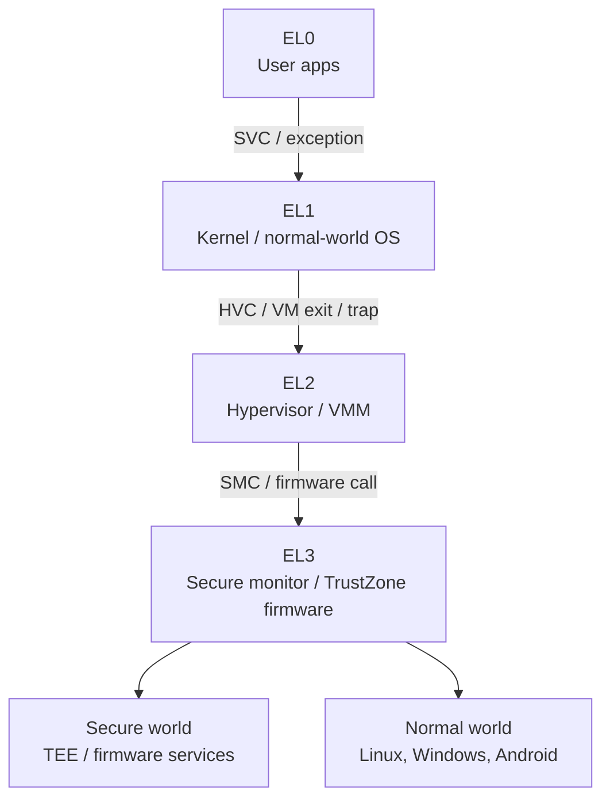
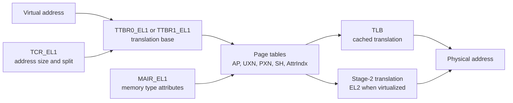

# ARM Architecture Main Differences

Value Score: 80/100
Role: Architecture translation map
Proof Level: Conceptual

Date: 2026-05-15

Scope: a practical ARM and AArch64 orientation for OS internals, reverse engineering, exploit reasoning, and security analysis. This mainly compares modern ARMv8+/AArch64 systems with x86-64 because that is the most common Linux, Android, Windows-on-ARM, and cloud/server comparison. ARMv7/32-bit ARM differences are called out separately.

## Core Mental Model

ARM is not "x86 with different register names." The main differences are privilege levels, system registers, memory model, page-table controls, exception entry, interrupt routing, calling convention, boot/firmware ecosystem, and optional security extensions such as PAC, BTI, MTE, PAN, PXN, UXN, and TrustZone.

For low-level security, always ask:

- Which exception level is executing: EL0, EL1, EL2, or EL3?
- Which translation base is active: TTBR0 or TTBR1?
- Which page attributes apply: UXN, PXN, AP, SH, AttrIndx, tag state?
- Which system registers control the boundary: SCTLR, TCR, MAIR, VBAR, ESR, FAR, SPSR, ELR?
- Is a hypervisor or secure world involved: EL2, stage-2 translation, EL3/TrustZone?
- Which optional mitigation exists on this CPU and OS build: PAC, BTI, MTE, PAN?

## Exception-Level Diagram

The rough x86 analogy is ring 3 to ring 0 to VMX root/non-root plus firmware, but it is not exact. ARM makes exception levels central, and TrustZone introduces a secure-world split that x86 systems usually express through a different platform security architecture.

## Translation Diagram

On AArch64, TTBR0 commonly maps user space and TTBR1 maps kernel space. The exact split is configured by TCR and the OS. Under virtualization, guest physical addresses may be translated again by EL2 stage-2 tables, similar in purpose to EPT/NPT on x86.

## Main Differences At A Glance

| Area | x86-64 intuition | ARM/AArch64 reality | Why it matters |
|---|---|---|---|
| Privilege | Rings 3 and 0 dominate normal OS thinking. | EL0 is user, EL1 is kernel, EL2 is hypervisor, EL3 is secure monitor. | Security analysis must identify the active exception level and whether EL2/EL3 constrains EL1. |
| Syscalls | `syscall`/`sysenter`, MSRs, syscall ABI. | `SVC` traps from EL0 to EL1; args usually in `x0`-`x7`, syscall number convention is OS ABI-specific. | Entry-path reversing and crash analysis use different registers and exception metadata. |
| Registers | General registers plus x86 control registers, segment legacy, flags. | `x0`-`x30`, `sp`, `pc`, `pstate`, plus many system registers such as `SCTLR_EL1`, `TTBR0_EL1`, `VBAR_EL1`. | "Control registers" become ARM system registers; knowing their role matters more than memorizing names. |
| Return address | Return address often lives on stack after `call`. | Link register `x30` holds return address until spilled. | ROP, unwinding, prologues, and crash triage look different. |
| Calling convention | Windows x64 and SysV x86-64 differ; stack usage is x86-specific. | AAPCS64 uses `x0`-`x7` for args, `x0` for return, `x29` frame pointer, `x30` link register. | Function prototypes and stack traces are decoded differently. |
| Page-table control | CR3 selects page-table root; PTE bits include U/S, NX, RW. | TTBR0/TTBR1 select roots; PTEs use AP bits, UXN/PXN, shareability, memory attributes. | Memory permissions map conceptually but not bit-for-bit. |
| Kernel/user execute protections | SMEP/SMAP are common x86 terms. | PAN blocks kernel access to user pages; PXN/UXN block privileged/user execution from pages. | Kernel exploit mitigations use different names and slightly different semantics. |
| Memory model | x86 is relatively strongly ordered. | ARM is weakly ordered and needs explicit barriers. | Lock-free code, drivers, atomics, and exploit races require stronger memory-ordering discipline. |
| Cache coherency | Usually coherent for mainstream x86 software assumptions. | ARM systems vary more; DMA/cache maintenance may be more visible, especially embedded/mobile. | Driver and DMA bugs often involve cacheability, shareability, and barriers. |
| Interrupts | APIC/MSI vocabulary. | GIC, IRQ/FIQ, interrupt priority and routing through exception levels. | Kernel interrupt paths, hypervisor routing, and device analysis use different primitives. |
| Virtualization | VT-x/AMD-V, VMCS/VMCB, EPT/NPT. | EL2, HVC, stage-2 translation, VHE on some systems. | Guest/kernel/hypervisor boundaries are named and configured differently. |
| Firmware/security world | UEFI/SMM/TPM dominate many PC discussions. | UEFI may exist, but TrustZone/secure monitor/TEE/secure boot chain are central on many platforms. | Boot trust and secrets may depend on secure world rather than only normal-world firmware. |
| Control-flow mitigation | CET shadow stacks/IBT on newer x86. | PAC signs pointers; BTI constrains indirect branch targets; shadow call stack may be software-assisted. | Exploit primitives and binary analysis change significantly. |
| Memory tagging | Usually not a mainstream x86 production feature. | MTE can tag memory and pointers on supported ARMv8.5+ systems. | UAF/OOB reliability and diagnostics can change materially. |
| Endianness | x86 is little-endian. | AArch64 is usually little-endian in mainstream OSes, but ARM supports endian variants. | Reversers should not assume all ARM firmware blobs are little-endian. |
| Instruction encoding | Variable-length x86 instructions. | Fixed-width 32-bit A64 instructions; 32-bit ARM also has ARM/Thumb modes. | Disassembly alignment, gadget density, and patching constraints differ. |

## Key Register And State Mapping

| Concept | x86-64 | AArch64 | Security meaning |
|---|---|---|---|
| User instruction pointer | `RIP` | `PC` | Current execution point. |
| Stack pointer | `RSP` | `SP` | Current stack; ARM may have banked SPs per EL. |
| Return address | Stack after call | `LR` / `x30`, often spilled later | Return hijack and unwinding differ. |
| Page-table root | `CR3` | `TTBR0_EL1`, `TTBR1_EL1`, plus EL2/EL3 variants | Selects active translation tables. |
| MMU control | `CR0`, `CR4`, `EFER` | `SCTLR_EL1`, `TCR_EL1`, `MAIR_EL1` | Enables translation, permissions, alignment, memory attributes. |
| Exception vector base | `IDT` plus descriptor state | `VBAR_EL1`, `VBAR_EL2`, `VBAR_EL3` | Controls privileged exception entry targets. |
| Fault address | `CR2` for page fault | `FAR_ELx` | Address that faulted. |
| Fault reason | error code, trap frame | `ESR_ELx` | Explains exception class and access type. |
| Saved return from exception | trap frame / `IRETQ` state | `ELR_ELx`, `SPSR_ELx` | Where execution resumes and with what state. |
| Hypervisor translation | EPT/NPT | Stage-2 translation tables | Lets EL2 constrain guest memory. |
| Device DMA isolation | IOMMU/VT-d/AMD-Vi | SMMU/IOMMU | Restricts device-visible memory. |

## Memory And Ordering Differences

ARM's weaker memory model is one of the biggest practical differences for kernel work.

| Topic | ARM-specific point | Consequence |
|---|---|---|
| Load/store ordering | Independent loads/stores may be observed in different orders without barriers. | Correct locking, atomics, and driver code require acquire/release semantics or explicit barriers. |
| Barriers | `DMB`, `DSB`, and `ISB` serve different ordering and synchronization purposes. | Page-table updates, device programming, and self-modifying/JIT code need the right barrier sequence. |
| Device memory | Memory attributes distinguish normal, device, cacheable, shareable, and other access types. | MMIO must not be treated like ordinary cached RAM. |
| TLB maintenance | Translation invalidation has explicit instructions and ordering requirements. | Changing page permissions is not complete until TLB and instruction synchronization requirements are met. |
| I-cache / D-cache | Some systems require explicit instruction-cache maintenance after generating or modifying code. | JITs, loaders, kernel patching, and exploit analysis must account for cache coherency behavior. |

## ARM Security Features

| Feature | What it does | Rough x86 analogy | Security impact |
|---|---|---|---|
| PAN | Prevents privileged code from accessing user mappings except through controlled sequences. | SMAP-like | Reduces kernel user-pointer abuse. |
| PXN | Prevents privileged execution from marked pages. | SMEP-like in effect | Stops kernel from executing mappings marked privileged execute-never. |
| UXN | Prevents user execution from marked pages. | NX/DEP | Enforces non-executable user pages. |
| BTI | Requires indirect branches to land on valid landing-pad instructions. | CET IBT-like | Reduces arbitrary indirect-branch target choices. |
| PAC | Adds pointer authentication codes to selected pointers, often return addresses or function pointers. | No exact classic x86 equivalent; partly overlaps with CFI goals | Makes pointer reuse/hijack harder without the right signing context. |
| MTE | Tags memory allocations and pointers and checks tag compatibility. | No mainstream x86 equivalent | Helps detect or block some UAF/OOB classes depending on mode. |
| SCS | Shadow call stack, often compiler/runtime assisted. | CET shadow stack-like goal | Protects return addresses through a separate call stack. |
| TrustZone | Splits secure and normal worlds through EL3/secure monitor. | Not SMM exactly; platform security role overlaps | Secrets and platform services may live outside the normal OS. |
| SMMU/IOMMU | Restricts device DMA addressability. | VT-d/AMD-Vi IOMMU | Device isolation and DMA attack surface depend on configuration. |

## Linux, Android, And Windows Consequences

| Area | Linux on ARM/AArch64 | Android | Windows on ARM |
|---|---|---|---|
| Syscall ABI | `SVC` path, AArch64 syscall ABI, architecture-specific entry code. | Same kernel fundamentals, with Android-specific Binder, SELinux, Zygote, ART, vendor kernels. | Native ARM64 system DLLs and ARM64 syscall stubs; x86/x64 compatibility layers may also exist depending on build. |
| Memory layout | TTBR0/TTBR1 split, KASLR, page-size variants, architecture-specific page-table bits. | Extra emphasis on app sandboxing, SELinux domains, JITs, MTE on supported devices. | VAD/section concepts remain Windows concepts, but enforced by ARM64 page tables and ARM64 mitigations. |
| Mitigations | PAN/PXN/UXN, BTI/PAC/MTE depending on CPU/kernel/config. | PAC/BTI/MTE and hardened allocators can materially affect app and native exploitability. | CFG, CET-like platform differences, PAC/BTI where supported by compiler/OS policy, VBS/HVCI where enabled. |
| Drivers | Device tree or ACPI depending on platform; GIC; SMMU; cache/DMA attributes matter. | Vendor drivers and firmware blobs are central to real-world security posture. | Windows driver model remains WDM/WDF conceptually, but ARM64 calling convention, page tables, and platform firmware differ. |
| Boot | UEFI may exist, but embedded/mobile often uses platform-specific boot chains. | Verified Boot, AVB, boot/vendor partitions, rollback indexes, TEE integration. | UEFI Secure Boot and Windows boot chain, with ARM64 platform requirements. |

## ARMv7 / 32-Bit ARM Caveats

Do not automatically project AArch64 facts onto older 32-bit ARM.

| Topic | ARMv7 / 32-bit point |
|---|---|
| Execution modes | 32-bit ARM has processor modes such as User, SVC, IRQ, FIQ, Abort, Undefined, System, Monitor, and Hyp on newer variants. |
| Instruction sets | ARM and Thumb/Thumb-2 modes can coexist; the low bit of branch targets may indicate Thumb state. |
| Registers | General registers are `r0`-`r15`; `r13` is SP, `r14` is LR, `r15` is PC. Some modes have banked registers. |
| Page tables | Different descriptor formats and permission bits from AArch64. |
| Security extensions | TrustZone exists on many ARMv7 systems; PAC, BTI, and MTE are AArch64-era features, not generic ARMv7 features. |
| ABI | AAPCS32 differs from AAPCS64; argument and return handling are different. |

## Reversing And Exploit-Reasoning Differences

| Difference | What to look for |
|---|---|
| Link register control | Function returns often depend on `x30`; check where prologues spill and epilogues restore it. |
| PAC-signed returns or pointers | A crash may come from authentication failure rather than a plain invalid branch. Pointer corruption may not be enough without valid PAC context. |
| BTI landing pads | Indirect branches may require landing on instructions such as `bti`. Gadgets that look valid syntactically may fail under BTI. |
| MTE tag faults | Memory bugs may fault due to tag mismatch. Crash reports may identify tag-check faults rather than ordinary page faults. |
| Weak memory ordering | Race bugs may reproduce differently than on x86. Missing barriers can be real correctness and security bugs. |
| Fixed-width instructions | Patching and gadget search differ because A64 instructions are 4 bytes and aligned. |
| Syscall and exception metadata | Inspect `ESR_ELx`, `FAR_ELx`, `ELR_ELx`, and `SPSR_ELx` rather than expecting x86 page-fault error code patterns. |
| Page-size variants | 4K, 16K, or 64K pages change allocator behavior, page-table shape, and exploitation assumptions. |

## Common Mistakes

| Mistake | Better model |
|---|---|
| "EL1 is just ring 0, so everything is identical." | EL1 is kernel privilege, but the exception model, system registers, page attributes, and EL2/EL3 interactions differ. |
| "PAC means memory corruption is solved." | PAC protects selected pointers in selected contexts. Data-only attacks, logic bugs, info leaks, unsigned pointers, and non-control data still matter. |
| "MTE stops all UAF/OOB bugs." | MTE coverage depends on hardware, OS mode, allocation tagging, tag granularity, and enforcement mode. |
| "ARM is always embedded/mobile." | ARM is also servers, cloud, Apple Silicon, Windows devices, and high-end Android systems. |
| "The same ROP/gadget intuition carries over." | Link register, PAC, BTI, fixed-width instructions, calling convention, and cache behavior change the analysis. |
| "Strong x86 ordering assumptions are portable." | ARM requires explicit ordering reasoning in lock-free, driver, page-table, and device code. |

## Interview Answer Template

If asked "what is different about ARM architecture?", answer in this order:

1. Privilege model: EL0/EL1/EL2/EL3 instead of ordinary ring-centric thinking.
2. System state: TTBR/TCR/MAIR/SCTLR/VBAR/ESR/FAR/ELR/SPSR replace many x86 control-register and trap-frame assumptions.
3. ABI: `x0`-`x7`, `x29`, `x30`, `SVC`, and fixed-width A64 instructions change reversing and debugging.
4. Memory model: weaker ordering, explicit barriers, page attributes, cache maintenance, and TLB maintenance matter.
5. Security extensions: PAN/PXN/UXN, PAC, BTI, MTE, SCS, TrustZone, SMMU.
6. OS impact: Linux/Android/Windows keep their own object and policy models, but the final enforcement maps to ARM exception levels, page tables, and system registers.

