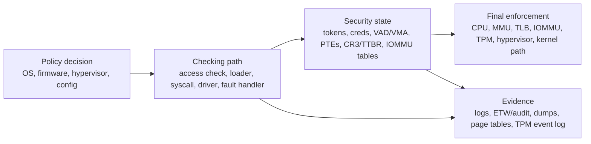

# Hardware and OS Internals Security Relationship, Scored

Value Score: 86/100
Role: Hardware/security Q&A owner
Proof Level: Conceptual, source-routed

Date: 2026-05-15

Purpose: explain how Linux and Windows internals sit on top of hardware mechanisms from a security, reverse-engineering, exploit-research, rootkit-analysis, and defensive perspective. This file focuses on boundaries, primitives, mitigations, telemetry, and failure modes. It intentionally avoids operational exploitation recipes.

## Core Mental Model

Operating systems enforce policy, but hardware enforces many of the boundaries the policy depends on. A kernel can decide "this process cannot read that memory," but the MMU, page tables, TLB, CPU privilege level, IOMMU, interrupt controller, and virtualization extensions are the mechanisms that make that decision real.

For security analysis, every OS abstraction should eventually be reducible to a hardware-backed question:

- Which privilege level is executing?
- Which address translation is active?
- Which page permissions are enforced by hardware?
- Which device can DMA into which memory?
- Which interrupt or exception path transferred control?
- Which CPU features are mitigating control-flow or data-flow abuse?
- Which firmware or hypervisor component was trusted before the OS started?

For the full component-by-component matrix, use [the low-level security component map](<../01-comparisons-and-maps/02-low-level-security-component-map.md>). That file expands each mechanism into checker, final enforcer, implementation layer, protected barrier, and attacker value.

x86 companion: [x86 privilege rings, descriptors, and syscall entry](<../05-topic-notes/x86-privilege-rings-descriptors-and-syscall-entry.md>) is the focused explanation for CPL, DPL, RPL, GDT/LDT/IDT/TSS, syscall MSRs, `swapgs`, control registers, SMEP/SMAP, and why exposing `wrmsr` through a weak driver is a privileged-state bug.

Critical terms companion: [Low-level security critical terms](<../05-topic-notes/low-level-security-critical-terms.md>) is the quick FAQ for PPL, SRM, driver dispatch, IRPs, MDLs, ACPI tables, MSRs, gates, U/S, privileged control state, syscall dispatch, KPTI/KVA shadow, invalid PTE states, PCID/ASID, DMA pinning, PTE backpointers/reverse mappings, and Windows/Linux kernel-thread terminology.

## Responsibility Snapshot

| Security question | Software component that decides/checks | Hardware/firmware/hypervisor component that enforces | State attackers most want |
|---|---|---|---|
| Can user code become kernel code? | syscall/exception entry, driver dispatch, security checks | CPU privilege level, syscall/SVC entry rules, SMEP/SMAP/PAN/PXN | entry targets, user pointers, driver buffers, privileged control state |
| Can one process read another process? | Linux ptrace/LSM/Yama or Windows Object Manager/SRM/PPL checks | MMU page permissions during kernel-mediated copy/map | handles/fds, tokens/creds, VAD/VMA/PTE state |
| Can code execute from this page? | loader and memory manager page-protection policy | NX/DEP, PTE execute permission, TLB permissions | executable private mappings, modified image pages, JIT/manual-map regions |
| Can a device read or write this memory? | driver DMA API, pinned-page/MDL management, IOMMU policy | IOMMU/DMA remapping and device DMA engine | DMA descriptors, stale mappings, MDLs, IOMMU tables |
| Can early boot be trusted? | boot manager, kernel loader, CI/module signing, ELAM/LSM startup | UEFI Secure Boot, TPM measured boot, hypervisor-backed CI where enabled | boot entries, Secure Boot policy, PCR measurements, boot drivers/initramfs |
| Can the normal kernel be constrained by a lower layer? | hypervisor and secure-kernel policy | VT-x/AMD-V/arm virtualization, EPT/NPT/stage-2 translation | VMCS/VMCB, EPT/NPT, VBS/HVCI policy |

## Priority Index

| Score | Area | Question |
|---:|---|---|
| 100 | Privilege | How do CPU privilege levels make user/kernel isolation real on Linux and Windows? |
| 99 | MMU | How do page tables, TLBs, NX, user/supervisor bits, and page permissions become security boundaries? |
| 98 | Syscalls/exceptions | Why are syscall, interrupt, and exception entry paths security-critical? |
| 97 | Mitigations | How do SMEP/SMAP, PAN/PXN/UXN, KPTI, DEP/NX, CFG/CET, PAC/BTI/MTE change exploitability? |
| 96 | TLB/cache | Why do stale TLBs, instruction/data-cache behavior, cache flushes, and speculation matter for security? |
| 95 | DMA/IOMMU | Why are DMA and IOMMU central to driver and device security? |
| 94 | Virtualization | How do VT-x/AMD-V, EPT/NPT, Hyper-V, KVM, VBS, and HVCI change the trust model? |
| 93 | Firmware/boot | How do UEFI, Secure Boot, measured boot, TPM, BitLocker, and initramfs/boot drivers affect trust? |
| 92 | Interrupts/APIC/MSI | How can interrupt delivery, DPC/softirq paths, and device events affect attack surface and telemetry? |
| 91 | Timers/perf | Why are timers, TSC, PMCs, and tracing hardware relevant to both attacks and defenses? |
| 90 | Drivers/MMIO | Why are MMIO, PCIe BARs, IOCTLs, and driver trust hardware-security issues? |
| 89 | Architecture | Which x86-64 versus arm64 hardware security differences matter most? |
| 88 | Memory tagging | What security problems do MTE, KASAN-like tagging, and allocator metadata try to expose? |
| 87 | Debug features | Why do hardware breakpoints, debug registers, tracing, and crash dumps matter to defenders and attackers? |
| 86 | Side channels | How should OS-internals people reason about side channels without overfitting to one CVE? |
| 85 | Devices/network/storage | How do NIC/storage offloads and device queues affect visibility, trust, and forensic interpretation? |
| 84 | Remote HW/SW interfaces | Which hardware/software boundary components are interesting to remote attackers, and why? |

## Best Answers

### 100 - CPU Privilege Levels

Linux and Windows both rely on CPU-enforced privilege separation. User code normally runs at an unprivileged level, such as ring 3 on x86/x64 or EL0 on arm64. Kernel code runs at a privileged level, such as ring 0 or EL1. User code cannot directly modify page tables, control registers, interrupt descriptor tables, privileged MSRs, or device MMIO mappings unless the kernel exposes a path.

From a security perspective, privilege level is the first hard boundary. A user-mode exploit must either stay within user-mode authority, abuse a privileged service, or trigger a kernel/driver/hypervisor flaw to cross the boundary. Linux and Windows name the abstractions differently, but both depend on the CPU refusing privileged operations from user mode.

On x86, that refusal is a concrete set of checks rather than a slogan. The current privilege level, CPL, is derived from the current code-segment state. Descriptor privilege level, DPL, lives in GDT/LDT/IDT descriptors and gates. Requested privilege level, RPL, is carried in selector values and can make a selector request less privileged, not more privileged. Loading segment selectors, invoking gates, taking interrupts, returning with `iret`, and entering through `syscall` each has its own hardware-defined checks.

The modern x86-64 syscall path is MSR-backed. The OS programs state such as `IA32_LSTAR`, `IA32_STAR`, `IA32_FMASK`, `IA32_EFER`, and GS-base MSRs, then user code executes `syscall`. The CPU enters CPL0 at the OS-selected address, but early kernel code still has to switch to trusted stack/per-CPU state and, on KPTI/KVAS systems, the full kernel page-table view. This is why `swapgs`, `CR3`, `CR4`, `LSTAR`, and entry trampolines all belong in the same security answer.

Privileged instructions are the other half of the boundary. User mode cannot execute `wrmsr`, write `CR0`/`CR3`/`CR4`, load `GDTR`/`IDTR`, or install a new TSS. Those operations fault unless executed with the required privilege. A vulnerable driver that lets an untrusted IOCTL choose an MSR index and value is therefore not "user mode doing `wrmsr`"; it is kernel code acting as a confused deputy and mutating CPU entry state on untrusted input.

### 99 - MMU, Page Tables, TLB, NX, Permissions

The MMU enforces virtual-to-physical translation and page permissions. Page-table bits decide whether a page is present, writable, executable, and accessible from user mode. NX/DEP makes data pages non-executable. User/supervisor bits prevent user mode from accessing kernel pages even if their virtual addresses are known.

Attackers care because many exploitation goals become "change a translation, bypass a permission, find a writable code pointer, or reuse executable code." Defenders care because memory maps, VADs/VMAs, page protections, and executable private memory reveal behavior. The TLB matters because hardware may keep cached translations; correct security changes require page-table updates plus invalidation.

There are separate software and hardware "bits" because they answer different questions:

| Question | Layer that answers it | Examples |
|---|---|---|
| Should this virtual range exist, and what protections/backing are allowed? | VMA/VAD range policy | Linux `VM_READ`, `VM_WRITE`, `VM_EXEC`, `VM_SHARED`, may-permission flags, locked/dump/growth flags; Windows VAD protection, private/mapped/image type, guard, commit, section view. |
| What physical frame and permissions will the CPU use right now? | Page-table entry | Present/valid, PFN, write, user/supervisor, NX/XN, accessed/dirty, global, cache type, huge/block mapping. |
| What is this physical page's lifetime and ownership state? | Page record metadata | Linux `struct page`/folio refcount/mapcount/LRU/dirty/writeback/pin/slab state; Windows PFN database reference/share count and page-list state. |
| Where do contents come from, and can another mapping see them? | Backing object metadata | Linux page cache, anon_vma/rmap, swap, file `address_space`; Windows section/control area/prototype PTE/pagefile state. |
| Is the cached enforcement state current? | TLB/cache/invalidation state | TLB entries, page-walk caches, instruction-cache coherency after code modification. |
| Can a device or hypervisor see a different truth? | IOMMU or second-level translation | DMA-remapping tables, EPT/NPT/stage-2 tables, VBS/HVCI secure-kernel policy. |

Hardware PTE documentation gives the exact architecture bits, but it does not describe the whole OS truth. The kernel may deny an access before a PTE exists, may accept a fault and install a PTE later, may encode swap or transition state in a non-present PTE, may split COW on write, or may revoke access in the VMA/VAD and only later flush stale TLB entries. For security analysis, compare the independent layers instead of trusting one view.

For x64 PTE/PDE reviews, the high-value bits are the ones that change enforcement or state interpretation: `Valid` decides whether hardware translates or the OS fault path interprets software state; RW decides write access; user/supervisor decides privilege reachability; NX/XD decides instruction fetch; PFN decides which physical memory is behind the VA; large-page changes the mapping granularity; global changes TLB lifetime; accessed/dirty feed reclaim and writeback policy; cache bits affect coherency; and OS-owned bits such as Windows COW/prototype/software-write guide fault handling. An attacker who can modify these bits can potentially create writable code, executable data, user-accessible privileged mappings, physical aliases, or page-table subtrees, but only if the entry remains structurally valid and the TLB, VMA/VAD, PFN, and backing-object layers do not expose or undo the lie.

Large/huge pages are security-relevant because the leaf entry moves upward in the hierarchy. A 2 MB x64 large page is a PDE leaf; a 1 GB page is a PDPTE leaf. The hardware stops walking early, uses more low virtual-address bits as the offset, and applies the higher-level entry's permissions to the entire range. The TLB then caches that translation at the larger page size, so one TLB entry can cover what would otherwise need hundreds of 4 KB translations. This improves performance by reducing TLB and page-walk pressure, but it makes permissions, COW, guard behavior, dirty/accessed state, stale-TLB hazards, and corruption impact coarser. A single bad bit can affect hundreds of ordinary pages, and an analyst who only looks for final PTEs can miss the real enforcing entry.

With an extreme read/write primitive, separate page-table memory from page-table root registers. Page tables are memory-resident structures; a true kernel/physical write can corrupt PTEs, create aliases, change permissions, or tamper with OS-owned fields that describe a process address-space root. The active root register is different: on x86/x64, `CR3` is a privileged CPU register; on arm64, `TTBR0_EL1`/`TTBR1_EL1` fill the same role. A remote attacker cannot directly "write CR3" through a network bug or ordinary memory write. They need privileged code execution, a vulnerable kernel/driver/hypervisor path, a debugger-like thread-context path that the OS permits, or an indirect corruption of trusted kernel state that the scheduler or exception path later loads.

So "page-table pivot" is possible as a class only after the attacker crosses a high-trust boundary. Examples at the conceptual level include modifying existing PTEs, changing a process's stored page-table root so a later context switch loads attacker-controlled tables, or abusing a hypervisor/firmware layer that owns second-level translation. Reliability is hard: page tables must be structurally valid, page sizes and permission bits must match the architecture, stale TLB entries may keep old translations alive until invalidation or context switch, multi-CPU state must stay coherent, and modern systems add KPTI, SMEP/SMAP or PAN/PXN, VBS/HVCI, EPT/NPT, IOMMU, PatchGuard-like checks, and memory-encryption/isolation features.

Address-width changes are security-relevant even when the permission model is unchanged. On x86-64, five-level paging/LA57 expands canonical linear addresses from the familiar 48-bit model to 57 significant bits when enabled. This can increase available ASLR/KASLR space and make sparse guard regions cheaper, but it also breaks brittle software assumptions: top-16-bit masking, stale user/kernel split constants, 48-bit pointer compression, incorrect canonical-address checks, JIT sandbox bounds based on old ranges, and tooling that assumes four page-table levels. Treat LA57 as a layout/entropy/bug-class issue, not as a replacement for NX, SMEP/SMAP, KPTI, CFG/CET, or leak resistance.

### 98 - Syscalls, Interrupts, Exceptions

Syscalls are controlled transitions from user mode to kernel mode. Exceptions are synchronous events caused by the current instruction, such as page faults or invalid opcodes. Interrupts are asynchronous events from devices or timers. All three move execution into privileged code paths with saved CPU state.

These paths are security-critical because they parse untrusted state at privilege boundaries: syscall arguments, user pointers, trap frames, device state, and fault metadata. Bugs here can turn user-controlled data or device-controlled events into privileged behavior. Defensively, entry paths also produce telemetry: syscall traces, ETW, audit/eBPF, page-fault behavior, crash dumps, and interrupt/DPC/softirq evidence.

### 97 - Hardware-Backed Mitigations

SMEP and SMAP on x86, and PAN/PXN/UXN-style controls on arm64, reduce the usefulness of classic primitives by preventing kernel execution of user pages or kernel access to user pages except through controlled paths. KPTI separates user and kernel page-table views to reduce exposure of kernel mappings. DEP/NX blocks direct execution from writable data memory.

Control-flow mitigations such as CFG, CET shadow stacks/indirect branch tracking, PAC, and BTI make hijacking indirect calls or returns harder. MTE and related tagging approaches expose some memory-safety errors by checking pointer/tag consistency. These mitigations do not remove bugs; they reshape which primitives remain useful. Data-only attacks, logic bugs, info leaks, and signed/vulnerable driver abuse often become more attractive.

### 96 - TLBs, Caches, Flushes, And Speculation

The TLB and CPU caches are performance structures, but security depends on them being coherent with policy. If stale TLB entries remain after permissions change, a CPU may continue using old translations. If cache timing reveals secret-dependent behavior, a process can infer information without architecturally reading it.

Instruction-cache/data-cache coherency is a separate issue from code integrity, but it is real and security-relevant. Some architectures require explicit cache maintenance after code bytes are generated or modified: clean the data side so the new bytes reach the point of coherence, then invalidate the instruction side so execution fetches the new stream. Windows exposes this contract through `FlushInstructionCache`; portable Unix-style code may use compiler/runtime helpers such as `__builtin___clear_cache`. This is important for JITs, hotpatching, unpackers, hooks, self-modifying code, and shellcode-like staging.

Do not describe common OS mitigations as "comparing the instruction cache with the data cache before execution." That is not the normal model. The real failure mode is that the instruction side can keep observing stale code after the data side has been modified. NX/DEP, W^X, CFG, CFI, CET shadow stacks/IBT, PAC/BTI, ACG/CIG, code signing, and HVCI constrain page permissions, executable provenance, indirect branches, returns, and policy. Cache flush behavior is mostly a coherency/correctness requirement, with narrow architecture-specific stale-code security implications that can accidentally harden a target against naive shellcode.

Raspberry Pi examples should be described carefully: Pi 3 uses Cortex-A53 and Pi 4 uses Cortex-A72, and both are ARMv8-A cores. A 32-bit OS may expose an ARMv7-style ABI, but shellcode differences are more likely about the core, execution state, cache-maintenance availability, and whether the payload performed the required clear-cache sequence.

Speculative execution showed that "the instruction should not architecturally access this" is not always enough for confidentiality. Mitigations include KPTI, speculation barriers, retpolines, microcode updates, branch predictor controls, and constant-time coding in sensitive paths. OS-internals reasoning must include architectural state, microarchitectural leakage risk, and the invalidation/coherency story after security-relevant state changes.

### 95 - DMA And IOMMU

DMA lets devices read or write memory without CPU copy loops. That is necessary for performance but dangerous because a device is a bus master. A buggy or malicious device, firmware component, or driver can corrupt memory or read secrets if DMA is not constrained.

The IOMMU remaps and restricts device-visible memory. Linux exposes this through DMA APIs and IOMMU groups; Windows uses DMA remapping and driver DMA abstractions. Driver bugs involving pinned pages, MDLs, scatter/gather lists, or stale DMA mappings can become memory-corruption or information-disclosure issues. Device isolation is therefore part of OS memory security, not only hardware plumbing.

### 94 - Virtualization And Hypervisor Trust

Hardware virtualization adds another privilege layer. VT-x/AMD-V and EPT/NPT let a hypervisor run guest kernels while controlling privileged events and second-level address translation. Linux KVM and Windows Hyper-V use these features, and Windows VBS/HVCI relies on virtualization-backed isolation to protect code integrity and secrets from the normal kernel.

Security analysis must ask which layer owns the truth: guest user mode, guest kernel, hypervisor, firmware, or management host. Hypervisor-backed features can protect the OS from some kernel compromise, but hypervisor or vulnerable-driver attacks can undermine those protections. Rootkit analysis must include the possibility of code below the OS, not only kernel hooks inside it.

### 93 - Firmware, Boot, TPM, Measured Trust

The OS starts after firmware, bootloaders, and early boot components. UEFI Secure Boot verifies early boot images according to trust policy. Measured boot records component measurements into TPM PCRs. BitLocker can seal disk keys to expected measurements. Linux initramfs and Windows boot-start drivers shape what code runs before normal defenses are fully active.

From a security perspective, early boot decides whether later kernel state can be trusted. A bootkit or malicious early driver may run before EDR-like components. Defenders use Secure Boot, measured boot, TPM attestation, ELAM on Windows, module signing/lockdown on Linux, and disk encryption policy to reduce pre-OS and early-kernel tampering.

### 92 - Interrupts, APIC, MSI, Deferred Work

Devices signal events through interrupts, MSI/MSI-X, or polling. Kernels split urgent interrupt handling from deferred processing: Linux uses softirqs, NAPI, workqueues, threaded IRQs; Windows uses ISRs, DPCs, work items, and completion mechanisms. This split is a security concern because device-controlled data often enters the kernel at high privilege and awkward timing.

Attack surface appears in drivers, packet/storage completion paths, interrupt moderation logic, and race-prone deferred work. Defensively, interrupt/DPC/softirq storms, unusual device activity, and driver crashes can be clues. A serious rootkit or EDR discussion must include driver event paths, not only syscalls.

### 91 - Timers, TSC, PMCs, Tracing Hardware

Timers and counters are used for scheduling, timeouts, profiling, and telemetry. They are also used by malware and researchers for anti-debugging, sandbox detection, side-channel measurement, and performance-based inference. TSC behavior, high-resolution timers, performance counters, and tracing features can reveal or conceal behavior depending on policy.

Defenders use hardware and kernel tracing to attribute execution, sample stacks, and diagnose performance or stealth. Attackers may look for timing anomalies, single-stepping overhead, VM timing artifacts, or disabled counters. The important lesson is that time is both an OS service and an observation channel.

### 90 - Drivers, MMIO, PCIe BARs, IOCTLs

Drivers are where OS policy meets device hardware. PCIe BARs expose MMIO regions; drivers map them and program devices. User mode may reach drivers through device files and ioctls on Linux, or device objects and `DeviceIoControl` on Windows. A vulnerable driver can become a bridge from user mode to privileged device or kernel operations.

Hardware-facing bugs are dangerous because they may combine weak IOCTL validation, DMA, MMIO, interrupt races, and physical-device trust. Defenders inspect driver signing, device ACLs, IOCTL surfaces, DMA policy, loaded modules/drivers, and unusual device access. BYOVD attacks on Windows are a practical example of hardware-adjacent trust abuse without needing a new kernel exploit.

### 89 - x86-64 Versus arm64 Security Differences

x86-64 and arm64 provide different names and mechanisms for similar goals. x86 commonly discusses rings, SMEP, SMAP, KPTI, CET, canonical addresses, and MSRs. arm64 discusses exception levels, PAN, PXN/UXN, BTI, PAC, MTE, TBI, and page-size variants. The syscall and exception ABIs also differ.

Exploitability changes with architecture. PAC can make pointer reuse harder; BTI constrains branch targets; MTE can expose memory-safety bugs; different page sizes alter allocator and mapping assumptions. A Windows/Linux answer that ignores architecture is incomplete for modern endpoint and mobile systems.

For a standalone ARM-focused summary, use [ARM architecture differences](<../01-comparisons-and-maps/03-arm-architecture-differences.md>).

### 88 - Memory Tagging And Bug Detection

Memory tagging associates metadata with memory and pointers so some incorrect uses can be detected. Hardware MTE on arm64 is one example. Software tools such as KASAN and allocator debugging use related ideas to catch UAF, OOB, or invalid accesses in test/debug builds.

From a hacking perspective, tagging changes primitive reliability. A stale pointer that used to read or write reused memory may now fault if tags mismatch. From a defensive engineering perspective, tagging and sanitizers reveal classes of bugs earlier, but production deployment, performance, coverage, and bypass limitations matter.

### 87 - Debug Hardware And Crash Evidence

Hardware breakpoints, debug registers, branch tracing, performance counters, and crash-dump mechanisms help analysts observe behavior without patching code. Debuggers and EDR tooling can use them to catch execution, memory access, and control-flow anomalies.

Attackers may detect or interfere with debugging, inspect debug registers, use timing to spot tracing, or rely on behavior that changes under instrumentation. Defenders should understand what evidence comes from hardware-assisted tracing versus OS logs versus memory dumps, and how malware might behave differently when observed.

### 86 - Side Channels

A side channel leaks information through timing, cache state, branch predictor state, power, contention, or other indirect effects rather than direct architectural access. OS internals matter because scheduling, page mapping, isolation, timers, and shared hardware decide what can be observed.

Do not memorize only Spectre/Meltdown names. Reason by asking: what shared resource exists, what secret-dependent behavior influences it, what can the attacker measure, and what isolation/mitigation reduces the signal? This keeps the model useful across new CPU issues.

### 85 - Device Queues, Offloads, Visibility

NICs and storage devices use DMA rings, queues, offloads, and interrupt moderation. NVMe has submission/completion queues; NICs have RX/TX rings and offloads such as checksum, segmentation, and RSS. These features improve performance but change what the OS sees and when it sees it.

For security and forensics, offloads can make packet captures look odd, queues can hide timing relationships, and device firmware/driver behavior can affect evidence. Defenders should interpret network/storage telemetry with hardware offloads in mind and treat firmware/drivers as part of the trust boundary.

### 84 - Remote-Relevant Hardware/Software Interfaces

A remote attacker usually does not start with hardware authority. Remote input first lands in a parser, service, browser renderer, media stack, network stack, broker, or driver-facing API. Hardware/software interfaces become interesting when that first foothold can reach a privileged subsystem, a shared buffer, a driver, a JIT/compiler, a device queue, or a lower translation layer.

| Component | Remote path that can reach it | Why attackers care | Defensive questions |
|---|---|---|---|
| MMU, page tables, PTEs, TLB | Kernel/driver/hypervisor bug after remote code execution, sandbox escape, or exposed kernel interface. | Can turn a write primitive into permission changes, arbitrary mappings, W^X bypass, aliasing, or KASLR/ASLR defeat. | Which layer owns the mapping, which TLB invalidation is required, and do VMA/VAD policy and hardware PTEs agree? |
| DMA and IOMMU | NIC/storage/GPU/USB/Thunderbolt driver bugs, VFIO/device passthrough, RDMA, compromised device firmware, or bad DMA-map lifetime. | Device writes can bypass ordinary CPU page-permission checks if IOMMU policy or map lifetime is wrong. | Is DMA remapping active, are buffers pinned/unpinned correctly, and can an untrusted device reach memory outside its contract? |
| CPU caches, predictors, speculation | JavaScript/native code, sandboxed code, co-resident workloads, high-resolution timers, or gadget-bearing kernel/user code. | Can leak layout or secrets through timing without direct architectural reads; can help defeat ASLR/KASLR or key isolation. | What resource is shared, what secret influences it, what can the attacker measure, and what timer/isolation mitigations apply? |
| GPU command buffers, shader compilers, and shared GPU memory | Browser WebGL/WebGPU, media decode, graphics drivers, ML/compute APIs, desktop remoting, or sandboxed GPU processes. | Complex parsers/JITs and shared CPU/GPU buffers create info-leak, UAF, OOB, and sandbox-escape surfaces. | Which process owns the GPU service, how are handles/fences/shared resources validated, and is uninitialized GPU memory exposed? |
| NIC/storage queues and offloads | Network packets, remote storage protocols, kernel network/storage drivers, RDMA, NDIS/NAPI paths. | Remote bytes can reach descriptor rings, packet metadata, firmware, interrupt moderation, and offload logic before normal application parsing. | Where do bytes first become trusted metadata, and do offloads hide or transform evidence? |
| Interrupts, MSI/MSI-X, DPC/softirq/workqueues | Device-driven packet/storage/completion paths or driver bugs triggered by remote traffic. | Races and lifetime bugs often appear in deferred completion paths rather than the initial parser. | Which context owns the object now, can the path sleep, and what reference protects completion state? |
| MMIO and PCIe BARs | Privileged driver APIs, bad IOCTL ACLs, container/device passthrough, or compromised firmware. | Misprogramming registers can change DMA, queues, interrupts, or device state below normal OS object checks. | Which user or service can map/program the device, and are register accesses ordered and validated? |
| Hypervisor second-level translation | VM escape bugs, virtual device emulation, VBS/HVCI boundary bugs, cloud host interfaces. | EPT/NPT/stage-2 translation can overrule guest page tables and protect or expose guest/host memory. | Which layer owns the real physical mapping, and can the guest influence emulator or shared-memory state? |
| Firmware, ACPI, SMM, boot chain | Usually post-admin, supply-chain, update mechanism, vulnerable driver, or management-plane path. | Persistence and stealth below the OS can invalidate later telemetry. | Is update/authentication policy enforced, and do measured boot/attestation views match expected components? |
| Shared-memory async rings | `io_uring`, AF_XDP, eBPF maps/rings, RDMA queues, shared graphics buffers, Windows IOCP/driver queues. | Shared producer/consumer state creates lifetime, bounds, cancellation, and stale-reference bugs. | Who owns each buffer at each transition, and can one side race cleanup or reuse? |

The rule of thumb is: hardware-facing state is attractive when it changes enforcement, visibility, lifetime, or authority. MMU state changes what memory means; DMA changes who can touch memory; caches and predictors leak facts without direct reads; GPUs and accelerators expose large shared buffers and compilers; queues/offloads move remote bytes through privileged metadata before defenders may see a normal application event.

## Linux And Windows Mapping

| Hardware/security topic | Linux-facing concepts | Windows-facing concepts |
|---|---|---|
| CPU privilege | user/kernel mode, syscall ABI, KPTI, SMEP/SMAP where available | user/kernel mode, `ntdll` stubs, KPTI, SMEP/SMAP, VBS/HVCI interactions |
| Page policy | `mm_struct`, VMAs, PTEs, page faults | VADs, sections, PTE/prototype PTE concepts, page faults |
| Device DMA | DMA API, IOMMU groups, pinned pages | DMA remapping, MDLs, map registers, WDF/WDM DMA |
| Deferred device work | IRQs, softirq, NAPI, workqueues, threaded IRQs | ISRs, DPCs, work items, IOCP/completions |
| Virtualization | KVM, EPT/NPT, containers plus VM isolation | Hyper-V, VBS, HVCI, Credential Guard, WSL2 |
| Boot trust | UEFI Secure Boot, measured boot, module signing, lockdown, initramfs | UEFI Secure Boot, measured boot, TPM, BitLocker, ELAM, driver signing, WDAC |
| Hardware mitigations | NX, SMEP/SMAP/PAN, KPTI, BTI/PAC/MTE on arm64 where applicable | DEP/NX, CFG/CET, SMEP/SMAP, KPTI, VBS/HVCI, Kernel-mode CET where available |
| GPU/accelerators | DRM/KMS, render nodes, DMA-BUF, sync fences, Mesa/vendor drivers, WebGL/WebGPU paths | WDDM, DXGI/D3D, shared resources, GPU scheduler, display miniport/user-mode drivers |

## Remaining Gaps

| Gap | Why it remains |
|---|---|
| Detailed exploit methods for side channels, DMA attacks, or hypervisor escapes | Intentionally omitted. This is defensive/research context, not an operational guide. |
| CPU-vendor-specific errata and microcode behavior | Too version-specific for a general transition guide. |
| Deep firmware reverse engineering, SMM, ACPI exploitation, or PCIe protocol labs | Worth separate specialist notes if firmware/hardware security is the target. |
| Hands-on lab commands | Should be a separate safe lab guide using benign tracing and observation tasks. |
