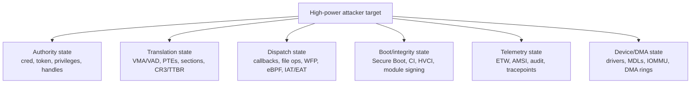

# Attacker-Relevant Structures and Components: Creative Abuse Notes

Value Score: 91/100
Role: Attacker-relevant structure map
Proof Level: Conceptual, evidence-routed

Date: 2026-05-15

Scope: security-internals research and reversing notes on how important Linux and Windows structures or components are creatively abused or repurposed in real-world-style malware, rootkits, exploit chains, and intrusion tooling. The main interview scenario is 0/1-click RCE+PE enabling an authorized spying/assessment agent. This is not a turnkey exploitation recipe. It focuses on why a component is attractive, what agent capability it can support, what constraints and mitigations matter, what abuse shape to recognize, and what evidence proves the hypothesis.

Remote-chain companion: [Remote-attacker low-level mechanisms](<remote-attacker-low-level-mechanisms.md>) follows 0/1-click compromise through client execution, RCE, PE/sandbox escape, agent runtime, telemetry, communication, and persistence surfaces on both Linux and Windows. Vulnerability research is useful support, but the main focus is security internals that determine what an authorized agent can do.

Journey companion: [Journey PDF source map](<journey-pdf-source-map.md>) points to companion Linux Security, Windows Security, Windows Forensic, and Networking review tracks. Use them as supporting review when a structure below needs broader security, forensic, or packet-flow context.

## How To Read This

Use this file to train the habit: "What invariant does this component enforce, and what happens if an attacker can corrupt, fake, hide, reuse, or redirect it?"

For interview prep, answer every row in this order: scenario role, reachability, authority, agent capability, constraints, mitigation impact, reliability, and authorized validation. Bug class and exploitability matter when the component is the RCE/PE path, but they are secondary to understanding the security internals of agent execution and control.

## Offensive Priority Index

Use this as the local order for offensive low-level study. The later best-answer sections are grouped by topic, but this score table tells you what to internalize first.

| Score | Content | Why it is prioritized |
|---:|---|---|
| 100 | Highest-power target classes: authority, translation, dispatch, integrity, telemetry, device/DMA | These are the state classes that convert code execution into durable capability or boundary crossing. |
| 99 | Cross-platform abuse patterns and attacker-tunable state | Connects generic OS objects to the ways attackers influence process, memory, launch, path, and policy state. |
| 98 | Windows `_TOKEN`, handles, `_EPROCESS`/`_ETHREAD`, VADs, section objects | Core Windows authority, identity, process, thread, and memory state. |
| 98 | Linux `cred`, `task_struct`, VMAs/page tables/page cache, `struct file` | Core Linux authority, process, memory, and fd-backed object state. |
| 96 | Dispatch redirection: callbacks, minifilters, WFP, file operations, eBPF/io_uring | Trusted execution redirection and kernel/user extension points. |
| 95 | ETW, AMSI, credential components, anti-debug, telemetry gaps | Evidence control, collection surfaces, and security-product interaction. |
| 94 | Persistence/configuration surfaces and network/DNS/proxy behavior | Useful after authority is established; less useful before the agent/runtime stage. |

| Score | Meaning |
|---:|---|
| 100-95 | Core attacker/defender mental model. |
| 94-90 | Very high-value reversing and incident-response concept. |
| 89-85 | Important subsystem-specific concept. |
| 84-80 | Useful specialist detail. |

## Highest-Power Target Classes

The strongest attacker targets are not random structures. They are components that decide authority, translation, dispatch, integrity, telemetry, or device reach. Use [the low-level security component map](<../01-comparisons-and-maps/02-low-level-security-component-map.md>) when you need the exact checker/enforcer split.

| Target class | Why attackers value it | Defensive posture |
|---|---|---|
| Authority state | Changes what a subject may do without requiring obvious new code execution. | Track legitimate authority transitions and inspect unexpected token/cred/handle access. |
| Translation state | Changes which memory exists, what backs it, and whether it is readable, writable, or executable. | Compare metadata views with page-table/VAD/VMA and backing-file reality. |
| Dispatch state | Redirects trusted control flow through existing extension points or function tables. | Verify ownership, signer, callback registration, table targets, and code-section integrity. |
| Boot/integrity state | Determines whether later kernel state and telemetry should be trusted. | Inspect Secure Boot, measured boot, CI/HVCI/module-signing state, early drivers, and boot configuration. |
| Telemetry state | Blinds or distorts the evidence defenders depend on. | Cross-check high-level logs against memory, kernel, filesystem, network, and process evidence. |
| Device/DMA state | Lets hardware or drivers affect memory outside ordinary CPU load/store assumptions. | Inspect DMA policy, IOMMU state, MDLs/pinned pages, device ACLs, and driver signer/behavior. |

## Cross-Platform Abuse Patterns

| Pattern | Linux examples | Windows examples | Defensive question |
|---|---|---|---|
| Authority object abuse | `cred`, capabilities, namespaces, LSM labels | `_TOKEN`, privileges, integrity, AppContainer, impersonation | Did authority change without a legitimate policy path? |
| Lifetime abuse | refcounts, RCU, `struct file`, `sk_buff`, io_uring requests | object references, handles, IRPs, driver objects, callbacks | Can stale references still reach freed or repurposed memory? |
| Mapping abuse | VMAs, page tables, page cache, memfd, COW | VADs, section objects, image sections, private executable pages | Does memory reality match loader and disk metadata? |
| Metadata hiding | `/proc`, module lists, link maps, fd tables | PEB loader lists, handle tables, driver/module lists, ETW providers | Do independent views disagree? |
| Hook or dispatch redirection | `file_operations`, netfilter, LSM hooks, BPF, syscall table historically | IAT/EAT/inline hooks, callbacks, minifilters, WFP, SSDT historically | Who owns the dispatch point, and is it expected? |
| Config/persistence object abuse | systemd units, cron, preload, PAM/NSS, SSH config | services, scheduled tasks, registry, COM, WMI, IFEO | Did a configuration object become an execution path? |
| Telemetry tampering | audit/eBPF disabling, procfs hiding, module hiding | ETW/AMSI tampering, callback tampering, PPL/EDR targeting | Is telemetry missing where lower-level state proves activity? |

## Attacker-Tunable State: OS, Process, Thread, And Environment Parameters

A tunable is any setting or metadata field that changes authority, mapping, dispatch, visibility, timing, or child-process behavior. In the main 0/1-click scenario, most tunables are not directly reachable before code execution. The usual chain is: remote content influences a browser/document/media parser, child process, file path, environment, or resource limit; RCE gives client-process or service-account control; PE/sandbox escape gives root/admin or stronger local policy control; a kernel or vulnerable-driver primitive gives direct control of state that normal APIs would not expose.

Use this prerequisite scale:

| Prerequisite | Meaning for remote cases |
|---|---|
| Remote content/input only | The attacker can influence web content, document/media/file parser input, protocol fields, archive metadata, command arguments, resource pressure, or paths consumed by a client or service. |
| Client or service code execution | The attacker runs code as the content-handling client process or network-facing service account and can tune its process, threads, children, files, and same-user state. |
| Privileged client/service context | The compromised process already has Linux capabilities/root or Windows service privileges/SYSTEM/admin-equivalent rights, so local-only tunables become reachable through that process. |
| Root/admin after privesc | The attacker gained operating-system policy authority and can change sysctls, registry policy, services, firewall, logging, and loader configuration. |
| Kernel primitive | The attacker has a kernel arbitrary read/write, vulnerable-driver primitive, or equivalent and can alter state that should only change through kernel policy paths. |

### Linux favorite and niche tunables

| Priority | Tunable surface | Why attackers care | Remote path and prerequisite | Research evidence |
|---|---|---|---|---|
| Favorite | Environment and dynamic-loader variables: `LD_PRELOAD`, `LD_AUDIT`, `LD_LIBRARY_PATH`, `GLIBC_TUNABLES`, `MALLOC_*`, language runtime search paths, `PATH`, `TMPDIR`, locale variables | Changes which code or runtime behavior is used by child processes; can turn a command execution bug into loader/runtime control. | Remote input only if the server maps input to environment or command execution; otherwise service code execution. Setuid/secure-exec paths strip many loader variables, so bypass usually needs a buggy helper, unsafe wrapper, or privileged service context. | Capture `execve` argv/env where possible, inspect service unit environment, `/proc/<pid>/environ`, shell wrappers, dropped files in writable library/module paths, and unusual runtime variables. |
| Favorite | Process launch metadata: argv, cwd, umask, inherited fds, rlimits, signal dispositions | Influences path resolution, file permissions, resource exhaustion, core dumps, and child-process authority. | Remote input can affect CGI/FastCGI wrappers, archive extractors, build hooks, image converters, and command wrappers; service code execution controls children directly. | Audit child process lineage, cwd, inherited descriptors, unexpected `RLIMIT_*`, permissive umask, unusual open fds, and service manager configuration. |
| Favorite | Debug/core/ptrace knobs: `PR_SET_DUMPABLE`, `core_pattern`, `fs.suid_dumpable`, `coredump_filter`, `kernel.yama.ptrace_scope` | Controls whether memory can be dumped or inspected and whether crashes leak credentials or evidence. | A process can tune some self state; system-wide settings need root/admin after privesc. Kernel primitive can falsify visibility. | Compare process dumpability, core settings, crash artifacts, `/proc/<pid>/status`, ptrace denials, audit logs, and recent sysctl writes. |
| Favorite | Capabilities, securebits, ambient capabilities, file capabilities, `no_new_privs` | Authority often lives in capabilities rather than UID 0; cap-bearing network daemons can make local-only operations remote-reachable. | Remote service code execution if the service already has useful caps; changing global/file capability state needs root. `no_new_privs` and seccomp can normally only become more restrictive once applied. | Inspect `CapEff/CapPrm/CapBnd/CapAmb`, file capabilities, systemd capability settings, securebits, `NoNewPrivs`, and unexpected capability-bearing binaries. |
| Favorite | Memory-layout and execution policy: `personality` flags, `kernel.randomize_va_space`, `vm.mmap_min_addr`, `vm.mmap_rnd_bits`, `mprotect`, anonymous executable mappings | Changes exploit reliability, low-address mapping, and executable-memory behavior. | Same-process code can choose mappings and sometimes personality for itself/children; sysctls need root; PTE changes need a kernel primitive. | Inspect `/proc/<pid>/personality`, maps/smaps, anonymous RX/RWX mappings, sysctl baselines, W/X transitions, and crash addresses that imply disabled randomization. |
| Favorite | Namespaces, cgroups, and seccomp: user/mount/net/pid namespaces, `user.max_user_namespaces`, distro userns enable flags, cgroup controllers, seccomp filters | Shapes containment, visibility, resources, and syscall surface; container escapes often depend on a mis-set combination. | Remote code execution inside a container/service can use whatever namespace/cgroup operations policy permits; host-level changes need root or runtime misconfiguration; relaxing existing seccomp normally requires a kernel bug. | Record namespace IDs, cgroup paths/controllers, seccomp mode, capabilities inside user namespaces, device exposure, mounts, and runtime configuration. |
| Favorite | Network routing and filtering: `ip_forward`, `rp_filter`, policy routing, nftables/iptables, `SO_MARK`, proxy/env resolver state, `/etc/hosts`, resolver config | Enables pivoting, traffic capture, egress shaping, DNS manipulation, or hiding C2 inside allowed flows. | User-level proxy/env control is reachable from service code; route/firewall/sysctl changes require `CAP_NET_ADMIN` or root. | Compare routing tables, nftables rules, conntrack, resolver files, proxy env, systemd-resolved state, packet captures, and unexpected `CAP_NET_ADMIN` use. |
| Favorite | Telemetry and hardening sysctls: `kptr_restrict`, `dmesg_restrict`, `perf_event_paranoid`, `unprivileged_bpf_disabled`, `modules_disabled`, `kexec_load_disabled` | Controls information leaks, tracing, BPF reach, module loading, and reboot/boot pivot options. | Mostly root/admin after privesc; kernel primitive can bypass state directly. | Baseline sysctls, audit writes, inspect loaded modules/BPF programs, perf access, dmesg access, and changes near exploitation time. |
| Niche | eBPF/JIT and pinned BPF state | Gives powerful tracing/filtering and sometimes attack surface if verifier/helper assumptions fail. | Requires CAP_BPF/CAP_SYS_ADMIN or an environment that still allows unprivileged BPF; remote reach comes from a service with those privileges or after privesc. | Inventory programs/maps, attach points, bpffs pins, JIT settings/hardening, BTF use, and unexpected long-lived tracing/filtering programs. |
| Niche | Kernel helper paths and early-exec hooks: module auto-loader helper state such as `modprobe_path`, initramfs hooks, systemd generators | Turns a later kernel or privileged event into controlled execution. | Root can alter some configuration; direct kernel helper-path mutation requires a kernel write primitive and is a classic post-exploit objective, not a pre-auth remote knob. | Inspect kernel helper path state, module-load events, initramfs contents, systemd generator output, audit logs, and unusual helper executions after failed lookups. |
| Niche | Scheduler/resource knobs: nice level, CPU affinity, realtime policy, `oom_score_adj`, cgroup CPU/memory/io, `RLIMIT_MEMLOCK`, timer slack | Improves reliability, hides in resource noise, pins work to CPUs, avoids OOM, or shapes race timing. | Same-process code can tune many soft knobs; realtime/negative OOM score/cgroup control need capabilities or root. | Compare scheduler policy, affinity, cgroup limits, OOM score, memlock, timer slack, and resource changes around exploit or beacon activity. |
| Niche | LSM/IMA/EVM/lockdown/audit policy | Decides whether object access, module load, measurement, and audit events happen. | Root can change some policy only if policy permits; lockdown/IMA/EVM may require boot-time or signed-policy control; kernel primitive can tamper below policy. | Inspect SELinux/AppArmor mode/profile transitions, audit rules, IMA/EVM appraisal state, lockdown mode, boot parameters, and gaps between policy and observed access. |

### Windows favorite and niche tunables

| Priority | Tunable surface | Why attackers care | Remote path and prerequisite | Research evidence |
|---|---|---|---|---|
| Favorite | Environment and runtime variables: `PATH`, `PATHEXT`, `COMSPEC`, `TEMP/TMP`, `PSModulePath`, CLR/.NET variables such as `COR_*`, `COMPlus_*`, `CORECLR_*`, `DOTNET_STARTUP_HOOKS` | Influences child process lookup, temp-file placement, PowerShell/module loading, CLR profiling/startup behavior, and runtime diagnostics. | Remote input only when a server maps request data into child process env/commands; service code execution can tune children; machine-wide env needs admin. | Capture process creation env/command line where possible, inspect service environment, registry environment values, module loads, temp paths, PowerShell module path, and CLR/profiler-related events. |
| Favorite | Loader and DLL search state: cwd, `SetDllDirectory`, `AddDllDirectory`, SafeDllSearchMode, App Paths, side-by-side manifests, KnownDLLs | Turns path control into code loading or changes which dependency a trusted process consumes. | Service code execution can set child/current process search state; writable directories or unsafe deployment can make remote file upload relevant; KnownDLLs and system-wide policy need admin/kernel. | Compare loaded module path, signer, KnownDLL status, search directories, current directory, manifests, App Paths, directory ACLs, and image-load ETW. |
| Favorite | Process parameters and PEB/TEB metadata: command line, image path, current directory, environment, loader lists, TLS | Hides or changes what tools report and supports API discovery/anti-debugging. | Same-process code can change its own user-mode metadata; cross-process tampering needs VM write rights; kernel primitive can falsify lower-level views. | Cross-check PEB with ETW process/image events, VADs, section backing, command-line telemetry, parent process, and memory scans. |
| Favorite | Token and privilege state: enabled privileges, impersonation token, integrity level, AppContainer/capabilities, logon session | Authority is often a bit in a token, not a new exploit. `SeImpersonatePrivilege`, `SeDebugPrivilege`, and service tokens are common high-value pivots. | Remote service code execution inherits the service token; enabling a privilege requires the token already contain it; token theft or modification needs handles, impersonation paths, admin, or kernel primitive. | Inspect token privileges, integrity, impersonation level, logon session, token handle access, service account, child token lineage, and unusual privilege enables. |
| Favorite | Handle inheritance, duplication, and object DACLs | Moves already-granted authority to a child or attacker-controlled process without reopening the object. | Service code execution can inherit or duplicate handles it owns; cross-process duplication needs handle rights; changing DACLs needs ownership/admin/privilege. | Audit inherited handles, `DuplicateHandle`, granted access masks, sensitive object handles, service object ACLs, named-object ACLs, and unexpected child authority. |
| Favorite | Mitigation and image policy: Exploit Protection/IFEO `MitigationOptions`, `ProcessMitigationPolicy`, DEP/ASLR/CFG/CIG/ACG/dynamic-code policy | Changes exploit reliability or what code a process may load/generate. | A process creator can choose some child mitigation attributes; persistent image policy needs admin/registry rights; post-creation bypass often needs memory-write or kernel primitive. | Inspect process mitigation policy, IFEO registry, image load failures, dynamic-code events, CFG/CIG/ACG state, and mismatches between baseline and running process. |
| Favorite | IFEO, AeDebug, SilentProcessExit, WER LocalDumps | Redirects launch/debug behavior or collects dumps from privileged or sensitive processes. | HKCU/user scope may affect same-user processes; HKLM/system-wide and many useful targets require admin. Remote service code execution can write only where its token permits. | Inspect IFEO keys, debugger values, SilentProcessExit, WER LocalDumps, dump directory ACLs, new dump files, and process launches through unexpected debuggers. |
| Favorite | Services, scheduled tasks, WMI, COM registration, service DLLs, driver service keys | Configuration becomes execution, persistence, or privilege boundary crossing. | Admin/SYSTEM or weak service/task/registry ACLs; remote reach appears when a network service runs with those rights or exposes a confused-deputy path. | Compare SCM/task/WMI/COM registry state, service account, triggers, binary paths, DLL paths, signer, ACLs, and recent registry/file writes. |
| Favorite | Defender, AMSI, ETW, PowerShell logging, AppLocker/WDAC/Smart App Control policy | Changes visibility and policy enforcement rather than payload logic. | Same-process code can patch or bypass some user-mode telemetry paths; policy/exclusions/logging changes require admin/SYSTEM; kernel tampering needs a kernel primitive. | Correlate policy registry, CodeIntegrity events, Defender exclusions, ETW provider/session state, AMSI provider state, PowerShell logging, and lower-level behavior without expected events. |
| Favorite | Network/proxy/name-resolution policy: WinHTTP/WinINet proxy, user proxy, hosts file, DNS client/NRPT, firewall, routes, WFP callouts | Controls egress, C2 routing, credential exposure, name resolution, and filtering. | User proxy can be same-user; firewall/routes/hosts/NRPT/WFP usually require admin or a privileged service. | Inspect proxy settings by user and machine, WinHTTP config, DNS client events, hosts file, routes, firewall rules, WFP callouts, and per-process network telemetry. |
| Niche | Thread state: context, APC queue, hide-from-debugger flag, priority, affinity, impersonation, TLS/FLS | Redirects execution, shapes timing/races, frustrates debugging, or changes per-thread authority. | Same-process code can tune own threads; cross-process needs thread handles; kernel primitive can alter scheduler/thread structures directly. | Check thread start/context, APC activity, suspend/resume, priority/affinity, impersonation token, TLS/FLS anomalies, debugger-state mismatches, and call stacks. |
| Niche | Job objects, silos, and child-process restrictions | Shapes containment, process lifetime, UI restrictions, handle inheritance, and kill-on-close behavior. | A service can place children into jobs it controls; escaping an inherited job depends on job flags or privilege; kernel/silo tampering needs deeper primitives. | Inspect job membership, limits, breakaway flags, kill-on-close, session/silo membership, child process tree, and unexpected lifetime coupling. |
| Niche | PPL/protection level, process signature level, Code Integrity state | Determines whether high-value processes can be opened, injected into, or debugged. | Not normally user-settable downward after creation; changing it requires kernel privilege, vulnerable driver, or policy-signed/protected launch path. | Inspect protection level, signer level, PPL state, CI/HVCI status, driver loads, vulnerable-driver blocklist, and failed handle opens. |
| Niche | Kernel callbacks, minifilters, WFP callouts, driver dispatch tables, instrumentation callbacks | Changes telemetry, file/network policy, or dispatch without obvious user-mode hooks. | Requires a loaded driver or vulnerable-driver/kernel primitive; PatchGuard/HVCI constrain unsupported mutation. | Enumerate callback/callout/filter owners, dispatch pointer targets, driver signer, altitude/layer, code ranges, ETW gaps, PatchGuard/HVCI state, and crash dumps. |
| Niche | Boot and integrity policy: BCD debug/testsigning-like options, Secure Boot state, WDAC policy files, driver blocklist, ELAM | Controls early trust before normal telemetry and kernel policy. | Admin plus reboot or firmware authority; some changes are blocked by Secure Boot or policy signing; kernel primitive can only affect current runtime unless boot state is changed too. | Inspect BCD, Secure Boot, TPM/measured boot, WDAC active policies, ELAM events, CodeIntegrity logs, driver blocklist state, and unexpected boot-option changes. |

### Remote attacker reasoning checklist

1. Identify the first remotely influenced state: request body, filename, archive entry, header, environment variable, command argument, deserialized object, uploaded DLL/SO, or resource pressure.
2. Identify the privilege context that consumes it: anonymous parser, service account, cap-bearing daemon, SYSTEM service, broker, container runtime, or kernel driver.
3. Separate user-mode tunables from policy tunables: env/argv/cwd/thread/memory can often be changed inside the compromised process; sysctl/registry/service/firewall/CI policy needs privilege; PTE/token/cred/callback mutation needs kernel authority.
4. Ask whether the tunable crosses a boundary: child process, helper binary, loader, privileged broker, namespace/container boundary, service manager, kernel driver, or network stack.
5. Compare intended baseline to current state: sysctls, registry, service units, process parameters, privileges/capabilities, mitigation policy, network policy, telemetry policy, loader paths, and memory maps.

## Linux Structures and Components

| Score | Structure/component | Creative abuse shape | Why attackers like it | Defensive/reversing notes |
|---:|---|---|---|---|
| 100 | `struct cred` | Data-only privilege or identity manipulation; stale credential references; namespace/capability confusion | Authority is data. Changing credential state can be more reliable than control-flow hijack under modern mitigations. | Watch abnormal UID/GID/capability transitions, LSM denials after apparent privilege, suspicious `commit_creds`-style behavior in crash traces, and bugs that write near credential objects. |
| 99 | `task_struct` and process lists | Process hiding, lineage confusion, zombie/lifetime abuse, stale task references | Process visibility and scheduling identity depend on task structures and list membership. | Cross-check `ps`, `/proc`, scheduler state, cgroups, audit, and memory forensics. Hidden tasks often create inconsistencies across views. |
| 98 | `mm_struct`, VMAs, and page tables | Memory hiding, executable anonymous mappings, COW manipulation, fault-time race orchestration | Address-space metadata decides what code/data exists and whether it is executable, writable, shared, or private. | Inspect `/proc/<pid>/maps`, `smaps`, deleted mappings, memfd mappings, anonymous executable regions, and page-table/VMA corruption symptoms. |
| 97 | `struct file`, fdtable, and `file_operations` | Type confusion after UAF, unexpected operation dispatch, fd leaks across privilege boundaries | Open files bridge authority, object lifetime, and function dispatch. | Compare `/proc/<pid>/fd`, `lsof`, audit, and object lifetime. Review bugs where file refs outlive expected owner or `private_data` is reused incorrectly. |
| 96 | `dentry`, `inode`, `super_block`, path state | File hiding, path confusion, overlay/bind-mount confusion, deleted-but-open artifacts | Filesystem identity is not just a string; dentries/inodes can outlive path names. | Compare path, inode, mount namespace, deleted-open files, overlay layers, and audit/fanotify events. |
| 95 | Page cache, `struct page`/folio, COW state | File-memory mismatch, Dirty-COW/Dirty-Pipe-style class of page-cache modification bugs | Page cache is shared between file I/O and memory mappings, so small state mistakes can affect real file-backed data. | Look for write paths that should not modify backing files, odd dirty-page behavior, COW failures, pinned-page interactions, and mismatched disk/memory content. |
| 94 | `pipe_buffer` | Pipe/page-cache state confusion; flags or backing-page misuse enabling unexpected writes | Pipes interact with page references and buffering state; small metadata errors can cross a trust boundary. | Treat as a class: page-backed buffer state must not grant write authority to immutable or unauthorized backing pages. Avoid recipe thinking; inspect invariants. |
| 94 | SysV `msg_msg` and similar heap objects | Heap shaping, info leak or read/write primitive staging in public kernel exploit research | Message objects are controllable, persistent kernel heap allocations with useful size/content behavior. | In crash/exploit analysis, recognize them as common heap objects, not magic. Focus on allocator size class, lifetime, and what stale reference reinterprets. |
| 93 | `seq_file` and procfs output helpers | Length/accounting bugs and information disclosure through generated virtual files | Procfs exposes kernel state to userspace and often formats variable-length data. | Review bounds, integer arithmetic, iterator lifetime, and whether generated output reflects hidden/tampered kernel state. |
| 93 | `sk_buff`, `sock`, `net_device` | Packet metadata corruption, socket hiding, netfilter/BPF manipulation, packet path redirection | Network packet metadata is complex, high-throughput, and reachable remotely or from containers in some configurations. | Cross-check `/proc/net`, `ss`, conntrack, packet capture, eBPF/netfilter state, and kernel memory. Watch inconsistent socket visibility. |
| 92 | eBPF programs, maps, verifier, JIT | Powerful observability/policy mechanism; verifier or helper mistakes; stealthy monitoring if abused | BPF is safe only if verifier, helpers, privilege checks, and attach points hold. | Inventory loaded programs/maps, attach points, privileges, BTF use, JIT state, and unexpected long-lived pinned programs. |
| 92 | io_uring rings, requests, registered files/buffers | Async lifetime bugs, stale references, pinned-buffer complications | io_uring keeps state alive across time, threads, workers, and shared rings. | Inspect request lifetime, cancellation, registered resources, credentials, worker context, and page pins. |
| 91 | `userfaultfd`, futexes, wait queues | Fault-time orchestration and race stabilization; synchronization edge cases | Attackers and researchers value control over timing and fault resolution. | Treat as race-shaping surfaces. Look for unexpected use in exploit-like processes, but remember legitimate checkpointing/VM/runtime uses. |
| 90 | LSM hooks, netfilter hooks, tracepoints, kprobes | Supported hook points used for security tools, observability, and potential stealth | Hook points provide visibility and control without crude syscall patching. | Enumerate policies/hooks/programs where possible; verify ownership and persistence. Supported hook use is not malicious by itself. |
| 89 | Kernel modules and module lists | Rootkit loading, list hiding, taint manipulation, driver-backed persistence | Kernel code can observe or alter nearly every OS invariant. | Check module list, memory scan, taint flags, signing/lockdown state, initramfs, DKMS/package hooks, and loaded code not present on disk. |
| 88 | Namespaces and cgroups | Boundary confusion, user namespace root misunderstanding, container escape staging | Isolation is compositional and easy to misconfigure. | Distinguish userns root from host root. Inspect capabilities, mounts, devices, cgroup controllers, seccomp, and LSM domain. |
| 87 | PAM/NSS/ld.so preload and shell startup components | Credential collection and persistence through normal extension points | These are intended plugin/config mechanisms in trusted paths. | Inspect PAM modules, NSS config, `/etc/ld.so.preload`, rpath/runpath, shell profiles, SSH configs, ownership, and write paths. |
| 86 | Timers, workqueues, RCU callbacks | Deferred execution hiding and delayed cleanup/lifetime abuse | Deferred work separates cause from effect in time and context. | Correlate allocation, scheduling, callback owner, and execution context. Delayed callbacks can explain "action after process exit" behavior. |

## Windows Structures and Components

| Score | Structure/component | Creative abuse shape | Why attackers like it | Defensive/reversing notes |
|---:|---|---|---|---|
| 100 | `_TOKEN` and impersonation tokens | Privilege/identity abuse, token theft, impersonation confusion, privilege enabling | Token state is authority. Data-only token manipulation or stolen impersonation can avoid code-execution tricks. | Inspect user SID, groups, privileges, integrity, impersonation level, AppContainer, logon session, token source, and suspicious handle access to tokens. |
| 99 | `_EPROCESS`, `_ETHREAD`, process/thread objects | DKOM-style hiding historically, parent spoofing, thread start anomalies, protected-process boundary probing | Process/thread objects define identity, lifetime, scheduling, and telemetry anchors. | Cross-check ETW, process lists, handles, memory, parent metadata, job/session, PPL state, and thread start addresses. |
| 98 | Handle tables and object references | Privileged handle leakage, handle duplication, confused-deputy access, hidden authority transfer | A handle already contains granted access; duplicating it can move authority across processes. | Use Process Explorer/handle views/WinDbg `!handle`; inspect granted access, source process, inheritance, duplication, and handles into LSASS/security tools. |
| 97 | VADs, section objects, control areas | Injection, process hollowing class, manual mapping, shared-section staging, image/file mismatch | Memory mappings can execute code without normal module-load appearance. | Compare VADs, PEB loader lists, image-load ETW, thread starts, backing file, protections, private RX/RWX, and mapped sections. |
| 96 | PEB, TEB, PEB loader lists | API discovery, anti-debug checks, module hiding/unlinking, environment/process-parameter tampering | PEB/TEB are easy user-mode metadata sources used by both tools and malware. | Treat PEB data as untrusted. Cross-check with VADs, ETW image loads, Toolhelp/PSAPI, WinDbg `lm`, and command-line telemetry. |
| 95 | IAT/EAT, inline code, API-set resolution | Hooking, import redirection, export forwarding abuse, API hashing/dynamic resolution | Dispatch indirection is a natural control point. | Compare in-memory code to clean image, inspect IAT/EAT targets, API-set forwarders, module ownership, and unexpected trampolines. |
| 94 | TLS callbacks, `DllMain`, unwind/function tables | Pre-entry execution, loader-lock tricks, exception-driven control flow, dynamic code unwind support | Code can run before normal breakpoints and outside obvious control flow. | Break on loader events/TLS callbacks, inspect `.pdata`/dynamic function tables, exception frequency, and code regions with registered unwind metadata. |
| 94 | `_FILE_OBJECT`, file handles, share modes | Deletion/rename while mapped, fileless-looking mapped images, handle-based lock or access confusion | File identity, sharing, and mapping can diverge from path strings. | Correlate file object, path, file ID, sharing, mapped sections, USN/ETW/Procmon, and disk-memory mismatch. |
| 93 | `_DRIVER_OBJECT`, `_DEVICE_OBJECT`, device symbolic links | Vulnerable-driver abuse, hidden device interfaces, privileged IOCTL gateway | Drivers can expose powerful kernel operations through device handles. | Inspect loaded drivers, device objects/symbolic links, ACLs, signer, IOCTL surface, Driver Verifier findings, and unexpected user-mode clients. |
| 93 | `_IRP`, `IO_STACK_LOCATION`, IOCTL buffers, MDLs | Confused buffering, user-pointer misuse, arbitrary kernel read/write classes in vulnerable drivers | IRPs are the packet format for driver trust boundaries. | Review IOCTL access bits, buffering method, MDL use, caller mode, output lengths, cancellation, and completion paths. |
| 92 | Kernel callbacks: process/thread/image/registry/object | EDR visibility, policy enforcement, stealthy monitoring, callback tampering | Supported callbacks give high-value visibility without patching the kernel. | Enumerate callbacks where possible, verify owning drivers, signatures, altitude/order, and whether expected telemetry is missing. |
| 92 | Minifilters and WFP callouts | File/network interception, hiding, blocking, exfiltration visibility, security-product control points | These are legitimate extensibility points directly in file/network paths. | Inspect minifilter altitude/order, WFP layers/callouts, owning driver, policy, signer, and behavior consistency. |
| 91 | ETW providers and AMSI | Telemetry source or tampering target; script/content visibility control | Defenders rely on these signals; attackers may try to blind them. | Cross-check ETW with kernel events, Sysmon, memory, process lineage, AMSI provider state, and unexplained telemetry gaps. |
| 91 | LSASS, logon sessions, credential material, PPL | Credential theft target, modern protection boundary, identity/session pivot source | Credentials and tokens often matter more than code execution. | Inspect PPL/Credential Guard/LSA protection state, handle access attempts, suspicious SSP/credential provider modules, and logon-session anomalies. |
| 90 | Registry service/driver/COM/WMI objects | Persistence and execution through configuration rather than a dropped binary | Registry-backed components decide what runs, as whom, and when. | Inspect services, drivers, Run keys, IFEO, COM CLSIDs, WMI consumers, shell extensions, ACLs, timestamps, and owner process. |
| 89 | ALPC/RPC/COM/named-pipe endpoints | Impersonation and broker-boundary abuse, service attack surface, endpoint-name confusion | IPC endpoints often cross privilege and identity boundaries; some can transfer handles, mapped views, or client identity. | Identify server identity, client token, impersonation level, pipe/RPC/ALPC endpoint ACLs, RPC QoS/SQOS, COM activation path, transferred resources, and service hosting process. |
| 88 | Object namespace, named sections/events/mutexes | Shared-memory staging, single-instance markers, object squatting, namespace confusion | Named objects coordinate processes and can leak state or authority. | Inspect `\BaseNamedObjects`, sessions, Global/Local namespaces, named sections, ACLs, and unexpected cross-session objects. |
| 87 | APC queues, thread contexts, start addresses | Execution redirection, callback execution in target threads, unusual control-flow starts | Threads are the execution vehicle; APC/context state can redirect them. | Correlate thread creation, start address, APC use, alertable waits, call stacks, and memory region backing. |
| 86 | Boot-start drivers, CI, VBS/HVCI, PatchGuard | Persistence before defenders, integrity constraint bypass attempts, vulnerable-driver path | Early/kernel trust determines whether later telemetry can be trusted. | Check boot configuration, Secure Boot/VBS/HVCI, driver signing, blocklist status, boot-start services, and memory integrity alerts. |
| 85 | PowerShell/.NET/CLR runtime components | In-memory code loading, reflection, script execution, AMSI/ETW friction | Rich admin runtimes provide high-level access to OS APIs and credentials. | Correlate CLR loads, script block logs, AMSI, command line, parentage, module loads, network, and registry/file behavior. |

## Component-Specific Best Answers

### Linux `cred`

`cred` is attractive because it is the kernel's compact representation of process authority. If an attacker can corrupt credential data or confuse credential lifetime, the impact can be a data-only privilege change rather than a control-flow hijack. This matters because modern mitigations make direct code execution harder.

The defensive answer is to watch credential transitions as policy events. Ask whether UID/GID/capability changes followed `execve`, setuid, file capabilities, namespace rules, or a legitimate privileged helper. In vulnerability analysis, focus on writes near credential objects, refcount/lifetime mistakes, and whether LSM policy still constrains a process that appears privileged.

### Linux `task_struct`

`task_struct` is attractive because it anchors scheduling, identity, process hierarchy, namespace membership, and `/proc` visibility. Historically, hiding a task from lists or manipulating lineage was a rootkit idea; more generally, stale task references can become UAF or information-leak surfaces.

Defensively, do not trust one process view. Compare `/proc`, `ps`, scheduler/debug views, audit logs, cgroups, namespace views, and memory forensics. Inconsistency is the signal: a thread that runs but lacks expected `/proc` state, a task with odd parentage, or resource usage without a visible process.

### Linux VMAs, Page Tables, And Page Cache

VMAs and page tables are attractive because they define what memory exists and how it can be used. Page cache is attractive because it bridges files and memory. Creative abuse often comes from mismatched assumptions: private versus shared, file-backed versus anonymous, pinned versus reclaimable, or dirty versus clean.

Defensively, compare `/proc/<pid>/maps`, `smaps`, page-cache behavior, mapped deleted files, anonymous executable memory, and file hashes. For exploit analysis, ask whether a bug changes mapping policy, translation state, or backing-page state. Most serious MM bugs violate an invariant between those layers.

### Linux `struct file` And `file_operations`

`struct file` is attractive because it combines authority, object lifetime, and a dispatch table. Drivers and pseudo-filesystems often store private state behind `file->private_data`, making it a common place for UAF, type confusion, and incorrect permission assumptions.

Defensively, trace fd creation and ownership. Ask who opened the file, what operations were allowed, what private object is attached, and whether close/release can race with outstanding operations. In exploit writeups, file objects are often valuable because they are reachable from syscalls and survive across multiple calls.

### Linux `sk_buff` And Network State

`sk_buff` is attractive because packet metadata is complex, high-volume, and crosses driver, protocol, firewall, namespace, and socket layers. Bugs in packet metadata or socket lifetime can be reachable remotely, locally, or from container contexts depending on the path.

Defensively, inspect both packet-level and socket-level views. `/proc/net`, `ss`, packet captures, conntrack, netfilter/eBPF state, and memory state should agree. Rootkits and stealthy tooling may hide sockets or alter filtering paths, so cross-view network analysis is mandatory.

### Linux eBPF And io_uring

eBPF and io_uring are attractive because they are powerful modern interfaces with complex verifier, lifetime, shared-memory, and asynchronous behavior. eBPF gives controlled code execution at hook points; io_uring gives long-lived async request/resource state.

Defensively, inventory loaded BPF programs, maps, attach points, pinned objects, and privileges. For io_uring, inspect registered files/buffers, workers, cancellation, credentials, and page pins. The creative abuse theme is not "magic exploitation"; it is complex state surviving longer and crossing more contexts than a simple syscall.

### Windows `_TOKEN`

`_TOKEN` is attractive because it is Windows authority in data form. Privileges, groups, integrity, impersonation, AppContainer state, and logon-session identity determine what a process or thread can do. Token abuse can produce impact without obvious shellcode-like behavior.

Defensively, inspect token lineage and contents. Look for suspicious token handles, privilege enabling, impersonation level changes, unexpected integrity transitions, service-account misuse, and processes acting with authority inconsistent with their image, parent, or session.

### Windows `_EPROCESS`, `_ETHREAD`, And Handles

Process and thread objects are attractive because they define identity, scheduling, handles, memory, and telemetry anchors. Handles are attractive because they carry already-granted access; stealing or duplicating one can move authority without reopening the object.

Defensively, inspect handle tables and thread starts. A process with a high-access handle to LSASS, a security product, a browser, or another user's process is a major clue. Cross-check parent metadata, ETW process/thread events, PPL state, jobs, sessions, and handle inheritance.

### Windows VADs And Section Objects

VADs and section objects are attractive because they let code and data exist in memory in ways that may not match normal DLL loader metadata. Injection, hollowing-like behavior, manual mapping, JITs, and packers all leave memory-management evidence.

Defensively, compare VADs with PEB loader lists and ETW image-load events. Private executable pages, mapped executable sections shared between unrelated processes, image-backed pages with private modifications, or thread starts outside known modules are high-value triage points.

### Windows PEB/TEB And Loader Metadata

PEB and TEB are attractive because they are easy user-mode sources of module, process, thread, TLS, and anti-debug state. Malware can read them to find modules and APIs without imports, or tamper with loader lists to hide.

On 32-bit x86 Windows, user-mode code commonly reaches the TEB through `FS`-relative addressing; on x64 Windows, user-mode code commonly reaches it through `GS`-relative addressing. The TEB points to the PEB, and the PEB's loader metadata leads to loaded module bases. From a module base, code can parse PE export directories to recover function addresses without static imports. This is a same-process discovery technique: it weakens ASLR after code execution or a reliable memory disclosure, but it is not a kernel bypass and it does not make PEB data trustworthy.

Defensively, treat PEB/TEB as useful but untrusted. Cross-check loader lists with VADs, ETW image-load events, memory scans, and debugger module views. Anti-debug fields and loader-list anomalies are clues, not final proof.

### Windows IRPs, Device Objects, And IOCTLs

IRPs and IOCTLs are attractive because drivers often expose powerful kernel functionality to user mode. A weak device ACL or bad IOCTL validation can turn a driver into a privileged service reachable through `DeviceIoControl`.

Defensively, identify the device object and symbolic link, check ACLs, inspect IOCTL buffering methods and access bits, verify caller-mode validation, and correlate user-mode clients. Vulnerable-driver abuse is often less about exotic kernel magic and more about a trusted driver accepting dangerous requests.

### Windows Callbacks, Minifilters, And WFP

Callbacks, minifilters, and WFP callouts are attractive because they are supported extension points in sensitive paths. EDRs use them; malicious or compromised drivers can also use them for visibility, blocking, hiding, or tampering.

Defensively, enumerate who owns the extension point. Check driver signer, load path, altitude/layer, callback registration, policy, and behavior. The presence of a hook-like component is not automatically bad; the question is whether it is expected, trusted, and consistent with independent telemetry.

### Windows ETW, AMSI, And Credential Components

ETW and AMSI are attractive because they provide visibility defenders rely on; attackers may attempt to blind or bypass them. Credential components such as LSASS, SSPs, credential providers, logon sessions, DPAPI, and Credential Guard are attractive because identity often matters more than code execution.

Defensively, cross-check telemetry with lower-level evidence. If script execution, image loads, process creation, or network activity exists but expected ETW/AMSI/Sysmon signals are absent, investigate tampering or policy gaps. For credentials, inspect PPL/Credential Guard state, suspicious handle access, unusual loaded authentication modules, and logon-session anomalies.

## Windows Technique Patterns: Answered Defensive Questions

These answers are for reversing, detection engineering, incident response, and interviews. They explain how attackers repurpose Windows mechanisms at a conceptual level and focus on evidence to inspect, not on implementation recipes.

### Glossary and reading pointers

Use this table when a technique name is unfamiliar. The goal is to define the mechanism and point to material that explains the underlying Windows component, not to provide an execution recipe.

| Term | What it means defensively | Where to read next |
|---|---|---|
| COM hijack | COM clients activate classes through registry-backed CLSID/ProgID/AppID configuration. A hijack is a registration or path mismatch where a trusted client activates an unexpected in-process DLL, local server, or proxied COM component. Investigate the activating process, CLSID, server path, hive precedence, ACLs, signer, and user-vs-machine registration. | [Windows Q&A: ALPC/RPC/COM](<../02-question-banks/02-windows-deep-understanding-qa.md#85---alpc-rpc-and-com>), [Binary loaders Q&A: hooks/proxy registration](<../02-question-banks/04-binary-loaders-linkers-qa.md#88---interposition-and-hooks>), [Digital Whisper map: DCOM lateral movement](<../04-windows/05-local-hebrew-paper-reading-map.md#older-issue-120-133-additions-worth-keeping>), Microsoft COM registry docs: [InprocServer32](<https://learn.microsoft.com/en-us/windows/win32/com/inprocserver32>), [LocalServer32](<https://learn.microsoft.com/en-us/windows/win32/com/localserver32>). |
| Scheduled task | A Task Scheduler object binds triggers to actions under a chosen account/context. The security question is who created or modified the task, what action runs, what account it uses, and whether the trigger is normal for the host. | [Windows Q&A: Scheduled Tasks/WMI/COM/IFEO](<../02-question-banks/02-windows-deep-understanding-qa.md#82---scheduled-tasks-wmi-com-ifeo>), [Memory/filesystems/network Q&A: persistence artifacts](<../02-question-banks/03-memory-filesystems-network-qa.md#91---filesystems-malware-and-forensics>), Microsoft: [Task Scheduler overview](<https://learn.microsoft.com/en-us/windows/win32/taskschd/task-scheduler-start-page>), [Task triggers](<https://learn.microsoft.com/en-us/windows/win32/taskschd/task-triggers>). |
| WMI permanent event consumer | WMI can persist an event subscription that runs an action when a filter condition matches. Treat it as event-driven automation with repository artifacts: filter, consumer, binding, namespace, creator, and action. | [Windows Q&A: Scheduled Tasks/WMI/COM/IFEO](<../02-question-banks/02-windows-deep-understanding-qa.md#82---scheduled-tasks-wmi-com-ifeo>), [Digital Whisper map: malware-less persistence](<digital-whisper-134-185-internals-map.md#windows-loader-syscalls-and-malware-triage>), Microsoft: [Receiving a WMI event](<https://learn.microsoft.com/en-us/windows/win32/wmisdk/receiving-a-wmi-event>), [Monitoring events](<https://learn.microsoft.com/en-us/windows/win32/wmisdk/monitoring-events>). |
| Run and RunOnce keys | Registry autostart locations that run commands at logon or startup. Analyze writer identity, hive, command path, quoting, signer, user context, and whether the target path is writable. | [Windows Q&A: registry/configuration](<../02-question-banks/02-windows-deep-understanding-qa.md#91---registry-and-configuration>), [Memory/filesystems/network Q&A: persistence artifacts](<../02-question-banks/03-memory-filesystems-network-qa.md#91---filesystems-malware-and-forensics>), Microsoft: [Run and RunOnce registry keys](<https://learn.microsoft.com/en-us/windows/win32/setupapi/run-and-runonce-registry-keys>). |
| Service or service DLL hijack | SCM-backed configuration controls which executable or service DLL runs, under which account, with which startup type and dependencies. A hijack is a mismatch between expected service identity and configured code/path/account/ACL. | [Windows Q&A: SCM and persistence](<../02-question-banks/02-windows-deep-understanding-qa.md#82---scm-and-persistence>), [Source-enriched mechanisms: jobs/services/sessions](<../04-windows/06-source-enriched-windows-mechanisms.md#jobs-silos-sessions-and-containers>), Microsoft: [Services](<https://learn.microsoft.com/en-us/windows/win32/services/services>), [Service Control Manager](<https://learn.microsoft.com/en-us/windows/win32/services/service-control-manager>). |
| IFEO debugger value | Image File Execution Options can attach debugger-style behavior or process-specific instrumentation to an image name. For defense, treat it as launch redirection/configuration: which image name, which debugger/monitor path, who wrote it, and whether it fits the admin workflow. | [Windows Q&A: Scheduled Tasks/WMI/COM/IFEO](<../02-question-banks/02-windows-deep-understanding-qa.md#82---scheduled-tasks-wmi-com-ifeo>), Microsoft: [GFlags and image file settings](<https://learn.microsoft.com/en-us/windows-hardware/drivers/debugger/gflags>), [Monitoring silent process exit](<https://learn.microsoft.com/en-us/windows-hardware/drivers/debugger/registry-entries-for-silent-process-exit>). |
| Print monitor/provider persistence | Print infrastructure can load monitor/provider components as part of spooler behavior. The security question is whether a privileged service loads unexpected code from unexpected configuration or path state. | [Windows Q&A: file systems/cache and drivers](<../02-question-banks/02-windows-deep-understanding-qa.md#89---file-systems-and-cache>), [Local Hebrew map: PrintNightmare](<../04-windows/05-local-hebrew-paper-reading-map.md#older-issue-120-133-additions-worth-keeping>), Microsoft: [Installing a print monitor](<https://learn.microsoft.com/en-us/windows-hardware/drivers/print/installing-a-print-monitor>), [Introduction to print providers](<https://learn.microsoft.com/en-us/windows-hardware/drivers/print/introduction-to-print-providers>). |
| Boot-execute style configuration | Some registry-backed session-manager settings run before ordinary user logon. Treat them as early execution policy: baseline the value, writer, target path, signer, and whether the timing explains later evidence gaps. | [Windows Q&A: boot trust](<../02-question-banks/02-windows-deep-understanding-qa.md#77---boot-trust>), [Source-enriched mechanisms: process teardown/startup context](<../04-windows/06-source-enriched-windows-mechanisms.md#process-and-thread-teardown>), Microsoft Sysinternals: [Inside Native Applications](<https://learn.microsoft.com/en-us/sysinternals/resources/inside-native-applications>). |
| DLL side-loading and proxy DLLs | A trusted executable loads an unexpected DLL because loader search policy, manifests, side-by-side policy, or application layout chooses that path. A proxy DLL additionally forwards expected exports while adding behavior. | [Binary loaders Q&A: DLL search](<../02-question-banks/04-binary-loaders-linkers-qa.md#96---search-order-and-loader-policy>), [Digital Whisper map: Proxy DLL](<digital-whisper-134-185-internals-map.md#windows-loader-syscalls-and-malware-triage>), Microsoft: [Dynamic-link library search order](<https://learn.microsoft.com/en-us/windows/win32/dlls/dynamic-link-library-search-order>), [Dynamic-link libraries](<https://learn.microsoft.com/en-us/windows/win32/dlls/dynamic-link-libraries>). |
| Process hollowing | A process is created or paused in one identity context, then its executable memory is replaced or altered so visible process metadata and executed bytes disagree. Detection is cross-view: image section, VADs, PEB, command line, thread starts, and image-load events. | [Local Hebrew map: Process Hollowing and Threadmap](<../04-windows/05-local-hebrew-paper-reading-map.md#priority-table>), [Windows roadmap know-cold: injection concepts](<../04-windows/08-windows-roadmap-know-cold-explanations.md#dll-loading-and-injection-concepts>), [Memory Q&A: executable memory triage](<../02-question-banks/03-memory-filesystems-network-qa.md#92---memory-executable-memory-triage>). |
| Process ghosting/herpaderping/doppelganging family | These are image/file identity mismatch families where file state, transaction/rename/delete behavior, or section creation makes disk/path evidence disagree with the image executing in memory. Treat the names as variants of file object, section, and process metadata disagreement. | [Local Hebrew map: process memory and injection](<../04-windows/05-local-hebrew-paper-reading-map.md#how-these-papers-map-to-the-main-study-track>), [Binary loaders Q&A: disk-memory mismatch](<../02-question-banks/04-binary-loaders-linkers-qa.md#89---file-memory-mismatch>), [Source-enriched mechanisms: Memory Manager](<../04-windows/06-source-enriched-windows-mechanisms.md#memory-manager-vads-sections-commit-and-working-sets>). |
| Manual mapping and reflective loading | PE-like code is placed in memory and made runnable without the normal Windows loader fully owning it. Evidence includes PE headers in private memory, relocations/imports handled outside loader metadata, missing image-load events, and thread starts in unlisted code. | [Binary loaders Q&A: manual loading](<../02-question-banks/04-binary-loaders-linkers-qa.md#94---manual-mapping-and-reflective-loading>), [Source-enriched mechanisms: DLL loading](<../04-windows/06-source-enriched-windows-mechanisms.md#dll-loading-knowndlls-api-sets-and-side-loading>), Microsoft: [PE format](<https://learn.microsoft.com/en-us/windows/win32/debug/pe-format>). |
| APC/thread-context/remote-thread injection | These differ in the control-flow vehicle: new remote thread, APC delivery to an alertable thread, or modified context of an existing thread. The invariant is target authority plus remote memory plus a start address or context pointing at suspicious code. | [Windows Q&A: cross-process access](<../02-question-banks/02-windows-deep-understanding-qa.md#86---cross-process-access>), [Roadmap know-cold: APCs](<../04-windows/08-windows-roadmap-know-cold-explanations.md#interrupts-irql-dpcs-apcs>), Microsoft: [CreateRemoteThread](<https://learn.microsoft.com/en-us/windows/win32/api/processthreadsapi/nf-processthreadsapi-createremotethread>), [QueueUserAPC](<https://learn.microsoft.com/en-us/windows/win32/api/processthreadsapi/nf-processthreadsapi-queueuserapc>), [SetThreadContext](<https://learn.microsoft.com/en-us/windows/win32/api/processthreadsapi/nf-processthreadsapi-setthreadcontext>). |
| IAT/EAT/inline hook | Control flow is redirected by changing import slots, export targets, or code bytes. Hooking is used by benign tools too; decide by ownership, target process, code provenance, clean-image mismatch, and independent telemetry. | [Binary loaders Q&A: PE imports](<../02-question-banks/04-binary-loaders-linkers-qa.md#98---pe-imports-iat-delay-load-bound-imports-forwarders>), [Binary loaders Q&A: interposition/hooks](<../02-question-banks/04-binary-loaders-linkers-qa.md#88---interposition-and-hooks>), [Source-enriched mechanisms: Malware and EDR mapping](<../04-windows/06-source-enriched-windows-mechanisms.md#malware-and-edr-relevant-mapping>). |
| VEH/SEH hook or exception-driven flow | Exception handlers become a dispatch path or analysis friction point. Evidence includes handler registration, abnormal exception volume, guard/fault behavior, x86 SEH versus x64 unwind metadata, and handler addresses in suspicious memory. | [Windows Q&A: exceptions](<../02-question-banks/02-windows-deep-understanding-qa.md#84---exceptions>), [Flare-On notes: evil](<../04-windows/04-flareon-windows-internals-notes.md>), Microsoft: [Vectored exception handling](<https://learn.microsoft.com/en-us/windows/win32/debug/vectored-exception-handling>). |
| Windows input/message hook | User32 hooks can observe or influence GUI/input/message flow in a session/desktop. Analyze hook owner, target desktop/thread, loaded module, integrity/UIAccess state, and whether the process should observe global input. | [Windows Q&A: GUI/input/sessions](<../02-question-banks/02-windows-deep-understanding-qa.md#78---gui-input-and-sessions>), Microsoft: [SetWindowsHookEx](<https://learn.microsoft.com/en-us/windows/win32/api/winuser/nf-winuser-setwindowshookexw>), [Hooks overview](<https://learn.microsoft.com/en-us/windows/win32/winmsg/hooks>). |
| API hashing/export walking | Code resolves APIs dynamically by walking module/export data and hashing names rather than using normal imports. This reduces static import clarity; recover the runtime call graph and compare it with behavior. | [Binary loaders Q&A: API hiding](<../02-question-banks/04-binary-loaders-linkers-qa.md#94---api-hiding-and-runtime-resolution>), [Digital Whisper map: WinAPI Hashing](<digital-whisper-134-185-internals-map.md#windows-loader-syscalls-and-malware-triage>), Microsoft: [PE export table](<https://learn.microsoft.com/en-us/windows/win32/debug/pe-format#the-edata-section-image-only>). |
| Direct or tampered syscall stubs | Malware may bypass user-mode API hooks or inspect patched `ntdll` stubs. Do not stop at the syscall number; recover the semantic operation: object opened, memory mapped, protection changed, thread created, or handle duplicated. | [Binary loaders Q&A: syscall/API boundary](<../02-question-banks/04-binary-loaders-linkers-qa.md#88---syscall-and-api-boundary>), [Digital Whisper map: direct/tampered syscalls](<digital-whisper-134-185-internals-map.md#windows-loader-syscalls-and-malware-triage>), [Source-enriched mechanisms: core shape](<../04-windows/06-source-enriched-windows-mechanisms.md#the-core-shape>). |
| AMSI/ETW telemetry gap | AMSI and ETW are visibility layers. A gap is meaningful only when lower-level evidence proves an expected event or scan path should have existed. Correlate memory, process, module, registry, file, network, and provider state. | [Roadmap know-cold: AMSI/ETW/EDR visibility](<../04-windows/08-windows-roadmap-know-cold-explanations.md#amsi-etw-edr-visibility-and-memory-scanning>), Microsoft: [AMSI](<https://learn.microsoft.com/en-us/windows/win32/amsi/antimalware-scan-interface-portal>), [ETW](<https://learn.microsoft.com/en-us/windows/win32/etw/event-tracing-portal>). |
| DNS tunneling/proxy-aware communication | Network activity may use DNS labels, HTTP(S), WinHTTP/WinINet/Winsock, or system proxy settings. Attribute traffic to process, module, token, parent, command line, DNS shape, proxy config, and timing. | [Memory/filesystems/network Q&A: DNS/proxy/TLS](<../02-question-banks/03-memory-filesystems-network-qa.md#93---network-dns-proxy-tls-credentials>), Microsoft: [WinHTTP](<https://learn.microsoft.com/en-us/windows/win32/winhttp/about-winhttp>), [WinINet](<https://learn.microsoft.com/en-us/windows/win32/wininet/about-wininet>), [GetAddrInfoW](<https://learn.microsoft.com/en-us/windows/win32/api/ws2tcpip/nf-ws2tcpip-getaddrinfow>). |

### Low-level mutation and patching model

Many malware names describe outcomes: injection, hooking, hollowing, tampering, rootkit behavior, or credential theft. The lower-level question is more precise: which bytes, pointers, mappings, objects, or metadata changed; which authority made the change possible; and which independent view can prove the change happened?

| Mutation target | What changes | Why attackers value it | Defensive evidence and reading |
|---|---|---|---|
| At-rest PE file content | Bytes on disk change before execution: PE headers, section table, entry point, import descriptors, resources, TLS directory, overlay data, certificate-related regions, or packed/encrypted sections. | The attacker can persist altered behavior, add a loader stub, hide payload material in resources/overlays, change imports, or break static signatures before the image is mapped. | Compare file hash, Authenticode/catalog trust, section entropy, timestamps, overlay size, PE header sanity, import/resource/TLS changes, MFT/USN history, Amcache/Shimcache, and disk-memory mismatches. Read: [Binary loaders Q&A: PE runtime structure](<../02-question-banks/04-binary-loaders-linkers-qa.md#100---pe-runtime-relevant-structure>), [Binary loaders Q&A: imports](<../02-question-banks/04-binary-loaders-linkers-qa.md#98---pe-imports-iat-delay-load-bound-imports-forwarders>), Microsoft: [PE format](<https://learn.microsoft.com/en-us/windows/win32/debug/pe-format>). |
| At-rest loader-relevant metadata | Import tables, delay-load tables, export forwarders, manifests, side-by-side policy, resources, and TLS callbacks are modified without necessarily changing obvious code sections. | The changed file can redirect future loader decisions, run code before the expected entry point, disguise a proxy DLL, or move payload bytes into data-looking regions. | Diff loader-relevant directories, verify import/export targets, inspect TLS callbacks, compare resources/manifests to known-good files, and check whether signature validation still covers the changed bytes. Read: [Binary loaders Q&A: search order](<../02-question-banks/04-binary-loaders-linkers-qa.md#96---search-order-and-loader-policy>) and [Binary loaders Q&A: imports](<../02-question-banks/04-binary-loaders-linkers-qa.md#98---pe-imports-iat-delay-load-bound-imports-forwarders>). |
| Same-process image patching | A process changes its own mapped image or loaded DLL bytes, commonly in `.text`, `.rdata`, import tables, vtables, exception metadata, `ntdll` syscall stubs, AMSI, or ETW-facing functions. | This can redirect execution, suppress instrumentation, alter security decisions, or hide behavior while keeping the process identity unchanged. | Look for copy-on-write private pages inside image ranges, memory bytes that differ from the clean file, suspicious `VirtualProtect` transitions, executable private regions near module code, altered `ntdll`/AMSI/ETW routines, and call targets outside expected modules. Read: [Source-enriched mechanisms: malware and EDR mapping](<../04-windows/06-source-enriched-windows-mechanisms.md#malware-and-edr-relevant-mapping>) and [Binary loaders Q&A: interposition/hooks](<../02-question-banks/04-binary-loaders-linkers-qa.md#88---interposition-and-hooks>). |
| Cross-process memory overwrite | One process obtains a handle to another process and changes code, data, pointers, thread context, or allocated private memory in the target address space. | The attacker can run under a trusted process name, reuse the target's token/session/network position, or change behavior without dropping a new executable. | Correlate process handle rights, `PROCESS_VM_WRITE`, `PROCESS_VM_OPERATION`, memory allocation/protection changes, write events, new executable private pages, remote or hijacked thread starts, and thread stacks that enter unexpected regions. Read: [Memory API flags map](<../01-comparisons-and-maps/04-process-memory-access-and-memory-api-flags.md>) and [Windows Q&A: cross-process access](<../02-question-banks/02-windows-deep-understanding-qa.md#86---cross-process-access>). |
| Detours, trampolines, and inline hooks | The first bytes or internal instructions of a function are replaced with a branch to attacker-controlled or monitoring code, often with a trampoline preserving the overwritten instructions. | A small byte change can intercept high-value API calls, filter parameters, hide objects, or bypass user-mode monitoring by redirecting execution before the original function body runs. | Compare function prologues to clean images, identify branch targets outside the owning module, find executable trampolines in private memory, inspect page protection history, and treat private image pages as evidence of code mutation. Read: [Binary loaders Q&A: interposition/hooks](<../02-question-banks/04-binary-loaders-linkers-qa.md#88---interposition-and-hooks>). |
| IAT, EAT, and pointer-table hooks | Function pointers in import tables, export tables, delay-load thunks, COM vtables, callback tables, window procedures, or other dispatch structures are overwritten. | Pointer replacement is often less noisy than patching code bytes and can redirect only the calls that flow through a chosen table. | Verify that table entries point into expected module ranges, compare import/export data against clean files, inspect writable table pages, and flag pointers into anonymous/private executable memory. Read: [Binary loaders Q&A: imports](<../02-question-banks/04-binary-loaders-linkers-qa.md#98---pe-imports-iat-delay-load-bound-imports-forwarders>) and [Binary loaders Q&A: interposition/hooks](<../02-question-banks/04-binary-loaders-linkers-qa.md#88---interposition-and-hooks>). |
| Fake-valid object substitution | Bytes are shaped so a legitimate consumer treats them as a real object, vtable-bearing instance, serialized graph, descriptor, request, page table, or security object. | This can turn data parsing into behavior without an obvious code patch: normal dispatch, cleanup, deserialization, DMA, MMU translation, or access-check logic consumes attacker-controlled state. | Identify the consumer and validate the object invariants it should require: allocation provenance, type tag, pointer ownership, table target, reference count, alignment, lifetime, signer/module ownership, and cross-view agreement. Read: [Vulnerability primitives: fake-valid object pattern](<vulnerability-research-and-exploitation-primitives.md#fake-valid-object-pattern>) and [Hardware Q&A: MMU/page tables](<../02-question-banks/05-hardware-security-relationship-qa.md#99---mmu-page-tables-tlb-nx-permissions>). |
| Data-only control-flow redirection | Non-code state changes: object pointers, C++ vtables, callback registrations, exception handlers, configuration fields, or security decision flags. | The attacker can change behavior without creating an obvious code patch, and the changed bytes may live in ordinary heap or data pages. | Look for pointers whose targets fall outside expected allocation/module ownership, unexpected callback owners, heap objects with impossible lifetimes, anomalous exception/VEH behavior, and security decisions that contradict policy state. Read: [Windows Q&A: exceptions](<../02-question-banks/02-windows-deep-understanding-qa.md#84---exceptions>) and [Windows Q&A: object callbacks](<../02-question-banks/02-windows-deep-understanding-qa.md#81---object-callbacks>). |
| PEB and loader-list tampering | Process parameters, command line, loaded-module lists, loader flags, or PEB-linked metadata are changed after process creation. | This can make friendly APIs report a false command line, hide a mapped module from loader-list enumeration, or create disagreement between memory reality and process metadata. | Cross-check PEB data with kernel process creation events, VADs, section objects, ETW image-load events, handle tables, and raw memory scans. Read: [Windows Q&A: PEB/TEB](<../02-question-banks/02-windows-deep-understanding-qa.md#83---pebteb>) and [Roadmap know-cold: PEB/TEB](<../04-windows/08-windows-roadmap-know-cold-explanations.md#peb-loader-lists-environment-and-process-parameters>). |
| Section object and mapped-view abuse | A file-backed or pagefile-backed section is mapped into one or more processes; the attacker changes shared bytes, executable views, or dirty pages that are not obvious from a simple file scan. | Shared mappings can stage payloads, move code between processes, or make execution appear to come from a mapped object rather than a normal allocation. | Inspect VAD type, section backing, shared/private page state, dirty image pages, unusual executable mappings shared by unrelated processes, and handle lineage for section objects. Read: [Source-enriched mechanisms: memory manager](<../04-windows/06-source-enriched-windows-mechanisms.md#memory-manager-vads-sections-commit-and-working-sets>) and [Memory API flags map](<../01-comparisons-and-maps/04-process-memory-access-and-memory-api-flags.md>). |
| Kernel driver dispatch and callback redirection | A malicious or abused driver changes `DRIVER_OBJECT` dispatch pointers, device objects, minifilter/WFP callbacks, registry/process/thread/image callbacks, or other kernel dispatch paths. | Kernel redirection can hide files/processes/network flows, intercept I/O, or alter security decisions below user-mode visibility. | Verify driver signatures and load history, check dispatch pointers belong to the expected image ranges, enumerate callbacks and filter/callout owners, compare live kernel state to load events, and account for PatchGuard, HVCI, WDAC, and vulnerable-driver blocklists. Read: [Source-enriched mechanisms: I/O manager](<../04-windows/06-source-enriched-windows-mechanisms.md#io-manager-drivers-irps-and-ioctls>) and [Flare-On notes: help driver](<../04-windows/04-flareon-windows-internals-notes.md#flare-on-11-help-windows-kernel-driver>). |
| Kernel data-only tampering and DKOM | Kernel objects or lists are altered directly: process/thread objects, tokens, handle tables, privileges, linked lists, or accounting fields. | Data-only changes can hide objects or change authority without placing a conventional hook in code. | Use cross-view checks: process/thread lists versus ETW history, object directory views versus pool/object scans, token lineage versus logon/session data, handle tables versus object references, and crash-dump validation. Read: [Windows Q&A: tokens](<../02-question-banks/02-windows-deep-understanding-qa.md#98---tokens-and-access-checks>) and [Roadmap know-cold: tokens](<../04-windows/08-windows-roadmap-know-cold-explanations.md#tokens-integrity-sids-privileges-and-handle-security>). |
| Page-table, PTE, and executable-permission tampering | Page permissions or mappings are changed below ordinary virtual-memory APIs, including PTE-level writes, MDL-based mappings, or hypervisor/EPT manipulation. | The attacker can make protected bytes writable, execute memory that should not execute, or hide mappings from higher-level views. | Compare VAD permissions with PTE state, investigate writable/executable kernel mappings, inspect PFN/page ownership, check VBS/HVCI status, and use crash dumps or live kernel debugging for authoritative page-table views. Read: [Hardware Q&A: MMU/page tables](<../02-question-banks/05-hardware-security-relationship-qa.md#99---mmu-page-tables-tlb-nx-permissions>) and [Source-enriched mechanisms: memory manager](<../04-windows/06-source-enriched-windows-mechanisms.md#memory-manager-vads-sections-commit-and-working-sets>). |

Low-level PE and process mutation should be reasoned about in this order:

1. Identify the layer: disk PE, image-backed page, private memory, loader metadata, function pointer table, process object, kernel object, or page table.
2. Identify the authority: file write access, process handle rights, token/integrity level, debug privilege, PPL boundary, driver signing path, device ACL, vulnerable driver, or kernel primitive.
3. Identify the mutability transition: disk write, copy-on-write image page, `RW` to `RX` transition, writable mapped section, MDL mapping, callback registration, or direct kernel memory write.
4. Compare independent views: clean file bytes, PE directories, signature state, VADs, PTEs, PEB loader lists, handle tables, ETW load/create events, thread starts, callback owners, and memory dumps.
5. Explain the mitigation boundary: ACLs, Authenticode/catalog signing, WDAC, ASR, CFG/CET, ACG/CIG, PPL, HVCI/VBS, PatchGuard, vulnerable-driver blocklists, and least-privilege handle policy.

### Signature, certificate, and TOCTOU checkpoints

A PE signature is not a continuous runtime blessing. It is evidence about a particular signed representation of a file, evaluated by a particular trust provider or enforcement policy at a particular time. The defensive question is always: which object was checked, which bytes were covered, which policy consumed the result, and did the executed or mapped bytes remain the same object afterward?

| Checkpoint | What is checked | What it does not prove | TOCTOU and attacker-relevant questions |
|---|---|---|---|
| Signing and publication | Authenticode or catalog signing creates a signed hash over the SIP-defined content. For PE files, embedded signatures live in the certificate table, and some PE fields/signature structures are intentionally outside the signed hash. | It does not prove every byte in the file is trusted data, and it does not prove the code is benign. Catalog signing and embedded signing also have different validation behavior. | Ask whether payload/configuration data is stored in unsigned or weakly interpreted regions such as certificate-related data, overlays, resources, or installer metadata. Validate the full file hash when the whole container matters, not only the Authenticode result. Read: Microsoft [Understanding executable file signing](<https://learn.microsoft.com/en-us/windows/win32/secbp/understanding-pe-signatures>) and [Authenticode digital signatures](<https://learn.microsoft.com/en-us/windows-hardware/drivers/install/authenticode>). |
| Download and reputation gate | SmartScreen-style checks can use file hash reputation and publisher/certificate reputation for downloaded files. Mark-of-the-Web and shell/browser mediation influence whether this path is reached. | Reputation is not the same as code integrity, and a signed file can still warn if its hash or publisher lacks reputation. A file that bypasses the download-origin path may not get the same prompt. | Ask whether the file kept its zone marker, whether the user or a tool removed it, whether the file hash changed after reputation was evaluated, and whether execution happened through shell mediation or another launch path. Read: Microsoft [SmartScreen reputation](<https://learn.microsoft.com/en-us/windows/apps/package-and-deploy/smartscreen-reputation>) and [Smart App Control overview](<https://learn.microsoft.com/en-us/windows/apps/develop/smart-app-control/overview>). |
| Explicit signature verification | Tools and applications can call `WinVerifyTrust` or related APIs to verify a named object or file for a selected trust action. | An API call is only a check at that moment. It does not force later `CreateProcess`, `LoadLibrary`, extraction, or parsing to use the same file object or same bytes. | Classic TOCTOU exists when software verifies a path, then later opens or runs the path again after rename, replace, hardlink, reparse-point, oplock, extraction, or writable-directory changes. Defensively, bind check and use to stable file identity: final handle, file ID, volume, hash, signer, sharing mode, directory ACL, and a last-moment recheck. Read: Microsoft [WinVerifyTrust](<https://learn.microsoft.com/en-us/windows/win32/api/wintrust/nf-wintrust-winverifytrust>). |
| Normal user-mode EXE/DLL loading | The loader validates PE format and maps an image section. Ordinary user-mode execution is not a universal Authenticode enforcement point on every Windows system. Signature enforcement depends on policy or context such as App Control/WDAC UMCI, Smart App Control, protected-process rules, CIG/ACG contexts, or the PE force-integrity flag. | A normal process name, signed disk image, or loaded module list does not prove the mapped bytes stayed clean after load. It also does not prove all DLL search-order choices were safe. | Ask whether a policy actually enforced signature or allow rules, whether the image section was created before later file replacement/delete, and whether mapped pages became private copy-on-write after patching. Read: Microsoft [App Control rule options](<https://learn.microsoft.com/en-us/windows/security/application-security/application-control/app-control-for-business/design/select-types-of-rules-to-create>) and [`/INTEGRITYCHECK`](<https://learn.microsoft.com/en-us/cpp/build/reference/integritycheck-require-signature-check>). |
| Kernel driver load | Kernel Code Integrity checks driver signatures during the driver load path. HVCI/Memory Integrity strengthens the boundary by requiring kernel executable pages to pass code-integrity checks and by preventing executable pages from also being writable. | A validly signed driver is not necessarily safe. BYOVD cases abuse signed but vulnerable drivers, and a loaded driver can still expose dangerous IOCTLs or modify kernel data if policy allows it to run. | Ask whether the loaded driver is expected, signed by an allowed signer, blocklisted, vulnerable, or exposing writable primitives. Replacing the file after load does not rewrite the already loaded image, but it matters for future loads and disk-vs-memory evidence. Read: Microsoft [Code Integrity event log messages](<https://learn.microsoft.com/en-us/windows-hardware/drivers/install/code-integrity-event-log-messages>) and [Code integrity checking](<https://learn.microsoft.com/en-us/windows-hardware/drivers/devtest/code-integrity-checking>). |
| Policy allow rule evaluation | WDAC/App Control can allow by hash, signer, publisher attributes, WHQL levels, managed installer, ISG, or file path. With UMCI enabled, policy can validate user-mode binaries and scripts. | A broad signer rule trusts all matching signed files, not only the intended product behavior. A path rule can be weaker if the path is writable by the attacker. | Treat path-based allow rules as a TOCTOU surface. Microsoft documents runtime FilePath Rule Protection that checks whether allowed paths are only writable by administrators; disabling it weakens that protection. Prefer hash/signer rules for high-risk locations and audit CodeIntegrity events. Read: Microsoft [App Control rule levels and runtime FilePath protection](<https://learn.microsoft.com/en-us/windows/security/application-security/application-control/app-control-for-business/design/select-types-of-rules-to-create>). |
| Post-load memory state | After code is mapped, runtime state can diverge from the signed file through copy-on-write image patches, private executable memory, IAT/EAT/vtable changes, detours, injected sections, or kernel writes. | The original signature does not continuously attest to every private page or pointer in a running process. | Ask who had write authority, what memory protection transition occurred, whether the page is image/private/mapped, whether clean-image bytes match memory, and whether thread starts/callbacks point into changed code. Use VMMap/WinDbg/EDR memory scans, VADs, PTEs, ETW image-load events, and clean-file comparison. |

Race and context-switch thinking should stay precise. Attackers usually do not need magical control of the scheduler; they look for software that separates "check" from "use" across different opens, paths, directories, extraction steps, registry reads, or handles. They can widen the timing window with ordinary concurrency, file-system behavior, oplocks, reparse points, service restart timing, or asynchronous operations. Strong designs avoid relying on timing by checking the final object that will be used, keeping a handle to it, denying writes when possible, and comparing stable object identity plus hash/signature immediately before execution or loading.

### Malware and spyware method model

A defender has to reason from attacker intent to OS evidence. The same Windows primitive can support different goals: a hook can collect input, hide telemetry, or redirect API calls; process injection can hide C2, steal browser data, or run a payload in a trusted process. Use this table to connect the "why" to the evidence.

| Attacker method | What the attacker is trying to accomplish | Windows elements commonly abused | Defensive evidence and reading |
|---|---|---|---|
| User-driven execution | Get the user to start code or a script through a document, shortcut, fake update, archive, paste/run instruction, or trusted signed utility. | Shell mediation, file associations, Mark-of-the-Web, script hosts, Office/browser handlers, command interpreters, parent-child process lineage. | Parent/child process tree, file origin, command line, script interpreter launch, browser/download/referrer artifacts, AMSI/script logs. Read: [MITRE T1204 User Execution](<https://attack.mitre.org/techniques/T1204/>), [MITRE T1059 Command and Scripting Interpreter](<https://attack.mitre.org/techniques/T1059/>), [Windows case-study ClickFix section](<../04-windows/02-windows-case-study-resource-map.md#recent-clickfix-and-related-attacks>). |
| Payload staging and tool transfer | Move the next component onto the host or into memory after initial execution. | WinHTTP/WinINet/Winsock, PowerShell/.NET, BITS-like transfer paths, temp/user profile paths, archive extraction, memory-only loaders. | Network retrieval, new files in user-writable locations, interpreter downloads, memory regions that appear after network activity, proxy use. Read: [MITRE T1105 Ingress Tool Transfer](<https://attack.mitre.org/techniques/T1105/>), [Network Q&A: DNS/proxy/TLS](<../02-question-banks/03-memory-filesystems-network-qa.md#93---network-dns-proxy-tls-credentials>). |
| Loader, packer, and obfuscation behavior | Delay analysis, hide static imports, unpack code later, or make payload bytes differ from the on-disk file. | PE headers, TLS callbacks, loader lock, runtime API resolution, private executable memory, code mutation, string/API hashing. | Sparse imports, high-entropy sections, unpacking transitions, private executable memory, `LoadLibrary`/`GetProcAddress` patterns, ETW image-load mismatch. Read: [MITRE T1027 Obfuscated Files or Information](<https://attack.mitre.org/techniques/T1027/>), [Binary loaders Q&A: packers](<../02-question-banks/04-binary-loaders-linkers-qa.md#93---packers-and-staged-loading>), [Binary loaders Q&A: API hiding](<../02-question-banks/04-binary-loaders-linkers-qa.md#94---api-hiding-and-runtime-resolution>). |
| Environment and victim discovery | Decide whether the host is valuable, what privileges are available, which tools are installed, and whether analysis is happening. | WMI/CIM, registry, process/module/service enumeration, network adapter/route/proxy APIs, domain/user queries, debugger/VM checks. | Burst of system, user, network, process, module, service, security-product, and virtualization queries before branching. Read: [MITRE T1082 System Information Discovery](<https://attack.mitre.org/techniques/T1082/>), [MITRE T1016 System Network Configuration Discovery](<https://attack.mitre.org/techniques/T1016/>), [MITRE T1518.001 Security Software Discovery](<https://attack.mitre.org/techniques/T1518/001/>), [MITRE T1497 Virtualization/Sandbox Evasion](<https://attack.mitre.org/techniques/T1497/>). |
| Persistence through startup or events | Survive reboot/logon or re-run when a useful trigger fires. | Run keys, scheduled tasks, services, WMI consumers, COM registration, IFEO, print components, boot/session-manager configuration. | Config writes, task/service registration, trigger/action mismatch, unexpected COM/server paths, ACL and signer mismatch. Read: [MITRE T1547 Boot or Logon Autostart Execution](<https://attack.mitre.org/techniques/T1547/>), [MITRE T1546 Event Triggered Execution](<https://attack.mitre.org/techniques/T1546/>), glossary rows above for COM, WMI, services, IFEO, print, and boot-execute configuration. |
| Process hiding and trusted-process abuse | Make malicious activity appear to belong to a normal process or gain that process's access to files, network, browser state, or user trust. | Process handles, VADs, sections, remote threads/APCs, manual mapping, hollowing, browser/service hosts, PEB loader metadata. | Cross-process access, memory maps/writes, thread starts outside modules, private executable pages, injected modules, browser/service process network anomalies. Read: [MITRE T1055 Process Injection](<https://attack.mitre.org/techniques/T1055/>), injection and hollowing glossary rows above. |
| Credential and session theft | Obtain passwords, tokens, cookies, browser secrets, DPAPI-protected data, or session material that extends access beyond the current process. | LSASS/PPL, logon sessions, token handles, browser profile stores, DPAPI, Credential Manager, cookies, password stores. | Sensitive process handles, suspicious reads of browser profile files, credential-store access, token duplication, unusual authentication/logon behavior. Read: [Windows Q&A: authentication and identity](<../02-question-banks/02-windows-deep-understanding-qa.md#98---tokens-and-access-checks>), [MITRE T1555.003 Credentials from Web Browsers](<https://attack.mitre.org/techniques/T1555/003/>), [Digital Whisper map: LSASS and credentials](<digital-whisper-134-185-internals-map.md#windows-internals-and-security>). |
| Spyware input capture | Observe keystrokes, window messages, raw input, browser UI, forms, or accessibility surfaces. | `user32` hooks, raw input, clipboard APIs, UI Automation/accessibility, browser extensions, injected modules in GUI processes, session/desktop boundaries. | Hook registration, loaded DLLs in GUI processes, foreground-window queries, clipboard reads, browser profile access, network after sensitive UI events. Read: [MITRE T1056 Input Capture](<https://attack.mitre.org/techniques/T1056/>), [Windows Q&A: GUI/input/sessions](<../02-question-banks/02-windows-deep-understanding-qa.md#78---gui-input-and-sessions>), Windows input/message hook row above. |
| Screen and clipboard collection | Capture visual or transient user data such as screenshots, clipboard contents, copied passwords, wallet addresses, or document snippets. | GDI/DXGI/screen APIs, clipboard APIs, desktop/session access, browser/Office windows, timers, network staging. | Repeated screen/clipboard API use, foreground-window polling, clipboard open/read events where available, screenshots or encoded blobs staged before network transfer. Read: [MITRE T1113 Screen Capture](<https://attack.mitre.org/techniques/T1113/>), [MITRE T1115 Clipboard Data](<https://attack.mitre.org/techniques/T1115/>), [Windows Q&A: GUI/input/sessions](<../02-question-banks/02-windows-deep-understanding-qa.md#78---gui-input-and-sessions>). |
| Reference and data collection | Find and stage documents, browser data, databases, logs, wallets, archives, screenshots, or source code before exfiltration. | File APIs, shell known folders, registry/user profile paths, archive APIs/tools, temp directories, memory buffers. | File and directory discovery, reads across sensitive folders, archive creation, staging directories, unusual file extension filters, compression before network activity. Read: [MITRE T1005 Data from Local System](<https://attack.mitre.org/techniques/T1005/>), [MITRE T1119 Automated Collection](<https://attack.mitre.org/techniques/T1119/>), [MITRE T1083 File and Directory Discovery](<https://attack.mitre.org/techniques/T1083/>), [Memory/filesystems/network Q&A: malware and forensics](<../02-question-banks/03-memory-filesystems-network-qa.md#91---filesystems-malware-and-forensics>). |
| C2 and tasking | Maintain a control channel, receive commands, report host state, and fetch or run follow-on actions. | HTTP(S), DNS, WebSockets-like app protocols, proxy settings, named pipes/IPC inside the host, injected trusted process network use. | Beacon timing, unusual user agents, long or high-entropy DNS labels, proxy-aware traffic, trusted processes with unexplained modules, network following injection. Read: [MITRE T1071 Application Layer Protocol](<https://attack.mitre.org/techniques/T1071/>), DNS/proxy glossary row above. |
| Exfiltration | Move collected data out of the host or environment. | Same network stack as C2, cloud/storage clients, browser or service processes, archives, encryption/compression, DNS or HTTP(S). | Archive creation followed by outbound traffic, large or patterned uploads, DNS label volume/entropy, rare destinations, process/network attribution mismatch. Read: [MITRE T1041 Exfiltration Over C2 Channel](<https://attack.mitre.org/techniques/T1041/>), [Network Q&A: triage workflow](<../02-question-banks/03-memory-filesystems-network-qa.md#92---network-triage-workflow>). |
| Defense evasion and telemetry shaping | Reduce, delay, or distort what defenders see while still accomplishing execution, collection, C2, or persistence. | AMSI, ETW, user-mode hooks, `ntdll` stubs, security-product process discovery, logging policy, obfuscation, anti-debug/anti-VM checks. | Lower-level evidence without expected events, patched code/stubs, missing provider signals, suspicious security-product queries, behavior changes under debugger/VM. Read: [MITRE T1027 Obfuscated Files or Information](<https://attack.mitre.org/techniques/T1027/>), [MITRE T1497 Virtualization/Sandbox Evasion](<https://attack.mitre.org/techniques/T1497/>), AMSI/ETW and syscall-stub glossary rows above. |

### Spyware-specific defensive questions

Use these questions when reviewing a suspected spyware sample or intrusion:

1. What user data is the operator trying to observe: keystrokes, screen, clipboard, browser sessions, documents, credentials, chats, or network identity?
2. Which user boundary makes that data reachable: same logon session, same desktop, browser profile access, injected process context, token impersonation, or filesystem ACL weakness?
3. Does collection happen continuously, on a trigger, or only after discovery decides the host is valuable?
4. Where is collected data staged: memory, temp files, archives, browser-profile copies, registry values, named pipes, or direct network buffers?
5. Which process owns the collection and network events, and does that process normally need those capabilities?
6. What telemetry should exist if the behavior is real: process/thread/image events, ETW, AMSI/script logs, file/registry events, DNS/proxy logs, Sysmon, browser artifacts, or EDR memory scans?
7. What independent view can falsify the attacker's preferred story: VADs versus loader lists, file IDs versus paths, handle tables versus process names, screen/input APIs versus network timing, or DNS logs versus local process attribution?

### Technique coverage matrix

| Technique family | Concrete variants to know | Core Windows elements | Defensive evidence |
|---|---|---|---|
| Low-level PE and memory mutation | at-rest PE patching, import/resource/TLS/overlay changes, same-process image patching, cross-process memory overwrite, section-view mutation, PTE/permission tampering | PE directories, image sections, private pages, VADs, section objects, process handles, page protections, PTEs, code integrity state | file/signature mismatch, section entropy/overlay changes, private image pages, clean-image byte mismatch, write/protection transitions, VAD/PTE disagreement. |
| Signature and trust-check races | path checked then path reopened, reputation checked then file replaced, signed installer checked but payload not rechecked, path allow rule in writable directory, signed image patched after load | Authenticode, catalog files, SmartScreen, Smart App Control, WDAC/UMCI, `WinVerifyTrust`, file IDs, image sections, VADs | checked object differs from executed object, file ID/hash changes after verification, writable allow path, MotW missing/removed, signed disk image with private modified pages. |
| Module and API discovery | Module enumeration, export walking, API hashing, dynamic `LoadLibrary`/`GetProcAddress`, Native API discovery | PEB loader lists, PE export tables, API sets, `ntdll`, loader state | Sparse imports, runtime module walks, unusual export parsing, loader-list/VAD mismatch, calls resolved outside normal import tables. |
| Process injection | DLL injection, EXE/image injection, section-backed injection, APC/thread/context starts, cross-bitness injection | process handles, access masks, VADs, section objects, page protections, thread/APC state, WOW64 | high-access target handles, remote memory maps/writes, RX/RWX transitions, thread starts outside known modules, image-load absence, cross-architecture anomalies. |
| Manual mapping and reflective loading | Reflective DLL loading, manually mapped PE, in-memory relocations/imports, shellcode PE loaders | PE headers, relocations, import tables, TLS, VADs, PEB loader metadata | PE-like private memory, no normal loader entry, missing image-load event, import/relocation artifacts in private pages, thread start in unbacked code. |
| Hollowing, ghosting, and image tampering | Suspended-process tampering, image/file mismatch, deleted or renamed backing files, process parameter mismatch | image sections, file objects, VADs, PEB process parameters, command line, thread starts | process path does not match executed bytes, modified image pages, deleted/renamed mapped file evidence, thread starts in replacement image. |
| Shellcode and generated code | shellcode staging, generated code buffers, code cleanup/editing, instruction-cache-sensitive code mutation | page protections, executable private memory, CFG/CET/ACG/CIG policy, `FlushInstructionCache` contract | writable-to-executable transitions, small executable private regions, code not backed by image files, suspicious dynamic function tables or exception handlers. |
| Hooking and dispatch redirection | IAT hooks, EAT/export hooks, inline hooks, VEH hooks, Windows message/input hooks, native-call stubs | import/export tables, code pages, VEH/SEH, user32 hook chains, `ntdll` stubs | modified image bytes, IAT/EAT targets outside expected modules, private trampolines, handler registrations, hook owner module/process. |
| Persistence and autostart | Run keys, services, service DLLs, COM hijacks, print monitors/providers, boot-execute style configuration, scheduled/WMI/IFEO patterns | registry keys, SCM, COM registration, print spooler configuration, boot/session startup policy | recent config writes, weak ACLs, unsigned targets, writable paths loaded by trusted hosts, unexpected service account or trigger. |
| Token, impersonation, and elevation policy | token theft, impersonation, privilege enabling, service-account abuse, integrity transitions, UAC policy confusion | primary/impersonation tokens, privileges, integrity levels, logon sessions, AppContainer/capabilities, shell/elevation brokers | token handles, changed enabled privileges, odd impersonation level, high-integrity child lineage, behavior inconsistent with logon/session story. |
| Defense and telemetry friction | AMSI/ETW/logging gaps, security-product discovery, native paths, direct or tampered syscall stubs, policy probing | ETW providers, AMSI providers, process/module lists, `ntdll`, security-product processes/drivers | lower-level evidence without expected logs, patched stubs, missing scan/log events, security-product handle/process interactions. |
| Anti-analysis and exception control flow | debugger checks, PEB/TEB flags, timing checks, VEH/SEH dispatch, dynamic function tables | PEB/TEB, debug objects, exception dispatcher, x86 SEH, x64 unwind metadata | abnormal exception volume, suspicious handlers, guard-page behavior, patched bytes after faults, behavior changes under debugger. |
| Network communication | system/network enumeration, HTTP-style C2, proxy-aware communication, DNS tunneling, trusted-process network use | Winsock, WinHTTP/WinINet, DNS APIs, proxy config, per-process network telemetry | unusual outbound process, long/high-entropy DNS labels, proxy changes, odd user agent, traffic soon after script/process launch. |
| File/path manipulation | file copy/rename, trusted-directory confusion, delete-pending or renamed mapped files, shell-open behavior | `FILE_OBJECT`, paths, file IDs, sharing modes, section objects, shell mediation | path/file-ID mismatch, renamed/deleted mapped files, trusted path writable by low-trust user, shell-mediated launch artifacts. |

### Malware Technique Mechanism Additions

These additions capture important malware-analysis and malware-development mechanism families at concept level. Treat them as security-internals topics, not recipes. The useful interview skill is explaining the object, consumer, authority boundary, memory state, and evidence chain behind the label.

| Technique family | Why it matters mechanically | Evidence to inspect |
|---|---|---|
| Low-privilege autostart variants | Startup folders, Run keys, logon scripts, shortcut modification, screensavers, and PowerShell profiles are different ways to turn user-writable configuration into future execution. The "why" is trigger and consumer: shell, logon, script host, profile loader, or screen-saver policy decides when code runs and under which user context. | Writer SID, modified file/key, trigger time, target path, MotW, signer, profile/script logs, parent process, and whether the target path is user-writable. |
| Admin/system persistence variants | AppInit DLLs, AppCert DLLs, Netsh helper DLLs, Winlogon shell/userinit, time providers, port monitors, LSA SSPs/password filters, application shims, IFEO/SilentProcessExit/Verifier, WMI, services, tasks, and print components all persist by registering code with a privileged or widely used host. The reason they differ is host identity: user32, process-creation policy, networking shell, Winlogon, W32Time, spooler, LSASS, shim engine, WMI, SCM, or Task Scheduler consumes the config. | Registry path, task/service/WMI/shim object, host process, load event, module signer, ACL, account context, creation time, and whether a low-trust writer influenced a high-trust host. |
| Privilege-escalation and authority-transfer primitives | Unsecured services/files, PATH search hijacks, missing service/task paths, AlwaysInstallElevated policy, leaked handles, named-pipe server/client behavior, token abuse, Credential Manager access, and interesting-file/registry discovery each move authority through a different object: service config, filesystem ACL, installer policy, handle table, pipe impersonation boundary, token, credential vault, or stored secret. | Service/task config, file ACLs, PATH/current-directory context, installer policy keys, inherited/duplicated handles, named-pipe client/server identity, token impersonation level, credential-store access, and event/logon correlation. |
| Payload storage, encoding, and staged loaders | Payload bytes can live in `.text`, `.data`, `.rsrc`, overlays, encrypted blobs, Base64-like data, config sections, or network-fetched stages. This matters because static imports and obvious code sections may not contain the real behavior until decoding, decryption, relocation, or unpacking happens. | PE section entropy, resources, overlays, sparse imports, runtime decode/decrypt loops, memory writes into executable regions, config blobs, network-to-memory transitions, and post-unpack memory layout. |
| Maldoc and scripted delivery | Office/PDF/JavaScript/VBA/scripted delivery matters to the 0/1-click scenario because the first OS boundary is often a document or browser handler spawning an interpreter, script host, child process, or exploit-triggered renderer path. The mechanism is file association plus parser/runtime policy, not just "user opened a document." | MotW, parent Office/browser/PDF process, child interpreter, macro/script settings, AMSI/script logs, dropped files, command line, network retrieval, and unusual module loads. |
| Advanced injection and evasion variants | Thread-context injection, map-view/section injection, APC and early-bird APC, cross-bitness/Heaven's-Gate-style boundaries, PROPagate/window-message-style injection, reflective loading, process doppelganging/ghosting/herpaderping, and API hooking all reduce to authority, memory placement, and control-flow handoff, but each uses a different scheduler/loader/GUI/file-object boundary. | Target handle rights, VAD type, section object, APC queue/alertable state, thread context, process bitness/WOW64 state, GUI/window target, file-object identity, loader metadata, and thread start address. |
| Malware role taxonomy | RATs, spyware, worms, banking/web-inject malware, ransomware, POS malware, wipers, spambots, and stealers are not just names. They optimize for different data/control objectives: remote tasking, user observation, propagation, browser/session manipulation, encryption/destruction, payment-card data, mass messaging, or credential/session theft. | Data touched, persistence shape, network protocol, process chosen for injection, browser/profile access, file traversal, encryption/destruction behavior, removable/network propagation, and operator tasking artifacts. |
| Memory forensics, config extraction, and YARA/code-reuse hunting | Some evidence survives only in memory or in unpacked runtime state. Config extractors, emulators, Volatility-style memory analysis, and YARA hunting turn runtime bytes and structural patterns into evidence when disk files are packed, deleted, renamed, or staged. | Memory image, process/VAD/module lists, unpacked code, config structures, strings, decoded C2, YARA hits, stack/thread context, deleted mapped files, and mismatch between disk and live memory. |

The table is only the index. The interview-grade answer is the mechanism chain behind each family.

#### Low-privilege autostart

Low-privilege autostart is configuration becoming execution through a user-context consumer. The operating system and shell need extensibility points so user software can start at logon, load profiles, register shortcuts, run logon scripts, or attach user-specific automation. The security issue is not that these mechanisms exist; it is that a writable configuration object can become future code execution under a predictable user token and session.

The low-level model is writer -> configuration object -> consumer -> token/session -> target bytes. A Run key is consumed differently from a startup-folder shortcut, a PowerShell profile, a screensaver policy, or a logon script. Each has a different parser, trigger time, parent process, script policy, MotW treatment, logging source, and path-resolution behavior. A strong answer asks: who wrote the object, who later consumed it, under which token and integrity level, whether the target path is writable by the same subject, and whether the execution was expected for that user workflow.

#### Admin and system persistence

Admin/system persistence is configuration becoming execution through a privileged, early, or high-fan-out host. Services, scheduled tasks, WMI consumers, COM registrations, Winlogon values, LSA packages, print components, time providers, application shims, AppInit/AppCert DLLs, and Netsh helpers are not interchangeable because their consumers are different trusted subsystems. SCM, Task Scheduler, WMI, COM runtime, Winlogon, LSASS, spooler, W32Time, user32, process-creation policy, and shim infrastructure each load or launch code for a different reason and with different authority.

The deep question is which trust boundary the configuration write crossed. A legitimate admin install, a weak service DACL, a writable service binary, a vulnerable updater, and a confused-deputy management service produce similar final artifacts but different root causes. Evidence should tie writer SID/process, object path or registry key, ACL, host process, configured account, trigger, load event, signer, and creation time. The "why" is authority amplification: a small config write can cause a more trusted host to execute or load attacker-controlled bytes later.

#### Authority-transfer primitives

Authority-transfer primitives are about reusing an authority object that already exists. A Windows handle contains granted access, a token carries identity and privileges, a named pipe can create an impersonation relationship, a service configuration can define who runs code, and installer policy can decide elevation semantics. These are not merely "local privesc tricks"; they are failures to preserve the invariant that only the intended subject should exercise a sensitive right.

The answer should name the object that carries authority. For leaked handles, the authority is the granted access mask attached to the handle entry, not the process name. For named pipes, the authority depends on client identity, server behavior, impersonation level, and whether the server performs the privileged operation while impersonating. For service and PATH issues, authority comes from a privileged consumer resolving or executing bytes from a location influenced by a lower-trust writer. For credential-store access, the question is which logon session, DPAPI context, vault policy, or browser/profile boundary makes data readable.

#### Payload storage and staged loaders

Payload storage is about when bytes become meaningful. Malware often separates carrier bytes from runtime behavior: packed sections, overlays, resources, encrypted blobs, encoded strings, config blocks, embedded PE-like data, or network-delivered stages. This exists because PE loading, static imports, and on-disk section names are only one view of a program. The actual behavior may appear only after decoding, decryption, relocation, API resolution, unpacking, or mapping into a new memory region.

The low-level objects are PE sections, resources, overlays, heap buffers, file mappings, image sections, private VADs, page protections, import/export metadata, and thread start addresses. A good explanation follows the transition from inert storage to executable or parsed state: where were the bytes stored, which code transformed them, where did the transformed bytes land, did memory become executable, did loader metadata appear, and does live memory match the clean file on disk?

#### Maldoc and scripted delivery

Maldoc and scripted delivery are important to the 0/1-click scenario because the first OS boundary is often not "the user ran a program." It is file association and parser/runtime policy. A browser, Office host, PDF reader, archive handler, preview handler, JavaScript engine, script host, macro runtime, or sandbox broker receives attacker-controlled content and decides whether it is data, script, child-process input, network retrieval logic, or exploit-triggering parser state.

The mechanism chain is content -> handler -> parser/runtime -> sandbox/token -> broker or child process -> filesystem/network/memory effects. MotW, macro policy, file association, broker rules, child-process restrictions, AMSI/script logging, ETW process/image events, and network telemetry determine what is allowed and what is visible. The deep interview answer explains the host and policy path before naming the payload family.

#### Injection and evasion variants

Injection variants are different ways to combine authority, memory placement, executable permission, and control-flow handoff. DLL injection leans on loader behavior. Manual/reflective mapping recreates enough loader work in memory without normal loader bookkeeping. Section-backed injection uses mapped objects and shared views. APC and thread-context variants depend on scheduler/thread state. GUI-message variants depend on window/session/desktop boundaries. Hollowing, ghosting, doppelganging, and herpaderping create mismatches between process identity, file objects, section objects, and live executable memory.

The invariant is that code executing in a process should have a coherent provenance story: who opened the target, what access was granted, what memory appeared, what backs that memory, whether permissions changed, whether loader metadata and image-load telemetry exist, and how execution reached the region. A defensive or research answer should classify VAD type, section object, backing file identity, protection history, PEB loader state, thread start/APC/context/callback state, bitness/WOW64 boundary, and disk-vs-memory byte agreement before naming a technique.

#### Malware role labels

Role labels are conclusions, not mechanisms. RATs, spyware, stealers, worms, banking/web-inject modules, ransomware, wipers, POS malware, and spambots optimize for different data and control objectives. Those objectives pressure different OS internals: GUI/input/session state for spying, browser and credential-store boundaries for stealing, filesystem traversal and crypto APIs for ransomware, service/network/removable-media state for propagation, payment-process memory for POS scraping, and protocol/tasking state for remote control.

The role should be inferred from behavior and touched state. Ask what data was enumerated, which process was chosen as a host, which credentials or sessions were touched, what persistence shape exists, what network protocol and timing pattern appears, whether files were transformed or destroyed, and whether the code waits for operator tasking. The same loader or injection mechanism can support different roles, so role taxonomy without object/evidence reasoning is shallow.

#### Memory forensics, config extraction, and code-reuse hunting

Memory forensics matters because disk can be stale, packed, deleted, renamed, or intentionally misleading. The authoritative evidence may be a private executable VAD, a mapped section whose file object no longer has a normal path, a heap-resident config structure, a thread stack pointing into unpacked code, a decoded C2 string, or a mismatch between clean image bytes and live image pages. Config extraction is the act of turning runtime state back into structured facts: keys, flags, campaign parameters, endpoints, mutex names, timing, and feature toggles.

YARA and code-reuse hunting work best when the rule describes stable structure rather than private sample paths or one brittle string. Durable indicators include opcode/data patterns tied to a parser, config layout, decryptor shape, PE-resource convention, protocol grammar, or code-generation habit. The deep answer connects the hit to provenance: why the bytes are meaningful, where they reside, whether they are packed or unpacked, which process owns them, and what independent evidence confirms the same conclusion.

#### Linux agent and persistence mechanism parallels

Linux persistence and agent runtime should be explained through the same object-consumer-authority model as Windows, but the concrete consumers are different. Desktop autostart files, shell profiles, user systemd units, system systemd units, timers, cron, SSH configuration, PAM, NSS, dynamic-loader configuration, udev, package hooks, initramfs content, DKMS, and kernel modules are all ways for configuration or an extension point to become future execution. The "why" is not the filename by itself; it is which subsystem consumes it, whether it runs in a user session or system context, which UID/GID/capabilities and LSM domain it receives, and whether a lower-trust writer influenced a higher-trust consumer.

Linux loader and "fileless-looking" execution are also provenance problems, not magic. ELF execution involves the kernel's binary loader, the ELF interpreter path, dynamic linker state, mapped VMAs, link-map metadata, auxiliary vectors, and secure-exec behavior. `LD_PRELOAD`, `LD_AUDIT`, `rpath`, `runpath`, `ld.so.cache`, `dlopen`, deleted-but-mapped files, `memfd`, tmpfs, and packed ELF state all matter because a process can execute bytes whose runtime provenance is not captured by one stable pathname. A strong answer compares `/proc/<pid>/exe`, `/proc/<pid>/maps`, mapping permissions, backing files, deleted mappings, dynamic-loader metadata, file hashes, package ownership, and whether the process is in a secure-exec/setuid/capability-bearing context.

Linux process access and injection-like behavior should be reasoned from authority checks. Same-UID is not enough by itself: dumpability, ptrace policy, Yama, namespaces, capabilities such as `CAP_SYS_PTRACE`, LSM policy, `/proc` mount options, and container boundaries decide whether one process can inspect or modify another. `ptrace`, `/proc/<pid>/mem`, `process_vm_readv`/`process_vm_writev`, coredumps, debugger attachment, and inherited file descriptors are different front doors into process state. The mechanism question is which authority rule allowed memory or register state to be observed or changed, and which evidence ties the actor, target, mapping, and control-flow result together.

Linux collection surfaces for a spying or assessment agent are shaped by session and data boundaries. X11, Wayland compositors, portals, accessibility services, input devices, clipboard managers, browser profiles, desktop keyrings, SSH agents, files under the user's home directory, and service credentials all have different trust models. The deep answer asks whether the agent is in the same graphical session, the same user namespace, the same desktop bus/session bus, the same browser profile boundary, or a privileged service context. Collection evidence should connect the data source to process identity, open files, IPC endpoints, device nodes, desktop/session state, and network or staging behavior.

Linux kernel and telemetry hooks should be treated as supported extension points unless evidence says otherwise. eBPF programs, maps, kprobes, uprobes, tracepoints, perf events, netfilter hooks, tc/XDP, fanotify/inotify, audit rules, LSM hooks, and kernel modules can support legitimate observability, policy, and filtering. They can also become stealth, collection, packet control, or persistence surfaces after root/capability compromise. The "why" is dispatch ownership: code or policy attached to a hook receives trusted events. The proof is attach point, owning program/module, verifier/JIT state, pinning/persistence location, signer/package origin where relevant, privileges used to install it, and gaps between high-level tools and lower-level state.

Linux privilege persistence is mostly durable authority, not just durable execution. Setuid bits, file capabilities, sudoers/polkit rules, systemd service accounts, PAM/NSS modules, SSH authorized keys, writable service paths, writable library paths, container runtime configuration, and exposed device nodes all affect who may do what later. A strong interview answer separates "this runs again" from "this runs with more authority." Persistence that only restarts a same-user agent is a different mechanism from persistence that creates root execution, capability-bearing execution, or host escape from a container.

### How do attackers use process identity mismatch?

Attackers like process identity mismatch because Windows process identity is not a single field. A process has an executive process object, an image section, VADs, PEB process parameters, loader metadata, command-line telemetry, parent metadata, token state, job/session state, and thread start addresses. Hollowing, ghosting-style cases, herpaderping-style cases, and manual mapping all try to make one or more of those views disagree: the process may look like one executable by path or command line while executing code backed by another file, a deleted/renamed file, private memory, or a modified image view.

The defensive answer is cross-view comparison. Compare process creation telemetry, image-load telemetry, file object/backing path, VAD type, PEB loader lists, command line, parent process, token, signature, and thread starts. A mismatch is not automatically malicious because packers, updaters, JITs, debuggers, and security tools can create unusual memory. The suspicious pattern is a sensitive or trusted process whose executable memory, thread starts, loader metadata, and backing file cannot be explained by its normal loader path.

### How do attackers use file and path manipulation?

Attackers use file and path manipulation because Windows evidence often begins with path strings, while execution is tied to file objects, sections, handles, command lines, and shell mediation. A file may be copied, renamed, deleted after mapping, launched through the shell, or placed where a trusted process will load it. The attacker goal is usually to make the path story look more trustworthy or less connected to the bytes that actually execute.

The defensive answer is to move from names to objects and timeline. Correlate path, file ID, file object, section backing, signature, directory ACL, rename/delete events, image-load event, process command line, and parent or shell broker. Suspicious patterns include executable bytes mapped from a deleted or renamed file, a trusted-looking path writable by a low-trust user, a signed host loading an unsigned neighbor, or process parameters that disagree with the file object backing the image.

### How do attackers use signature and certificate check gaps?

Attackers care about signature checks because many systems treat "signed" as shorthand for "trusted." The real Windows model is narrower: Authenticode/catalog validation, SmartScreen reputation, App Control policy, driver Code Integrity, and explicit `WinVerifyTrust` calls each answer a different question at a specific time. Gaps appear when software checks one representation and later uses another: a path is verified and then reopened, a signed container is trusted while extracted payloads are not rechecked, a path allow rule includes a writable directory, a file is replaced after a reputation or signature check, or a signed image is patched in private memory after loading.

The defensive answer is to tie trust to the final object and final bytes. Record whether the decision came from Authenticode, catalog, SmartScreen, WDAC/UMCI, Smart App Control, `/INTEGRITYCHECK`, or kernel Code Integrity. Then compare path, file ID, volume, hash, signer, catalog, zone marker, directory ACL, image section backing, VAD type, and memory-vs-clean-file bytes. A valid signature is strong provenance evidence for the signed content; it is not proof that every byte in the file is covered, that the file remained unchanged after an earlier check, or that mapped memory still matches the signed image.

### How do attackers use executable memory without normal loader evidence?

Attackers use executable memory outside normal loader evidence when they want code to run without appearing as a regular DLL or EXE load. Common shapes include private executable pages, writable-to-executable transitions, executable mapped sections, modified image pages, manually mapped PE images, JIT-like regions, or shellcode-like stagers. The important mechanism is not the API name; it is memory that becomes executable and then receives control flow without a normal image-load story.

Defenders should classify the memory region before naming the technique. Ask whether the region is private, mapped, or image-backed; whether it is writable, executable, or recently changed; whether it has a file backing; whether it appears in PEB loader lists and ETW image-load events; and whether any thread, APC, callback, exception handler, or function table points into it. Private RX/RWX pages, thread starts outside known modules, executable pages with PE headers but no loader entry, or image-backed pages whose bytes differ from disk deserve attention.

### How do injection variants differ defensively?

Injection is a family of outcomes, not one API. DLL injection asks the target or loader path to load a module. Manual or reflective mapping places PE-like code into memory without normal loader bookkeeping. Section-backed injection maps shared or file-backed memory into another process. Shellcode staging writes or maps raw generated code. APC, remote-thread, thread-context, and callback-driven variants differ mainly in how control flow reaches the injected memory.

Defenders should describe the invariant instead of memorizing names: target authority, memory placement, executable permission, and control-flow transfer. For each suspected case, identify who opened the target process, what access was granted, which memory region appeared or changed protection, whether the region is private/mapped/image-backed, whether normal image-load telemetry exists, and which thread/APC/context/callback entered the region. This catches the major variants without needing to know the exact implementation.

### How do attackers use shellcode and generated code?

Shellcode and generated code are attractive because they can be small, position-independent, and independent of normal PE loader metadata. The same evidence shape can also appear in JIT engines, unpackers, profilers, EDR tooling, and DRM, so "private executable memory" is a triage signal rather than a verdict.

The defensive answer is provenance and control-flow context. Ask who created the memory, whether it transitioned from writable to executable, whether it is covered by CFG/CET/ACG/CIG policy, whether `FlushInstructionCache`-style coherency is relevant, whether unwind/function tables or exception handlers were registered for it, and whether threads or callbacks actually execute from it. Small private executable regions, generated code with no runtime explanation, or code entered from a newly created remote thread are higher risk.

### How do attackers use handles as authority transfer?

A Windows handle is valuable because it already contains granted access. If a process can inherit, duplicate, steal, or receive a powerful handle, it may avoid reopening the target object and avoid repeating the original access check. Handles to processes, threads, tokens, sections, files, registry keys, ALPC ports, desktops, and devices can all carry meaningful authority. This is why a handle leak or confused-deputy service can matter as much as an obvious privilege escalation bug.

The defensive answer is to inspect the handle graph, not only process names. For a suspicious handle, identify the target object type, granted access mask, source process, inheritance flag, duplication path, caller token, target protection level, and whether the target is sensitive. High-access handles to LSASS, security products, browsers, another user's processes, token objects, device objects, or writable service/registry objects are especially important. The question is "who already had authority, and how did it move?"

### How do attackers use PEB, TEB, and loader metadata?

Attackers use PEB and TEB metadata because it is easy user-mode state that reveals modules, process parameters, stack limits, TLS, API-set maps, loader lists, and anti-debug indicators. Malware may walk PEB loader lists to find `kernel32`/`ntdll` and resolve exports without imports. It may read PEB/TEB fields for anti-debug checks, inspect TLS and exception state, or tamper with loader lists and process parameters to make tools report a cleaner story than memory actually contains.

The defensive answer is to treat PEB/TEB as useful but untrusted. Cross-check PEB loader lists with VADs, `lm`/debugger module views, ETW image-load events, memory scans, file signatures, and thread start addresses. Cross-check process parameters and command line with creation telemetry and parent process behavior. PEB/TEB anomalies are strong triage leads, but final conclusions should come from independent kernel, memory, file, and telemetry views.

### How do attackers use dispatch redirection?

Dispatch redirection means changing where trusted control flow goes. In user mode this can appear as IAT/EAT changes, inline hooks, trampoline stubs, modified vtables, callback replacement, exception-handler tricks, or API-set/export forwarding confusion. In kernel and security-product contexts it can involve supported extension points such as process/thread/image callbacks, registry callbacks, minifilters, WFP callouts, object callbacks, or vulnerable driver dispatch routines. Attackers value dispatch points because code that already receives trusted traffic can be redirected without creating a new obvious process.

Defenders should verify pointer ownership and code provenance. For each dispatch point, ask what registered it, which module owns the target address, whether the target lies in a signed image or private executable memory, whether the bytes match a clean image, and whether the extension point is expected for that product. Supported hooks and callbacks are not suspicious by default; unexplained owners, unsigned drivers, stale registrations, unexpected altitudes/layers, or dispatch targets outside normal images are the evidence.

### How do attackers use GUI and input hooks?

GUI and input hooks are attractive because they sit in normal user-interaction paths. They can observe keystrokes, window messages, clipboard-adjacent behavior, foreground-window state, or browser/application interaction depending on session, desktop, integrity level, and hook type. This is not just "keylogging"; it is abuse of the Windows GUI/session/input model.

Defenders should map the hook to its session and desktop. Identify the hook owner process/module, target thread or desktop, integrity level, UIAccess state, loaded DLL path, signature, and whether the process normally needs global input visibility. Correlate hook registration with foreground-window access, clipboard reads, browser/profile access, screenshots, network output, and unusual module injection into GUI processes.

### How do attackers use configuration objects for persistence?

Attackers use configuration objects because Windows has many legitimate ways to say "run this later" or "load this component when this client activates." Services, drivers, scheduled tasks, Run keys, COM registrations, shell extensions, WMI permanent consumers, IFEO debugger values, print monitors, LSA/security packages, browser/helper extensions, and Office/script host configuration can all turn data into future execution. This is persistence through the platform's management surface, not necessarily through a novel binary.

The defensive answer is to inspect configuration as executable policy. For each object, identify the writer, timestamp, ACL, target path, signer, account context, trigger, command line, loaded module, and consumer process. A persistence object is more suspicious when a low-trust writer controls a high-trust execution path, when a signed host loads an unsigned dependency from a writable directory, when a COM or service DLL path changes unexpectedly, or when the configured action does not match the owning application's normal behavior.

### How do attackers use startup, service, COM, print, and boot-time surfaces?

These surfaces differ by trigger and host. Autostart keys usually run at logon or shell startup. Services and service DLLs run under SCM-controlled accounts and session 0 constraints. COM hijacks affect clients that activate a class or interface. Print monitors/providers are loaded by print infrastructure. Boot-execute style configuration runs earlier than normal user logon and changes what later defenders can assume.

The defensive answer is to name the host, trigger, and identity. For each persistence item, ask what process loads it, under which account or integrity level, from which path, under which registry key or task definition, and with which ACLs. Strong evidence includes a recent configuration write by a low-trust process, unsigned code loaded by a high-trust host, a service path in a writable location, COM registration under a user-writable hive affecting a trusted client, or early-start configuration inconsistent with the system baseline.

### How do attackers use token and identity elements?

Attackers use token and identity elements because tokens are Windows authority in data form. Token theft, impersonation, privilege enabling, logon-session abuse, service-account misuse, integrity-level confusion, AppContainer/capability mistakes, and duplicated token handles can let code act as a different subject without changing the executable image. A thread impersonation token can matter even when the process primary token looks ordinary.

The defensive answer is to check token lineage and effective authority. Inspect user SID, group SIDs, enabled privileges, integrity level, AppContainer/capabilities, impersonation level, token type, logon session, service SID, and source process. Then ask whether the process behavior fits that identity. Examples of suspicious mismatches include a low-reputation process enabling sensitive privileges, a normal desktop app impersonating a service or domain account, or a process using a token from a logon session unrelated to its parent/session story.

### How do attackers use UAC and elevation-policy confusion?

Attackers use UAC and elevation-policy confusion by leaning on the gap between user intent, shell mediation, integrity levels, auto-elevating components, and application compatibility behavior. UAC is not a complete security boundary like a kernel/user boundary; it is a policy and consent mechanism around administrative tasks. That makes elevation context, brokered launch paths, and trusted UI flows important forensic evidence.

The defensive answer is to trace the integrity transition. Identify the medium-integrity parent, high-integrity child, broker process, command line, token split, consent event, shell or COM activation path, and whether a trusted elevated component consumed user-controlled input or paths. Suspicious signs include unexpected high-integrity children, elevation without a clear administrative workflow, trusted binaries processing writable files, and registry/path changes immediately before elevation.

### How do attackers use telemetry gaps?

Attackers use telemetry gaps by making defenders see less than the system did. They may tamper with user-mode logging paths, patch or bypass AMSI-like scanning paths, avoid hooked APIs, use lower-level Native API paths, run inside trusted interpreters, interfere with provider registration, or target security-product processes and drivers. The goal is usually not to erase all evidence; it is to make the most convenient evidence source incomplete.

The defensive answer is negative correlation. If file, memory, network, registry, or process state proves an action happened but the expected ETW, AMSI, Sysmon, script, or EDR signal is absent, investigate policy gaps or tampering. Good triage compares multiple layers: process creation, image loads, VADs, handles, command line, script logs, module loads, network flows, registry writes, minifilter/WFP state, and memory bytes. Missing telemetry is evidence only when you can name the signal that should have existed.

### How do attackers use defense discovery and security-product interaction?

Attackers often inspect the environment before choosing behavior. They may enumerate processes, services, drivers, modules, network state, installed products, virtualization clues, logging configuration, or policy state. This is useful for choosing whether to unpack, inject, communicate, persist, or stay quiet. The key defensive point is that reconnaissance can be local and API-shaped, not just network scanning.

Defenders should look for unusual discovery from unusual processes. Correlate process/module enumeration, security-product process handles, service/driver inventory reads, registry policy queries, WMI queries, ETW/provider checks, virtualization/debugger checks, and quick behavior changes after the survey. Benign admin tools do this too, so the suspicious pattern is discovery followed by evasion-shaped branching, injection, persistence, or network staging.

### How do attackers use system enumeration?

System enumeration gives malware context: user, host, domain, privileges, installed software, network adapters, routes, proxy settings, processes, modules, services, and locale. Attackers use it to decide whether the host is worth acting on and which technique is likely to work. Enumeration is also a common first step before credential targeting, lateral movement, persistence, or C2 setup.

The defensive answer is sequence analysis. Enumeration alone is weak evidence; enumeration followed by token access, process injection, persistence writes, or outbound traffic is much stronger. Inspect which process asked for the information, whether it normally inventories the host, whether it queried security-sensitive state, and what action immediately followed.

### How do attackers use network APIs, DNS, and proxy behavior?

Attackers use normal network APIs and proxy behavior because enterprise traffic is noisy and many trusted processes legitimately talk to the internet. Code may communicate through WinHTTP, WinINet, Winsock, DNS APIs, browser/CLR/script runtimes, proxy-aware clients, or injected trusted processes. DNS can carry command, staging, or exfiltration-like data through query names; HTTP/S can blend into ordinary cloud, update, or content-delivery traffic; proxy settings can make network origin attribution harder.

The defensive answer is process-aware network analysis. Correlate destination, protocol, DNS query shape, user agent, proxy use, TLS/SNI/certificate metadata where available, parent process, command line, loaded modules, token, and timing. Suspicious signs include high-entropy or long DNS labels, unusual resolver paths, a process family that normally does not make outbound connections, network activity immediately after script/interpreter launch, trusted processes with unusual injected modules, or connections inconsistent with the binary's role.

### How do attackers use exceptions and anti-debug behavior?

Attackers use exceptions and anti-debug behavior to make static control flow misleading and to detect analysis. Exceptions can become a deliberate dispatcher through VEH/SEH, invalid opcodes, guard pages, single-step behavior, or dynamically registered function/unwind tables. Anti-debug checks may inspect PEB fields, debug objects, timing, breakpoints, tool windows, parent processes, heap flags, or exception behavior. The point is to alter behavior under analysis or move real control flow into handlers.

The defensive answer is to trace exception registration and exception volume. Identify VEH/SEH handlers, faulting addresses, patched bytes after faults, guard-page use, x86 SEH versus x64 unwind metadata, dynamic function tables, and whether handlers point into private executable memory. Treat anti-debug checks as signals about analyst friction, not proof of malware by themselves. Packers, DRM, and protectors can use similar patterns, so context and payload behavior still matter.

### How do attackers use WOW64 and Native API boundaries?

Attackers use WOW64 and Native API boundaries because bitness and API layering affect hooks, telemetry, structure views, and debugger interpretation. A 32-bit process on 64-bit Windows has 32-bit user-mode DLLs, WOW64 transition code, separate 32-bit and 64-bit views of some state, and thunking into 64-bit kernel transitions. Malware can inspect or manipulate these boundaries to confuse tools that only watch one architecture view or one API layer.

The defensive answer is to confirm architecture before interpreting evidence. Check whether the process is native 64-bit, native 32-bit, or WOW64; inspect the relevant `ntdll` view; understand registry/filesystem redirection; and verify whether hooks or telemetry exist in the layer the code actually uses. For suspicious direct Native API or syscall-like behavior, avoid obsessing over the syscall number. Ask what semantic operation occurred: object opened, section mapped, memory protection changed, thread created, handle duplicated, or file/registry/network state modified.

## What Is Still Missing

| Gap | Why it remains |
|---|---|
| Specific exploit recipes or offsets for known CVEs | Intentionally omitted. The goal is security-internals mechanism understanding, not a copy-paste playbook. |
| Campaign-specific threat intelligence | This file focuses on reusable internals patterns, not attribution. |
| Version-specific private structure layouts | These must be checked with symbols/source for the exact kernel or Windows build. |
| Hands-on memory-forensics labs | Should be a separate lab companion using crash dumps and benign test artifacts. |
