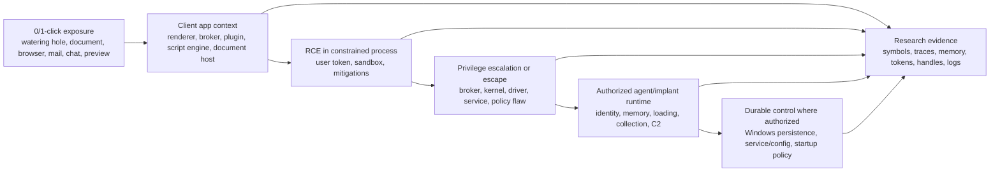
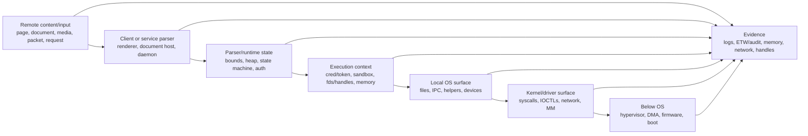

# Security Internals Research: 0/1-Click RCE+PE To Agent

Value Score: 94/100
Role: Security scenario map
Proof Level: Conceptual, evidence-routed

Date: 2026-05-16

Purpose: make the low-level mechanisms that matter to authorized security-internals research explainable at interview, red-team, government/army/B2G, reversing, and platform-research depth. The main scenario is a 0/1-click client-side compromise, such as a watering-hole or content-driven attack path, that reaches RCE plus privilege escalation and then enables an authorized spying/assessment agent to run. Vulnerability research and exploitability triage are useful secondary skills, but the primary focus is the OS security internals that determine what the agent can do, how authority is represented, where state lives, what mitigations constrain it, what persistence means especially on Windows, and what evidence proves the model.

Use this beside:

- [Vulnerability research and exploitation primitives](<vulnerability-research-and-exploitation-primitives.md>)
- [Attacker-relevant structures and components](<attacker-relevant-structures-and-components.md>)
- [Low-level security component map](<../01-comparisons-and-maps/02-low-level-security-component-map.md>)
- [Linux deep-understanding Q&A](<../02-question-banks/01-linux-deep-understanding-qa.md>)
- [Windows deep-understanding Q&A](<../02-question-banks/02-windows-deep-understanding-qa.md>)
- [Hardware and OS security Q&A](<../02-question-banks/05-hardware-security-relationship-qa.md>)

## Offensive Priority Index

The section order below is already close to offensive priority, but use this index when time is limited:

| Score | Read first | Why it matters for offensive low-level research |
|---:|---|---|
| 100 | [Focus Scenario](#focus-scenario), [Scope And Safety Rule](#scope-and-safety-rule), [Security Internals Research Checklist](#security-internals-research-checklist), [Mechanism Index](#mechanism-index) | Sets the RCE -> PE -> agent lifecycle and the questions every mechanism must answer. |
| 100 | Client content, network ingress, parser/heap/resource state | Initial reachability and pre-RCE shaping of memory, resource pressure, parsers, and protocol state. |
| 100-99 | Service identity, object authority, virtual memory, user/kernel transition | Authority, handles/fds, credentials/tokens, mappings, executable bytes, and syscall boundary crossings. |
| 98-97 | Process creation, loader state, path/filesystem resolution, IPC/service boundaries | Child process control, loader abuse, path confusion, broker/service IPC, and impersonation boundaries. |
| 96-95 | Async/lifetime/race state, kernel extension points, credentials/secrets, telemetry/anti-telemetry | High-value PE, persistence, collection, driver, and evidence-control mechanics. |
| 94-91 | Mitigations, containers/sandboxes/virtualization, DMA/device state, boot/firmware trust | Constraints and lower-layer escapes; read deeply when the chain reaches those layers. |

## Focus Scenario

The high-interest chain is:

This file is not organized around "find a bug, write an exploit." It is organized around security internals questions:

- After initial execution, what process, token/cred, sandbox, session, desktop, namespace, and integrity context exists?
- What boundary must be crossed for privilege escalation or sandbox escape?
- Once privileged, what OS objects and policy surfaces define the agent's authority?
- How do memory, loader, IPC, credentials, telemetry, and persistence surfaces actually work?
- Which mechanisms are different on Windows versus Linux?
- Which public research mechanisms should be understood because they explain these boundaries?

For the secondary vulnerability-research track, use [Vulnerability research and exploitation primitives](<vulnerability-research-and-exploitation-primitives.md>). That companion file covers structures of interest, bug classes, primitive quality, mitigation impact, and exploitability constraints without crowding this agent-internals path.

## Scope And Safety Rule

"Remote attacker" here mainly means a remote-origin 0/1-click path into a client process, not only a network daemon. Most low-level mechanisms become relevant only after one of these transitions:

| Stage | What the attacker has | What becomes relevant |
|---:|---|---|
| 0 | Remote content/input only | Browser/document/media/parser state, protocol state, archive/decompression state, auth boundary, heap/resource pressure, path handling. |
| 1 | RCE in a client or service process | Process memory, user token/cred, sandbox/container, same-user files, local IPC, child processes, outbound network, telemetry. |
| 2 | Sandbox escape or privilege escalation | Brokers, privileged helpers, services, drivers, kernel syscalls/ioctls, BPF/io_uring, namespaces/jobs, handle/fd authority, policy flaws. |
| 3 | Privileged user-mode context | Root/admin/SYSTEM/service privileges, credentials/tokens, security products, firewall/proxy policy, service/task/config surfaces, agent runtime choices. |
| 4 | Kernel/driver/hypervisor primitive | PTE/VAD/VMA state, credentials/tokens, callback tables, dispatch tables, telemetry state, DMA mappings, code-integrity state. |
| 5 | Durable control where authorized | Windows services/tasks/WMI/COM/Run keys/driver services; Linux systemd/cron/PAM/NSS/ld.so/SSH; auditability and rollback. |
| 6 | Boot/firmware control | Secure Boot, measured boot, initramfs/boot drivers, TPM-sealed secrets, early telemetry trust, persistence below the OS. |

The correct answer to "can a remote attacker use this?" is therefore not yes/no. It is: through which stage, with which authority, against which object, across which boundary, and with what independent evidence?

This file does not omit a mechanism merely because it is offensive or because it appears in public writeups. If a public technique, CVE analysis, vendor post, conference talk, or official document teaches a reusable OS mechanism, include the mechanism. The boundary is format and intent: capture what the mechanism is, why it matters, what primitive it may create, what mitigations constrain it, and how to validate it in an authorized lab; do not turn the notes into target-specific intrusion playbooks or copy-paste weaponization.

## Security Internals Research Checklist

For each mechanism below, force the answer through these checks:

1. Scenario role: initial client RCE, sandbox escape, privilege escalation, agent runtime, persistence, collection, C2, or telemetry interaction.
2. Entry: how does remote content, client code execution, service code execution, privileged context, or a kernel primitive reach this mechanism?
3. Object: what concrete object or state is acted on?
4. Authority: which token, credential, fd, handle, capability, privilege, policy, or kernel context permits it?
5. Boundary: which trust boundary is crossed?
6. Invariant: what property must stay true for the system to be safe?
7. Agent relevance: why does this matter for running, elevating, isolating, persisting, collecting, communicating, or hiding an authorized agent?
8. Primitive or capability: what capability could result conceptually, such as info leak, arbitrary read/write, object replacement, confused deputy, execution redirection, policy bypass, credential access, session access, persistence opportunity, or telemetry gap?
9. Constraints: what version, configuration, architecture, sandbox, mitigation, timing, memory-layout, permission, signing, or policy condition controls usefulness?
10. Vulnerability angle: if relevant, what bug class violates the invariant? Treat this as secondary unless the interview asks exploitability directly.
11. Reliability: what makes the condition deterministic or fragile in a lab?
12. Evidence: what independent views prove or disprove the hypothesis?
13. Validation: how would an authorized researcher demonstrate impact safely without turning the finding into an uncontrolled weapon?

If an explanation cannot answer scenario role, authority, agent relevance, constraints, and validation, it is not security-internals-research ready.

## Public Research Handling Template

When a mechanism appears in public exploit research, conference material, a vendor advisory, Project Zero-style writeup, public CVE analysis, or official documentation, summarize it in this shape:

| Field | What to capture |
|---|---|
| Targeted mechanism | The OS object or subsystem: parser, allocator, VMA/VAD, fd/handle, token/cred, IOCTL, BPF verifier, WFP callout, loader, path resolver, or driver/DMA path. |
| Reachability | Remote input only, service code execution, privileged service context, local privesc, kernel primitive, or boot/firmware control. |
| Bug class | UAF, OOB read/write, integer overflow, type confusion, TOCTOU, race, refcount error, confused deputy, path confusion, deserialization bug, or missing access check. |
| Conceptual primitive | Info leak, read/write primitive, object replacement, execution redirection, credential/token manipulation, sandbox escape, policy bypass, or telemetry blind spot. |
| Constraints | Version, configuration, architecture, heap shape, timing, namespace/container state, mitigation, signing policy, capability/privilege, or reachable code path. |
| Reliability factors | What makes the condition repeatable or fragile in a lab. |
| Mitigation impact | Which mitigation changes the chain and what primitive remains. |
| Safe validation | How to prove impact in an authorized lab without publishing a turnkey attack path. |
| Evidence | Logs, traces, memory state, crash state, object views, symbols, packet captures, or debugger output that prove the claim. |

This keeps public offensive information useful. The notes should preserve mechanism depth and exploitability reasoning while avoiding target-specific runbooks. For this interview track, every public vulnerability writeup should end with the security-internals takeaway: what it teaches about client context, PE boundary, agent authority, memory/loading, credential/session reach, telemetry, persistence, or platform policy.

## Agent-Enabling Security Internals

After RCE+PE, the core interview question changes from "what bug was used?" to "what does the operating system now allow this agent to do, and through which mechanisms?" Treat the agent as an authorized assessment implant whose behavior must be explainable, bounded, observable, and reversible.

| Agent need | Linux internals to understand | Windows internals to understand | Research question |
|---|---|---|---|
| Execution context | `task_struct`, `cred`, namespaces, cgroups, LSM label, seccomp, fd table, ELF loader | process/thread objects, token, integrity, AppContainer, session/desktop, job, PEB/TEB, loader | What identity, sandbox, session, and loader state does the agent actually run under? |
| Privilege after PE | UID/GID/capabilities, user namespace, setuid/file caps, privileged helpers, kernel creds | admin/SYSTEM, privileges, impersonation, service SID, PPL, UAC split tokens, token handles | What changed after PE: identity, privilege bits, object handles, or kernel state? |
| Memory residency | VMAs, PTEs, anonymous/file-backed memory, `mprotect`, memfd, deleted mappings, COW | VADs, sections, image/private/mapped views, `VirtualProtect`, COW image pages, working set | Where do executable bytes live, what backs them, and what policy permits execution? |
| Module/API discovery | ELF link map, GOT/PLT, `dlopen`, `dlsym`, `/proc`, vDSO | PEB loader lists, API sets, IAT/EAT, `LoadLibrary`, `GetProcAddress`, Native API | How does code discover OS capability without confusing loader metadata with truth? |
| Credential/session access | keyrings, PAM/NSS, Kerberos caches, SSH agent, `/proc`, dumpability, LSM | LSASS, logon sessions, DPAPI, token handles, SSPs, Credential Guard, PPL | Which identity material is accessible under the current authority, and what blocks it? |
| Collection surfaces | files, sockets, procfs/sysfs, input/display subsystems, browser/profile files, auditability | files, registry, browser/profile data, clipboard/UI/session boundaries, ETW visibility, object ACLs | Which user/session resources can be accessed without crossing a new boundary? |
| Communication | sockets, DNS/resolver, proxy env, routes, netns, nftables/eBPF, cgroup network policy | Winsock, WinHTTP/WinINet proxy, DNS client, firewall/WFP, per-process network telemetry | What network path exists from the agent's identity and policy context? |
| Persistence where authorized | systemd, cron, PAM/NSS, ld.so preload, SSH config, shell/profile hooks, kernel modules | SCM services, scheduled tasks, WMI consumers, COM, Run keys, IFEO, service DLLs, driver services | Which configuration object turns data into future execution, under which account and ACL? |
| Telemetry interaction | audit, journald, eBPF/ftrace/perf, LSM logs, `/proc`, cgroups | ETW, Event Log, AMSI, Sysmon, Defender, WFP, minifilters, callbacks | Which actions are visible, which views can disagree, and which gaps are policy versus tampering? |
| Cleanup and reversibility | package/service state, unit files, fds, namespaces, logs, mounts, keyrings | services/tasks/registry/COM/WMI state, handles, modules, ETW events, artifacts | How is authorized testing bounded and rolled back without corrupting the host? |

Windows persistence deserves extra weight because the platform has many first-class configuration objects that legitimately schedule or load code later. For interview purposes, do not memorize "persistence tricks." Explain the internals: which configuration object exists, who can write it, which process consumes it, under which token/session/integrity, from which path, with which signer and ACL, and what telemetry proves the chain. The same shape applies to Linux systemd/cron/PAM/NSS/loader hooks, but Windows exposes more registry-backed and COM/service-manager surfaces that often appear in B2G endpoint work.

## Cross-Platform Remote Chain

The high-value offensive research habit is to trace a remote event as state movement:

- Bytes become packet buffers or socket buffers.
- Packet/stream state becomes protocol state.
- Protocol state becomes authenticated identity, file paths, child process arguments, memory allocations, or database/config changes.
- A service process acts with a concrete credential/token and open fd/handle set.
- Local OS mechanisms decide what the service can reach.
- Kernel, driver, device, and boot mechanisms decide whether lower-level isolation still holds.

## Mechanism Index

| Score | Mechanism family | Linux anchors | Windows anchors | Why remote attackers care |
|---:|---|---|---|---|
| 100 | Client content and exposure surface | browser sandbox, renderer processes, document/media parsers, MIME handlers, desktop session, Flatpak/Snap/container policy | browser renderer/broker, Office/document hosts, mail/preview handlers, Mark-of-the-Web, SmartScreen, AppContainer, integrity levels | The main 0/1-click path starts in client-side content handling, not a server daemon. |
| 100 | Network ingress | NIC DMA rings, NAPI, `sk_buff`, socket queues, netfilter/eBPF | NDIS, AFD/TCPIP, Winsock, WFP callouts | It is the first kernel/user boundary remote bytes cross. |
| 100 | Parser, heap, and resource state | protocol state machines, glibc/musl/jemalloc heaps, fd/socket limits, cgroups | protocol state machines, segment heap/LFH, handle/thread/socket limits, jobs | Most pre-auth remote bugs are parser, allocator, state-machine, or resource-exhaustion failures. |
| 100 | Service identity and authority | `cred`, UID/GID, capabilities, namespaces, LSM labels | tokens, SIDs, privileges, integrity, impersonation, AppContainer, PPL | Remote code inherits the service's authority before it gets anything else. |
| 99 | Object authority | fd table, `struct file`, `f_cred`, inode/dentry | handles, Object Manager, granted access, security descriptors | Existing authority can be reused or leaked without reopening the object. |
| 99 | Virtual memory and executable bytes | VMA, PTE, page cache, anonymous/file-backed/COW pages | VAD, PTE/prototype PTE, sections, image/private/mapped views | Exploits, loaders, JITs, packers, and injected code all become memory state. |
| 98 | User/kernel transition | syscall ABI, `copy_from_user`, compat, seccomp | `ntdll` stubs, Native API, syscall dispatch, probe/capture | Most local escalation paths are bugs at this trust boundary. |
| 98 | Process creation and loader | `fork`/`clone`/`execve`, ELF interpreter, `ld.so`, env/auxv | `CreateProcess`, image sections, PEB, loader, API sets, KnownDLLs | Remote services often launch helpers; loader state can become code selection. |
| 97 | Path and filesystem resolution | `openat2`, dentries, inodes, mount namespaces, symlinks, file caps | Win32/NT paths, file objects, reparse points, share modes, minifilters | Remote uploads, archives, and path parameters often become object confusion. |
| 97 | IPC and service boundaries | Unix sockets, `SCM_RIGHTS`, D-Bus, netlink, Binder on Android | ALPC, RPC, COM, named pipes, SCM | Remote compromise often pivots through local brokers and impersonation. |
| 96 | Async and lifetime state | epoll, signals, futexes, io_uring, userfaultfd, workqueues, RCU | APCs, IOCP, IRPs, DPCs, work items, callbacks, rundown | Races and stale references usually live across time and context. |
| 96 | Kernel extension points | modules, LSM hooks, BPF, netfilter, filesystem ops, driver file ops | drivers, IOCTLs, callbacks, minifilters, WFP, ETW providers | Supported extensibility can be abused or become vulnerable attack surface. |
| 95 | Credentials and secrets | keyrings, PAM/NSS, SSH material, Kerberos caches, `/proc` leaks | LSASS, logon sessions, DPAPI, SSPs, credential providers, SAM/LSA policy | Identity often gives more reach than code execution. |
| 95 | Telemetry and anti-telemetry | audit, journald, eBPF/ftrace/perf, `/proc`, LSM logs | ETW, Event Log, AMSI, Sysmon, WPP, callbacks | Defenders rely on these views; attackers try to blind or confuse them. |
| 94 | Mitigations and policy gates | ASLR/KASLR, NX, SMEP/SMAP/PAN, KPTI, seccomp, lockdown, module signing | DEP, ASLR, CFG, CET, ACG/CIG, PPL, VBS/HVCI, WDAC, driver signing | They decide which primitives remain useful. |
| 93 | Containers and virtualization | namespaces, cgroups, seccomp, LSM, KVM | jobs, silos, AppContainer, Hyper-V, VBS, WSL2 | Remote services often run isolated; the exact boundary decides blast radius. |
| 92 | Device, DMA, and accelerator state | DMA API, IOMMU groups, pinned pages, MMIO, DRM/DMA-BUF, GPU command buffers | MDLs, DMA remapping, WDF/WDM DMA, device ACLs, WDDM/DXGI/D3D shared resources | Drivers, devices, and accelerators can bypass ordinary CPU memory assumptions. |
| 91 | Boot and firmware trust | UEFI, shim, GRUB, initramfs, measured boot, IMA/EVM | UEFI, Secure Boot, Boot Manager, ELAM, BitLocker, TPM, boot drivers | If early trust is lost, later OS evidence is suspect. |

## 100 - Client Content And Exposure Surface

The main scenario starts when remote-controlled content is rendered, previewed, opened, decoded, or handled by a client application. That may be a browser, document editor, mail client, chat client, file previewer, archive utility, media parser, updater, extension host, or scripting runtime. The important internals question is not only "what vulnerability exists?" It is: which process handles the content, which sandbox and broker model applies, what token/cred it has, what mitigations are enabled, and what boundary separates initial code execution from useful agent execution.

### Linux

Linux client-side exposure depends heavily on application packaging and sandboxing. A browser renderer, PDF viewer, media parser, Flatpak/Snap-confined app, desktop portal, or helper process may run with a normal user `cred` but reduced filesystem, device, namespace, seccomp, or LSM reach. The X11/Wayland split, desktop portals, browser profile directories, D-Bus access, user namespaces, and seccomp filters often matter more than raw UID.

Remote relevance:

- Initial code execution often starts with the user's identity but inside a renderer/content sandbox.
- The next security-internals question is broker reachability: which privileged browser, desktop, portal, helper, or service process accepts requests from the content process?
- User data access depends on filesystem namespace, portal policy, LSM/AppArmor/SELinux labels, seccomp, and profile directory permissions.
- PE or sandbox escape may target kernel interfaces, privileged helpers, desktop services, D-Bus endpoints, or runtime/package-manager boundaries.

Deep questions:

- Which process parsed the content, and which `cred`, namespaces, cgroups, seccomp mode, and LSM label did it have?
- Is the content process allowed to access the user's files directly, or only through a broker/portal?
- Which IPC endpoints can it reach: D-Bus, Unix sockets, browser broker, desktop portal, updater, extension host, or helper process?
- Which memory and loader mitigations apply to the content process?
- After PE, what authority actually changed: UID, capabilities, namespace, LSM label, fd set, or kernel state?

Evidence:

- Process tree, `/proc/<pid>/status`, namespace IDs, seccomp mode, LSM labels, cgroup path, open fds, D-Bus/socket access, browser/desktop logs, crash dumps, sandbox policy, package confinement metadata.

### Windows

Windows client-side exposure commonly crosses renderer/broker, document host, preview handler, scripting engine, COM, shell, and SmartScreen/Mark-of-the-Web policy boundaries. A browser renderer might run AppContainer/low-integrity with brokered access. Office, mail, preview handlers, shell extensions, and scripting hosts may involve MotW, Protected View-like policy, COM activation, child processes, and per-application mitigations.

Remote relevance:

- Initial RCE may land in a low-integrity/AppContainer renderer or a medium-integrity document process, which changes the PE problem completely.
- Broker boundaries, COM/RPC endpoints, named pipes, service interfaces, and privileged helpers decide whether the content process can turn code execution into agent execution.
- Mark-of-the-Web, SmartScreen, Attachment Execution Services, Protected View-style behavior, AMSI, and Exploit Protection affect whether content is opened, scanned, or constrained.
- Windows persistence is normally post-PE/admin/SYSTEM or weak-ACL dependent; understanding configuration consumers is more important than memorizing names.

Deep questions:

- Which process parsed or hosted the content: browser renderer, broker, Office process, preview handler, shell, script host, or extension process?
- What token, integrity level, AppContainer/capabilities, session, desktop, job, and mitigation policy apply?
- Which broker or COM/RPC/named-pipe/service endpoint can be reached from that context?
- Did MotW, SmartScreen, Protected View-style policy, AMSI, or Exploit Protection change behavior?
- After PE, what changed: token privileges, integrity, PPL boundary, handle access, service identity, kernel state, or persistence/config write authority?

Evidence:

- Process/token/integrity/AppContainer state, ETW process/image-load events, MotW/Zone.Identifier, SmartScreen/Defender logs, AMSI events, COM/RPC activation evidence, named-pipe access, broker logs, Procmon, WinDbg memory and handle views.

## 100 - Network Ingress

Remote bytes first become device and kernel state before a service parses them.

### Linux

A packet can arrive through NIC DMA into receive buffers, be processed by interrupt/NAPI paths, become an `sk_buff`, pass through driver, XDP/tc/netfilter/eBPF hooks, protocol handlers, socket lookup, and socket receive queues before userspace sees bytes. `sk_buff` is metadata around packet data, not the packet buffer itself. Cloning and shared fragments mean one logical packet path may involve multiple metadata objects pointing at shared data.

Remote relevance:

- Parser bugs can live in user-mode services, kernel protocol code, filesystem-over-network code, or device drivers.
- Packet metadata can carry authority decisions: interface, namespace, mark, conntrack state, LSM/secmark, socket ownership, cgroup, and netfilter verdicts.
- Network namespaces make "the socket table" namespace-relative; a container view is not host truth.
- eBPF/XDP/tc programs can observe, redirect, drop, or classify traffic depending on privilege and attach point.

Deep questions:

- Which layer first owns the bytes: NIC ring, XDP, `sk_buff`, protocol stack, socket queue, TLS library, or application parser?
- What metadata travels with the packet, and what can be changed by offloads, GRO/GSO, NAT, conntrack, BPF, or namespace boundaries?
- Are packet data and metadata shared or cloned? Who owns the lifetime?
- Which policy path accepted the packet: routing, firewall, cgroup/BPF, LSM, socket permission, service auth?
- If `/proc/net`, `ss`, packet capture, conntrack, and service logs disagree, which view is lower level?

Evidence:

- Packet capture, conntrack/nftables state, `ss`, `/proc/net`, cgroup/netns IDs, BPF program inventory, audit logs, kernel logs, service logs, memory dumps.

### Windows

Windows network ingress flows through NIC/NDIS, TCP/IP, AFD and Winsock-facing paths, with WFP layers/callouts available for filtering, inspection, modification, and logging. WFP has layers, filters, sublayers, shims, and callouts; callout functions run when matching filters are hit at a given layer.

Remote relevance:

- WFP callouts and NDIS filters can see or modify traffic before the application receives it.
- A user-mode service's Winsock call is not the whole path; kernel networking, WFP, firewall policy, and ETW providers may all participate.
- A compromised service can change user-level proxy behavior, but firewall/WFP/provider changes usually require higher authority.

Deep questions:

- Which process owns the socket, and which token/integrity/session does it run under?
- Which WFP layer, provider, sublayer, filter, and callout made a decision?
- Did traffic reach the service, get blocked in WFP, get terminated by TLS policy, or get consumed by a broker?
- Is process-level network attribution consistent across ETW, Sysmon, firewall logs, DNS logs, and packet capture?
- Could offloads, loopback, proxying, or injected trusted process behavior explain the evidence?

Evidence:

- ETW network providers, firewall logs, WFP state, DNS client logs, Sysmon network events, packet capture, process handle/socket ownership, loaded NDIS/WFP drivers.

## 100 - Parser, Heap, And Resource State

Most remotely reachable vulnerabilities happen before the attacker has local code execution. At that point the attacker controls bytes, timing, object counts, path strings, protocol ordering, compression ratios, authentication attempts, or malformed file content. The system turns those inputs into parser state, heap allocations, reference counts, queues, worker threads, and resource limits.

### Cross-platform model

Remote input usually passes through layers:

1. Framing: packet, stream, record, message, file, archive member, RPC PDU, HTTP request, SMB message, TLS record, or application command.
2. Decoding: charset, compression, serialization, ASN.1/DER, JSON/XML, image/media format, path normalization, or protocol-specific length/value parsing.
3. State machine: unauthenticated, negotiating, authenticated, authorized, streaming, closing, retrying, or resuming.
4. Allocation: heap object, arena/cache bucket, string buffer, vector, object pool, request context, socket buffer, file buffer, or kernel object.
5. Lifetime: owned by request, connection, session, worker, event loop, cache, async operation, or global registry.
6. Authority: still anonymous, authenticated as a user, service-account local authority, delegated identity, or privileged helper authority.

The failure shape is almost always one of these:

- Size/offset/count confusion: integer overflow, truncation, sign conversion, unit mismatch, length-field trust, or incomplete bounds propagation.
- State-machine confusion: using a message in the wrong phase, failing to reset state after auth/renegotiation/error, or mixing old and new session state.
- Lifetime confusion: object used after free, double completion, stale callback, refcount mistake, cache entry reused under a different authority.
- Type confusion: one parser layer stores an object that another layer later interprets differently.
- Path/identity confusion: one normalized string was checked, but another object was opened or used.
- Resource exhaustion: fds/handles, worker threads, memory, sockets, kernel queues, log volume, CPU, timers, or disk fill.
- Decompression/amplification: small remote input expands into large memory, CPU, file, or network work.
- Boundary confusion: untrusted remote state crosses into a privileged helper, parser plugin, kernel parser, or device path without revalidation.

### Linux

Linux user-mode services may use glibc `malloc`, musl, jemalloc, tcmalloc, language runtimes, custom arenas, or kernel-facing buffers. Allocator details are runtime-specific, but the deep model is stable: remote bytes become heap objects with sizes, metadata, ownership, references, and lifetime. The kernel also has its own allocators and object caches once input reaches sockets, filesystems, BPF, io_uring, netlink, or drivers.

Remote relevance:

- A network service RCE starts as user-mode parser and heap state before it reaches kernel mechanisms.
- Resource limits such as `RLIMIT_NOFILE`, cgroup memory, pids controller, socket backlog, systemd limits, and OOM policy change exploitability and denial-of-service impact.
- Parser plugins, archive extractors, image decoders, language package managers, and helper binaries can move remote content into separate process, filesystem, and loader contexts.

Deep questions:

- Which parser owns each length field, and are units bytes, characters, elements, pages, sectors, or blocks?
- Which allocator owns the object, and does the object lifetime match request, connection, session, cache, or worker lifetime?
- Are object counts bounded by service policy, rlimits, cgroups, or only by system memory?
- Can remote timing trigger cancellation, timeout, half-close, retry, signal, or async cleanup paths?
- Does the parser cross into a privileged helper, setuid binary, namespace boundary, or kernel interface?

Evidence:

- Service crash dumps, ASAN/UBSAN logs in lab, allocator diagnostics, cgroup pressure/oom events, systemd limits, core dumps, request logs, worker thread counts, fd tables, socket queues, perf/eBPF traces, sanitizer reproductions.

### Windows

Windows user-mode services may use the NT heap, segment heap, LFH behavior, COM/RPC allocators, CLR GC, language runtimes, or custom pools. Kernel-mode paths use pool allocations, lookaside-like caches historically, MDLs, IRPs, socket buffers, and driver-specific contexts. Exact heap internals are version-specific; the stable interview model is allocation size, owner, lifetime, reuse, metadata integrity, and mitigation state.

Remote relevance:

- Pre-auth bugs in services, RPC endpoints, HTTP stacks, parsers, archive handlers, media codecs, and brokers become heap/state-machine problems first.
- Job limits, service recovery, memory limits, handle quotas, threadpool behavior, IOCP backlog, and WER/local dump policy affect reliability and evidence.
- COM/RPC and service hosts can parse remote-ish data in one process and execute privileged helper logic in another.

Deep questions:

- Is the bug in user-mode parser state, RPC/COM marshaling, kernel driver parsing, filesystem/network parser, or a broker boundary?
- Which heap/runtime owns the allocation, and which mitigation policy applies to the process?
- Does cancellation, disconnect, async completion, or service recovery change object lifetime?
- Are handles, threads, completion ports, timers, or memory allocations bounded by job/service policy?
- Does the parser's authenticated identity match the token used for the later local operation?

Evidence:

- WER dumps, page heap/Application Verifier in lab, ETW heap/process/thread events where configured, service logs, RPC/COM tracing, IOCP/threadpool behavior, handle counts, job limits, crash bucket, memory dumps, Procmon/Sysmon around helper launch.

## 100 - Service Identity And Authority

The first privilege a remote attacker gets after code execution is the service's authority, not "the machine."

### Linux

Authority is held in `cred`: real/effective/saved IDs, supplementary groups, capabilities, securebits, keyrings, user namespace interpretation, and LSM security blobs. An open file can retain credentials from open time through fields such as `f_cred`, so "current process credentials" and "credentials used by this file object" may differ.

Remote relevance:

- A network daemon with `CAP_NET_ADMIN`, `CAP_DAC_READ_SEARCH`, file capabilities, or root in the initial namespace exposes very different post-RCE surface than an unprivileged daemon.
- User namespace root is not host root. Capabilities are scoped by namespace and bounding sets.
- LSM labels can still confine a process even when UID/capabilities look powerful.
- `no_new_privs`, seccomp, and ambient capabilities shape what child processes can gain.

Deep questions:

- Which credential is effective for this operation: task cred, file open-time cred, fsuid/fsgid, override cred, or LSM subject label?
- Are capabilities in permitted, effective, inheritable, bounding, or ambient sets?
- Is the process in a user namespace, and how does that map to host authority?
- Did authority change through `execve`, setuid, file capabilities, PAM/session setup, `setresuid`, namespace creation, or a bug?
- Which LSM hook would mediate the object operation?

Evidence:

- `/proc/<pid>/status`, `/proc/<pid>/uid_map`, `/proc/<pid>/gid_map`, capability fields, LSM context in `/proc/<pid>/attr/current`, systemd unit settings, audit logs, file capabilities, namespace IDs.

### Windows

Authority is in tokens and object handles. A primary token defines process default identity; a thread can impersonate another token. Tokens contain SIDs, groups, privileges, integrity level, AppContainer/capability state, logon-session data, default DACL, and protection-related context. PPL can block invasive access even from an administrator or SYSTEM context.

Remote relevance:

- A service running as LocalSystem, NetworkService, a domain account, an AppContainer, or a custom low-privilege service account creates different remote blast radius.
- `SeImpersonatePrivilege`, `SeDebugPrivilege`, service SIDs, and token impersonation levels are often more important than the username.
- A remote bug in an impersonating service may be checked as the client for one operation and as the service for another, creating confused-deputy risk.

Deep questions:

- Is the thread impersonating? If so, at what impersonation level?
- Which privileges are present and enabled, and are they relevant to the operation?
- What integrity level and AppContainer/capability SIDs apply?
- Is the target object protected by DACL, MIC, PPL, code-integrity policy, or object-specific rules?
- Did a handle already carry authority, bypassing the need to pass a new open check?

Evidence:

- Token inspection, process integrity, logon session, service account, privilege-enable events, handle tables, object ACLs, PPL/protection state, ETW/Sysmon process and access events.

## 99 - Object Authority: File Descriptors And Handles

Remote compromise often reuses existing authority.

### Linux

A file descriptor indexes a per-process table entry pointing to an open file description, usually a `struct file`. The `struct file` ties together file operations, position/state, flags, private driver data, and credentials captured at open time. It may refer to a regular file, socket, device, pipe, eventfd, epoll instance, pidfd, bpf object, or many other kernel objects.

Remote relevance:

- Inherited fds can give a helper process access it could not open itself.
- `SCM_RIGHTS` can transfer fds across Unix sockets.
- A service may already hold privileged sockets, device fds, namespace fds, pidfds, or memfds.
- Driver `file_operations` can expose complex kernel state behind an fd.

Deep questions:

- Who opened the fd, with which credentials, flags, and namespace view?
- Is authority in the fd itself, in the current credentials, or both?
- Can the fd be inherited across `execve`, or is `FD_CLOEXEC` set?
- Does `file->private_data` point to a lifetime-sensitive object?
- Can async operations still reference the file after close?

Evidence:

- `/proc/<pid>/fd`, `/proc/<pid>/fdinfo`, audit `open`/`execve`, socket peer creds, service manager fd passing, driver state, eBPF/ftrace for file operations.

### Windows

A handle is a per-process table entry to a typed object with a granted access mask. It is not a pointer and not globally meaningful. A duplicated or inherited handle transfers authority. The Object Manager and Security Reference Monitor decide access at open/duplicate time; later operations test the handle.

Remote relevance:

- A service may hold handles to files, sections, tokens, processes, registry keys, ALPC ports, devices, or jobs.
- Handle inheritance can give child processes sensitive authority.
- `DuplicateHandle` can move access across process boundaries if rights permit.
- Device handles plus permissive IOCTLs can turn local driver attack surface into remote-reachable surface through the service.

Deep questions:

- What object type does the handle reference?
- Which access mask was granted, and which later operation checks that bit?
- How was the handle obtained: open, inherit, duplicate, broker, COM/RPC, service startup?
- Is the handle protected from inheritance? Is it duplicated into a less trusted process?
- Does PPL, integrity, callback policy, or object-specific logic add another gate?

Evidence:

- Process Explorer/handle views, WinDbg `!handle`, ETW handle/object events where available, object ACLs, process creation inherited handles, broker logs, Sysmon events.

## 99 - Virtual Memory And Executable Bytes

All code execution eventually becomes virtual memory state.

### Linux

Linux address spaces are described by `mm_struct`, VMAs, page tables, page/folio metadata, anonymous memory, file-backed page cache, and swap/reclaim state. A VMA is policy; a PTE is current translation; a page or folio is physical memory metadata; the page cache is file-backed memory; anonymous pages usually back heap, stack, and COW-private data.

Remote relevance:

- User-mode memory corruption changes process memory before it changes the OS.
- `mmap`, `mprotect`, JITs, `memfd_create`, deleted mapped files, and `MAP_PRIVATE` COW are central to payload and packer triage.
- A service RCE can create executable anonymous memory if policy allows; seccomp/LSM/W^X policy may constrain it.
- Kernel MM bugs often violate VMA/PTE/page/refcount invariants.

Deep questions:

- Is the memory anonymous, file-backed, shared, private COW, memfd-backed, stack, heap, JIT, vdso/vvar, or device-mapped?
- Did bytes become executable through ELF loading, JIT, `mprotect`, `mmap(PROT_EXEC)`, `dlopen`, unpacking, or stale permissions?
- Does `/proc/<pid>/maps` agree with `smaps`, file hashes, deleted file state, and runtime loader link maps?
- Are pages pinned, COWed, reclaimed, swapped, or shared with another process?
- Is the fault path normal demand paging, COW, `SIGSEGV`, or `SIGBUS` due to backing-file state?

Evidence:

- `/proc/<pid>/maps`, `smaps`, `pagemap` where permitted, core dumps, `lsof`, file hashes, perf/eBPF traces, crash registers, allocator state, ELF loader/link-map data.

### Windows

Windows memory analysis starts with VADs, PTEs/prototype PTEs, section objects, control areas/subsections conceptually, image/mapped/private views, commit, working set, and page protections. Image mappings are special section-backed views with loader metadata; modified image pages often become private through COW.

Remote relevance:

- Cross-process injection requires process handle rights, target memory placement, protection changes, and execution redirection.
- Manual mapping, packers, JITs, and shellcode-like staging appear as VAD/section/protection/thread-start evidence.
- Image path and PEB loader list are not ground truth.

Deep questions:

- Is the VAD private, mapped, or image-backed?
- What backs it: file, pagefile, section, image section, or nothing visible?
- Is it committed, resident, shared, copy-on-write, executable, writable, or guarded?
- Does PEB loader state agree with VADs and ETW image-load events?
- Did bytes become executable through PE image mapping, `VirtualProtect`, `MapViewOfFile`, JIT policy, modified image COW, or remote write?

Evidence:

- WinDbg `!address`/`!vad`, VMMap, ETW image-load/process/thread events, module lists, backing file and file ID, private bytes, thread start addresses, memory dumps, code bytes versus clean image.

## 98 - User/Kernel Transition

The user/kernel boundary is a remote attacker's main escalation boundary after service compromise.

### Linux

Syscalls, exceptions, `copy_from_user`, `copy_to_user`, compat paths, ioctls, netlink, procfs/sysfs, eBPF loading, and filesystem operations all parse untrusted user state. `copy_from_user` is not ordinary `memcpy`; user pointers can fault, race, change permissions, point to unexpected layouts, or be invalid halfway through a copy.

Remote relevance:

- A service RCE converts remote input into local syscall and ioctl reachability.
- Compat ABI and variable-size structs add parsing risk.
- Seccomp can reduce reachable syscalls but is not a complete sandbox.

Deep questions:

- Which syscall or ioctl boundary receives attacker-controlled values?
- Are pointers copied once, probed safely, and used after capture, or re-read later?
- Are sizes, flags, alignment, integer arithmetic, and structure versions validated?
- Is object authority checked before lookup/use?
- Does seccomp filter the syscall, and did the filter check architecture and arguments correctly?

Evidence:

- `strace`, audit, seccomp mode/filter metadata, eBPF/ftrace/kprobes, crash oops, KASAN/KCSAN/KFENCE/lockdep, syscall arguments, reproducer minimization.

### Windows

Windows transitions can start at Win32, COM/RPC, service APIs, `kernelbase`, `ntdll` Native API, syscall stubs, and driver dispatch. Kernel code must probe/capture user buffers, validate handles, check granted access, obey caller mode, IRQL, locking, and object lifetime.

Remote relevance:

- Direct syscalls can change user-mode hook visibility but do not bypass kernel Object Manager, memory manager, SRM, or driver validation.
- A compromised service can reach Native APIs, device objects, ALPC/RPC endpoints, and drivers available to its token/handles.
- IOCTLs are a common bridge from user-mode service compromise to kernel driver attack surface.

Deep questions:

- Was the semantic operation Win32, Native API, raw syscall, COM/RPC, ALPC, or driver IOCTL?
- What handle/object was supplied, and what granted access was checked?
- Were user buffers probed, captured, locked through MDLs, double-buffered, or used as raw user pointers?
- Is the path running at PASSIVE_LEVEL, APC_LEVEL, DISPATCH_LEVEL, ISR/DPC, or arbitrary context?
- Can cancellation, completion, or process exit race the operation?

Evidence:

- ETW/Sysmon/Procmon, WinDbg stack and `!irp`, driver verifier, IOCTL traces, handle tables, crash dumps, WER, device ACLs, symbol-backed structure inspection.

## 98 - Process Creation And Loader State

Remote services often turn input into new processes or module loads.

### Linux

`fork`/`clone` create tasks; `execve` replaces the current image; dynamic ELF execution maps the interpreter and starts `ld-linux`; the initial stack carries argv, envp, and auxv. Environment variables, current directory, inherited fds, rlimits, `no_new_privs`, file capabilities, setuid bits, and LSM rules shape the transition.

Remote relevance:

- CGI-style services, wrappers, build systems, archive processors, image converters, and automation agents often let remote input influence argv/env/path.
- Dynamic-loader variables such as `LD_PRELOAD` are stripped in secure-exec contexts but remain relevant in unsafe wrappers and unprivileged helper chains.
- `FD_CLOEXEC` mistakes leak authority to children.

Deep questions:

- Which state crosses `execve`: argv, env, cwd, fds, rlimits, signal dispositions, credentials, namespaces?
- Did credentials change due to setuid, setgid, file capabilities, or LSM transition?
- Did `no_new_privs` block privilege gain?
- Does the binary use interpreter, `rpath`, `runpath`, `ld.so.cache`, preload, PAM/NSS, plugins, or language runtime search paths?
- Are inherited fds more dangerous than command-line arguments?

Evidence:

- audit `execve`, `/proc/<pid>/cmdline`, `/proc/<pid>/environ`, `/proc/<pid>/fd`, service unit files, loader debug logs in lab, file capabilities, `ldd`/ELF metadata, shell wrapper review.

### Windows

`CreateProcess` creates a process object and initial thread around an image section. Kernel creation is followed by user-mode loader work: PEB/process parameters, `ntdll`, API-set mapping, KnownDLLs, dependency loading, import resolution, relocations, TLS callbacks, `DllMain`, and CRT startup. `ShellExecuteEx` adds shell verbs, file associations, elevation, App Paths, URL handlers, and shell policy.

Remote relevance:

- Services launch helpers with selected token, environment, current directory, inherited handles, mitigation policy, and parent-process attributes.
- DLL search order, side-by-side manifests, App Paths, COM registration, KnownDLLs, and API sets decide which code loads.
- Process command line and PEB state are telemetry but can be tampered with from user mode.

Deep questions:

- Was the process started directly, through SCM, shell, COM, scheduled task, WMI, or a broker?
- Which token was used, and were handles inherited?
- Which mitigation policies were set at creation?
- Which DLL path was selected, and did KnownDLLs/API-set redirection apply?
- Did code run before entry point through TLS callbacks, `DllMain`, CLR startup, or script engine load?

Evidence:

- ETW process/image-load events, Sysmon, Procmon, PEB/process parameters, handle inheritance, module paths/signers, KnownDLLs, manifests, registry App Paths/COM, service/task/WMI logs.

## 97 - Path And Filesystem Resolution

Remote paths are not strings. They become object graph operations.

### Linux

Path resolution crosses directory fds, current working directory, mount namespace, symlinks, bind mounts, magic links, permissions, LSM hooks, and filesystem-specific behavior. `openat` and `openat2` exist because ambient current-directory string resolution is dangerous. Inodes, dentries, superblocks, mount points, file descriptors, and file capabilities are the real objects.

Remote relevance:

- Upload paths, archive extraction, symlink races, temp files, plugin directories, and config writes often become local privilege or code-loading paths.
- `rename`, `link`, `unlink`, `O_TMPFILE`, hardlinks, bind mounts, and deleted-but-open files can make path evidence misleading.
- A process can keep reading or executing an unlinked file through an fd or mapping.

Deep questions:

- Was the operation path-based or fd-based?
- Which directory fd and mount namespace anchored resolution?
- Were symlinks, hardlinks, bind mounts, procfs magic links, or overlayfs involved?
- Did code use `readlink`/`readlinkat` output as trusted identity, and did it handle missing NUL termination and truncation?
- Was the object checked and later reopened by path, creating TOCTOU?
- Did file capabilities, setuid bits, mount flags, LSM labels, or noexec/nosuid change execution authority?

Evidence:

- audit file events, `name_to_handle_at` where applicable, inode/device IDs, `/proc/<pid>/fd`, mount namespace, filesystem journal, file hashes, LSM logs, service temp directories and ACLs.

### Windows

Windows path resolution includes Win32 normalization, DOS device links, NT object paths, reparse points, file IDs, object handles, share modes, delete disposition, oplocks, minifilters, and filesystem drivers. A `FILE_OBJECT` is an open instance with state, not just a path.

Remote relevance:

- Upload paths, service working directories, DLL search, installer extraction, symbolic links/reparse points, hardlinks, and named pipe paths can create object confusion.
- Checking a path and later opening it again is weaker than checking and holding the file object/handle.
- Mapped image sections can keep code alive even after file rename/delete behavior changes.

Deep questions:

- Did the code validate a string path, a final file object, a file ID, a handle, or a section object?
- Did Win32 normalization differ from the NT path used by the kernel?
- Could reparse points, hardlinks, short names, alternate data streams, oplocks, or share modes alter the check/use relationship?
- Which minifilter saw or changed the operation?
- Does the mapped image still point to the expected file identity?

Evidence:

- Procmon stack/path data, USN journal, ETW file events, file ID/volume ID, handles, share mode, reparse data, minifilter list, image section mappings, signer/hash.

## 97 - IPC And Service Boundaries

Remote compromise often pivots by asking a local service to do something.

### Linux

Unix sockets, `SCM_RIGHTS`, D-Bus, systemd activation sockets, netlink, abstract namespace sockets, procfs/sysfs, Binder on Android, and local TCP listeners all expose local authority boundaries. Peer credentials and LSM labels matter.

Remote relevance:

- A network service may have access to local admin sockets or service-manager APIs.
- fd passing can move authority between processes.
- D-Bus or netlink methods can become confused-deputy surfaces if caller identity and object authority are confused.

Deep questions:

- Who is the server, who is the client, and how is peer identity authenticated?
- Are credentials checked at connect time, message time, or object use time?
- Are fds or namespace handles passed?
- Does the broker act with its own authority or the client's authority?
- Is the protocol state machine reentrant or async?

Evidence:

- Socket paths and permissions, `ss -x`, `lsof`, D-Bus policy, systemd units/sockets, audit logs, peer credentials, passed fd inventory, service logs.

### Windows

ALPC, RPC, COM, named pipes, SCM, WMI, Task Scheduler, services, and broker processes define many Windows privilege boundaries. Impersonation is central: a server may temporarily use a client token, or it may accidentally act with service authority.

Remote relevance:

- A remote service compromise can call local RPC/COM endpoints available to its token.
- Named pipe and RPC impersonation mistakes can turn client/server identity confusion into privilege movement.
- COM activation and registry-backed service configuration can become persistence or code-loading paths.
- Named pipe paths are file-like enough that path-consuming privileged code can accidentally be driven toward `\\.\pipe\...` or remote-style `\\host\pipe\...` endpoints.
- RPC may be local over ALPC, named-pipe-backed over SMB, or TCP-backed through endpoint-mapper-discovered dynamic endpoints, so "RPC" alone does not say whether the surface is local, remote, authenticated, or impersonable.
- On Windows 11, the IPC mechanisms remain relevant, but exact endpoint ACLs, endpoint availability, private layouts, and hardening effects must be verified on the analyzed build.

Deep questions:

- Which endpoint was contacted, and what ACL protects it?
- Did the server impersonate, and at which level?
- Was the access check made while impersonating but the action performed after revert?
- Did the client intentionally limit impersonation with pipe SQOS or RPC QoS?
- Did the privileged server check `ImpersonateNamedPipeClient`/`RpcImpersonateClient` failure before doing work?
- Can messages transfer handles, ALPC data views, or other resources that need receiver-side cleanup?
- Which COM CLSID/AppID/LocalServer/InprocServer registration controls activation?
- Is the service boundary session-, desktop-, integrity-, or AppContainer-sensitive?

Evidence:

- RPC/COM registration, endpoint ACLs, named pipe security descriptors, service logs, ETW, token impersonation state, process tree, registry changes, ALPC port names where observable, endpoint mapper output, pipe handles, and ALPC/RPC/pipe imports.

Detailed Windows IPC companion: [Windows IPC named pipes, RPC, ALPC, and security](<windows-ipc-named-pipes-rpc-alpc-security.md>).

## 96 - Async, Lifetime, And Race State

Most hard bugs are temporal: the object changed between check and use.

### Linux

Relevant mechanisms include epoll, signals, futexes, timers, workqueues, softirqs, task work, RCU, refcounts, `userfaultfd`, io_uring requests/workers, registered files/buffers, page pins, and cancellation paths.

Remote relevance:

- Remote input can shape timing through connection churn, slow reads, request cancellation, resource exhaustion, protocol pipelining, decompression, or filesystem latency.
- After service RCE, local race-shaping primitives such as futexes, `userfaultfd`, signals, and io_uring become available if policy permits.
- Kernel bugs often live where object lifetime crosses syscall return, async worker completion, RCU grace periods, or close/cancel.

Deep questions:

- Which object can outlive the syscall or request?
- Which reference is supposed to keep it alive?
- Which lock protects state, and which mechanism protects lifetime?
- Can cancellation, timeout, signal delivery, close, process exit, or namespace teardown race use?
- Are pages pinned or registered longer than the owning mapping expects?

Evidence:

- KASAN/KCSAN/KFENCE, lockdep, ftrace/eBPF timing, io_uring ring state, fdinfo, perf sched traces, crash stack, refcount warnings, RCU stall logs.

### Windows

Relevant mechanisms include APCs, alertable waits, IOCP, overlapped I/O, IRPs, cancel routines, completion routines, DPCs, work items, timers, rundown protection, object references, kernel callbacks, threadpool callbacks, and COM/RPC async calls.

Remote relevance:

- Network servers use async I/O heavily. Remote disconnects, timeouts, cancellation, malformed request sequences, and backpressure can reach rare paths.
- Driver bugs frequently appear in IRP lifetime, cancel/completion races, MDL lifetime, user-buffer lifetime, and device removal.
- APC/thread-context tricks require thread handles or in-process code, but remote RCE can create that local context.

Deep questions:

- Which IRP/request owns the buffer and completion state?
- Can completion run after the initiating thread exits?
- Is the code at PASSIVE_LEVEL or DISPATCH_LEVEL, and can it touch pageable memory?
- Does cancellation serialize with completion?
- Does rundown protection prevent callbacks after unregister/unload?

Evidence:

- WinDbg `!irp`, `!thread`, driver verifier, ETW I/O events, crash dumps, pool tags, object reference traces, stack traces, device removal logs.

## 96 - Kernel Extension Points And Drivers

Extension points are legitimate. That is why they are powerful.

### Linux

Kernel modules, `file_operations`, netfilter hooks, LSM hooks, eBPF programs/maps/helpers, kprobes/uprobes/tracepoints, cgroup hooks, filesystem operations, device ioctls, sysfs/procfs handlers, and BPF LSM all expose policy or dispatch points.

Remote relevance:

- A service RCE can reach kernel interfaces allowed by its credentials and seccomp profile.
- Privileged or capability-bearing services can load BPF, manage network policy, access devices, or control namespaces.
- Vulnerabilities in drivers, BPF verifier/helper paths, filesystem parsers, and ioctls can become post-RCE escalation paths.

Deep questions:

- Is this extension point an intended policy hook, observability hook, or driver dispatch path?
- Who is allowed to register, attach, load, or open it?
- Does it run in process, softirq, hardirq, workqueue, or RCU context?
- What object lifetime does the hook assume?
- How is ownership visible: module, BPF program, map pin, filesystem type, device node, cgroup?

Evidence:

- `lsmod`, `/sys/module`, bpftool program/map inventory, tracefs, nftables/netfilter state, `/dev` ACLs, sysfs/procfs entries, audit logs, kernel taint, module signing/lockdown state.

### Windows

Windows extension points include kernel drivers, device objects, IOCTLs, minifilters, WFP callouts, process/thread/image/registry/object callbacks, ETW providers, AMSI providers, SSPs, credential providers, COM servers, shell extensions, and service plugins.

Remote relevance:

- A remote service may be able to open device objects or trigger vulnerable IOCTL paths.
- Admin/SYSTEM compromise can install or reconfigure drivers, minifilters, WFP providers, callbacks, services, COM, or ETW/AMSI components.
- BYOVD-style risk is about a trusted signed driver exposing unsafe kernel functionality.

Deep questions:

- Which driver owns the dispatch, callback, filter, provider, or callout?
- Is it signed, expected, at the right altitude/layer, and loaded from a trusted path?
- What device ACL and IOCTL access bits gate user access?
- Which buffering method is used: buffered, direct/MDL, or neither?
- Does PatchGuard, HVCI/VBS, WDAC, or driver blocklist policy constrain the behavior?

Evidence:

- Driver list/signers, service registry, minifilter altitude, WFP providers/layers/callouts, callback enumeration where possible, device object ACLs, IOCTL traces, Code Integrity logs, ETW provider state.

## 95 - Credentials And Secrets

Remote attackers often want identity more than persistence.

### Linux

Credential-related mechanisms include process `cred`, Linux keyrings, PAM, NSS, Kerberos caches, SSH agents/keys, browser secrets, environment leaks, `/proc` visibility, core dumps, container secrets, service account files, and LSM confinement.

Remote relevance:

- Service RCE can read same-user secrets unless DAC/LSM/container policy prevents it.
- Dumpability, ptrace scope, procfs mount options, core dump policy, and secret file permissions determine exposure.
- PAM/NSS plugins and `ld.so` preload are trusted paths for credential handling and name resolution.

Deep questions:

- Which identity owns the secret, and which process can read it?
- Is the secret in memory, file, keyring, environment, fd, tmpfs, agent socket, or kernel key object?
- Does dumpability or ptrace policy allow memory inspection?
- Is access mediated by DAC only, or also LSM, namespace, cgroup, and service manager policy?
- Can a child process inherit the secret through env/fd/socket?

Evidence:

- File permissions, keyring state, process environment, fd table, `/proc` mount options, core dump settings, audit logs, LSM denials, service secret configuration, socket ownership.

### Windows

Credential mechanisms include tokens, logon sessions, LSASS, SSPs/authentication packages, credential providers, DPAPI, SAM/LSA policy, Kerberos/NTLM state, browser/Windows vaults, service account secrets, and PPL/Credential Guard.

Remote relevance:

- Service RCE can use the service token and access same-user secrets.
- Admin/SYSTEM still may be constrained by PPL, Credential Guard, ACLs, and protected process policy.
- Credential theft often begins as handle access, module injection/loading, memory read, or RPC/SSPI misuse.

Deep questions:

- Which logon session and token owns the credential material?
- Is LSASS protected by PPL or Credential Guard?
- Which process has handles to LSASS, tokens, credential stores, browser secrets, or DPAPI material?
- Are unexpected SSPs, authentication packages, credential providers, or security support modules loaded?
- Is access event telemetry present or missing?

Evidence:

- LSASS protection state, handle access events, ETW/Sysmon, loaded modules, LSA/SSP registry keys, logon events, DPAPI masterkey context, Credential Guard/VBS state, process memory triage.

## 95 - Telemetry And Anti-Telemetry

Telemetry is another low-level mechanism because it determines what can be proven.

### Linux

Important telemetry mechanisms include audit, journald/syslog, eBPF tracing, ftrace, perf, kprobes/uprobes, tracepoints, LSM denials, `/proc`, `/sys`, cgroup accounting, netfilter logs, conntrack, core dumps, crash dumps, KASAN/KCSAN/KFENCE, and kernel oops logs.

Remote relevance:

- A compromised service may delete or alter user-writable logs, but kernel/audit visibility depends on policy and privilege.
- Root can change audit rules, BPF/perf permissions, kernel log access, and module/BPF visibility.
- Kernel primitives can falsify state below normal telemetry.

Deep questions:

- Which layer should have produced evidence?
- Was telemetry disabled by policy, missing due to configuration, or tampered with?
- Are `/proc`, audit, network, memory, and filesystem views consistent?
- Does a container see only its namespace while host telemetry sees more?
- Are loaded BPF programs or kprobes legitimate observability or suspicious interception?

Evidence:

- audit rules/logs, journald, tracefs, bpftool inventory, `/proc` cross-view checks, conntrack/nftables, crash dumps, kernel taint, LSM logs.

### Windows

Important telemetry mechanisms include ETW providers/sessions, Windows Event Log, Sysmon, AMSI, WPP, WMI eventing, Procmon-style stack capture, minifilter/WFP/callback telemetry, Defender logs, Code Integrity logs, crash dumps, and memory forensics.

Remote relevance:

- User-mode patching can blind same-process AMSI/ETW paths but should not be confused with kernel-wide invisibility.
- Admin/SYSTEM can change policies, exclusions, sessions, logging, and providers.
- Kernel tampering can create gaps between memory reality and event views.

Deep questions:

- Which provider or subsystem should report this action?
- Did the event fail because policy disabled it, provider was absent, process was protected, or code tampered with instrumentation?
- Do ETW, Sysmon, Procmon, memory, handles, and network evidence agree?
- Are AMSI/ETW bypass claims contradicted by lower-level evidence?
- Which logs are generated before versus after process creation, image load, script scan, or network connect?

Evidence:

- ETW sessions/providers, Event Log channels, Sysmon, Defender/AMSI logs, Code Integrity events, WFP/firewall logs, memory dump, loaded modules, provider registration state.

## 94 - Mitigations And Policy Gates

Mitigations do not remove bugs. They change primitive economics.

### Linux

Important mechanisms include ASLR/KASLR, NX, SMEP/SMAP/PAN/PXN, KPTI, stack canaries, slab freelist hardening/randomization, hardened usercopy, refcount hardening, CFI where enabled, module signing, lockdown, IMA/EVM, seccomp, LSM policy, `no_new_privs`, BPF restrictions, `kptr_restrict`, `dmesg_restrict`, and perf/BPF sysctls.

Remote relevance:

- Remote user-mode bugs may be stopped by NX/ASLR/CFI/sandbox policy.
- Post-RCE kernel attack surface depends on seccomp, capabilities, namespaces, LSM, and sysctls.
- Root-level policy changes can weaken the environment; kernel primitives can bypass policy directly.

Deep questions:

- Which primitive does the mitigation frustrate: code injection, info leak, arbitrary write, control-flow hijack, user-pointer abuse, module load, BPF use, or kernel pointer disclosure?
- Is the mitigation build-time, boot-time, sysctl, per-process, per-binary, per-namespace, or hardware-backed?
- Can the service change it for itself or children, or does it need root?
- Does container policy add or remove constraints?
- Is the observed exploit chain relying on data-only state rather than control flow?

Evidence:

- Kernel config, boot args, sysctls, `/proc/<pid>/status`, seccomp mode, LSM state, module signature/lockdown state, crash addresses, memory permissions, sanitizer findings.

### Windows

Important mechanisms include DEP/NX, ASLR, CFG/XFG, CET shadow stacks/IBT where available, ACG, CIG, process mitigation policy, PPL, AppContainer, integrity levels, WDAC/App Control, Smart App Control, driver signing, vulnerable-driver blocklist, PatchGuard, VBS/HVCI, Credential Guard, KDP-like data protections where applicable, and Exploit Protection policy.

Remote relevance:

- Process mitigations shape exploitability inside a service.
- PPL/Credential Guard constrain post-compromise credential access.
- Driver signing/HVCI/PatchGuard change kernel persistence and tamper assumptions.
- Admin can set or weaken some policies, but hardware/hypervisor-backed enforcement may still matter.

Deep questions:

- Which mitigation is compiler-inserted, loader-enforced, memory-manager-enforced, kernel-enforced, or hypervisor-backed?
- Is the policy per-process, per-image, system-wide, or protected-process-specific?
- Does the process allow dynamic code, unsigned image loads, or non-CFG modules?
- Does the attack require changing executable memory, indirect call targets, token state, driver state, or protected process access?
- Are code-integrity failures logged?

Evidence:

- Process mitigation policy, Exploit Protection settings, Code Integrity logs, VBS/HVCI state, PPL state, loaded driver signers/blocklist, image-load failures, ETW/Sysmon, WinDbg process flags.

## 93 - Containers, Sandboxes, And Virtualization

Isolation is a composition, not a magic wrapper.

### Linux

Containers combine namespaces, cgroups, capabilities, seccomp, LSM, mount policy, device exposure, user namespaces, filesystem layers, runtime configuration, and shared-kernel risk. KVM/VMs add a hypervisor boundary.

Remote relevance:

- Most exposed Linux services run in some isolation layer.
- Root inside a user namespace or container may not be host root, but kernel attack surface is still shared unless a VM boundary exists.
- Device mounts, Docker socket access, hostPath volumes, privileged containers, broad capabilities, and weak seccomp profiles change the answer.

Deep questions:

- Which namespaces are active, and what do they actually isolate?
- Which capabilities remain inside the effective and bounding sets?
- Which devices, mounts, sockets, cgroups, and host paths are exposed?
- Is seccomp filtering syscalls, and what LSM domain applies?
- Is this a container escape, namespace escape, runtime misconfiguration, or host-kernel exploit?

Evidence:

- namespace IDs, cgroup paths/controllers, `/proc/self/status`, mounts, device nodes, runtime config, seccomp profile, LSM labels, container logs, host audit.

### Windows

Windows isolation mechanisms include AppContainer, integrity levels, jobs, silos/server containers, Hyper-V containers, VBS trustlets, WDAG-style containers, service SIDs, sessions/window stations/desktops, and WSL2/Hyper-V boundaries.

Remote relevance:

- A compromised Windows service may be in a job, AppContainer, session, or container-like silo.
- AppContainer/capabilities decide resource reach; jobs constrain process creation/lifetime; Hyper-V boundaries are stronger than process-only boundaries.
- VBS/HVCI protects some security state from the normal kernel.

Deep questions:

- Is the process AppContainer, low integrity, service SID-constrained, job-constrained, or PPL?
- Which capability SIDs grant access?
- Does the job restrict child processes, UI, handles, or breakaway?
- Is the workload in a silo/container or VM-backed boundary?
- Does Hyper-V/VBS own a lower-level truth than the normal kernel?

Evidence:

- token AppContainer/capabilities, integrity level, job object state, service SID, session/desktop, container/silo indicators, Hyper-V/VBS/HVCI state, ETW/container logs.

## 92 - Device, DMA, And Physical Memory State

Remote attackers usually reach devices through drivers, but the hardware boundary still matters.

### Linux

Relevant mechanisms include device files, driver `file_operations`, ioctls, DMA API, IOMMU groups, VFIO, pinned pages/GUP, MMIO mappings, PCIe BARs, firmware, block/network queues, and udev/systemd device permissions.

Remote relevance:

- A service with access to `/dev` nodes may reach powerful driver operations.
- Root or container misconfiguration may expose host devices.
- DMA bugs can corrupt memory outside ordinary CPU permission checks if IOMMU policy or mapping lifetime fails.

Deep questions:

- Which device node, driver, and file operation were reached?
- What credential/cgroup/device policy allowed access?
- Are user pages pinned, mapped for DMA, and unmapped at the right time?
- Is the device in an IOMMU group with other devices?
- Can firmware or device state outlive process cleanup?

Evidence:

- `/dev` permissions, udev rules, cgroup device policy, IOMMU group layout, driver logs, DMA API debug, pinned page indicators, kernel crash, PCI device inventory.

### Windows

Relevant mechanisms include device objects, symbolic links, device ACLs, IOCTLs, MDLs, DMA remapping, WDF/WDM DMA, map registers, MMIO, NDIS/storage queues, vulnerable signed drivers, and Plug and Play state.

Remote relevance:

- A compromised service can open device symbolic links allowed to its token.
- Bad device ACLs or `FILE_ANY_ACCESS` IOCTLs enlarge reach.
- MDL/direct I/O and `METHOD_NEITHER` bugs are classic driver trust-boundary problems.

Deep questions:

- Which device object and symbolic link are exposed?
- Does the security descriptor allow this service account?
- Does the IOCTL require read/write access or `FILE_ANY_ACCESS`?
- Does the driver use buffered, direct, or neither I/O?
- Are MDLs locked, mapped, and released correctly? Is DMA remapping active?

Evidence:

- device object ACLs, driver signer/path, IOCTL definitions/traces, WinDbg `!drvobj`/`!devobj`/`!irp`, Driver Verifier, Code Integrity logs, DMA/remapping policy, crash dumps.

### GPU, Accelerators, And Shared Device Memory

Relevant mechanisms include GPU command buffers, shader compilers, media decode/encode engines, ML/compute APIs, shared graphics resources, DMA-BUF on Linux, WDDM/DXGI/D3D shared resources on Windows, sync fences, GPU schedulers, user-mode drivers, kernel-mode display drivers, and browser GPU processes.

Remote relevance:

- Browser WebGL/WebGPU, media decoding, video conferencing, remote desktop, and ML inference can feed attacker-controlled data into GPU-adjacent parsers, compilers, and shared buffers.
- GPU stacks often split authority across a sandboxed client, a broker/GPU process, user-mode driver, kernel driver, firmware, and hardware queues.
- Shared CPU/GPU memory can become an information leak or lifetime bug if buffers are reused, imported, exported, fenced, or zeroed incorrectly.
- GPU bugs are often useful for sandbox escape because the renderer may have less authority than the GPU service or graphics driver path.

Deep questions:

- Which process owns the graphics or accelerator service, and what sandbox boundary separates it from the remote content process?
- Are shared handles, DMA-BUF fds, fences, and resource lifetimes validated at import/export time?
- Does the stack zero buffers before reuse across processes, contexts, users, or VMs?
- Are shader/compiler inputs treated as untrusted programs with verifier-style checks?
- Can device reset, context loss, cancellation, or timeout paths race cleanup?

Evidence:

- browser GPU-process logs, graphics-driver crashes, kernel `drm`/WDDM events, GPU hang/reset telemetry, shared-resource handles/fds, DMA-BUF exporters/importers, ETW graphics providers, crash dumps, and unusual media/GPU workload timing.

## 91 - Boot And Firmware Trust

Boot trust determines whether OS-level evidence starts from a trustworthy base.

### Linux

Relevant mechanisms include UEFI Secure Boot, shim, GRUB, kernel command line, initramfs, module signing, lockdown, IMA/EVM appraisal/measurement, TPM measured boot, disk encryption, early userspace, and boot services.

Remote relevance:

- Remote attackers usually reach boot state only after root/admin or firmware compromise.
- Boot policy affects whether later module loading, kexec, kernel memory access, and unsigned code are allowed.
- Compromised initramfs or early boot components can hide before normal services start.

Deep questions:

- What verified the boot chain, and what was only measured?
- Are kernel command line, initramfs, modules, and firmware measured or appraised?
- Is lockdown active, and which actions does it restrict?
- Are TPM PCRs tied to disk-unlock or attestation policy?
- Can normal logs be trusted if early boot was compromised?

Evidence:

- Secure Boot state, TPM event log/PCRs, kernel command line, initramfs contents, module signature state, IMA/EVM logs, boot journal, disk encryption policy.

### Windows

Relevant mechanisms include UEFI Secure Boot, Windows Boot Manager, measured boot, TPM PCRs, BitLocker sealing, ELAM, boot-start drivers, Code Integrity, WDAC, HVCI/VBS, driver signing, and recovery configuration.

Remote relevance:

- Remote reach is usually post-admin/SYSTEM or firmware-level, but boot trust constrains durable kernel persistence.
- BitLocker and measured boot can bind secrets to expected boot state.
- ELAM and Code Integrity influence which early drivers and policies run before normal EDR.

Deep questions:

- Which boot components are verified versus measured?
- Are BitLocker keys sealed to expected PCRs?
- Which boot-start drivers loaded before ordinary telemetry?
- Is HVCI/VBS active, and does CI policy block unsigned kernel code?
- Did recovery/debug/test-signing settings alter trust?

Evidence:

- Secure Boot and BitLocker status, TPM event log, Code Integrity events, ELAM logs, boot driver list, BCD settings, HVCI/VBS state, memory forensics.

## RCE+PE-To-Agent Drill Questions

Use these as final self-tests for security-internals interviews. A strong answer must name scenario role, object, authority, boundary, invariant, agent relevance, constraints, mitigation impact, validation, and evidence. Bug class and exploitability details are secondary unless the question explicitly asks how the initial RCE or PE happened.

1. A watering-hole page or document gives initial code execution in a client process. Explain the client process context: token/cred, sandbox, renderer/broker split, session/desktop or namespace, memory permissions, loader state, and telemetry.
2. Initial code execution needs privilege escalation. Compare the internals paths: broker/confused deputy, privileged helper/service, driver/IOCTL, kernel syscall surface, container escape, and policy misconfiguration.
3. RCE becomes an agent process. Explain process creation, inherited fd/handle state, environment, current directory, loader/module resolution, mitigation policy, and token/cred choice on Linux and Windows.
4. The agent has executable memory not backed by a normal module. Explain VMA/VAD, PTE, section/mapping, COW, JIT/packer/manual-map explanations, and what proves control flow reaches the region.
5. The agent wants user/session visibility. Explain Windows session/window-station/desktop/integrity/UIAccess boundaries and Linux display/session/input/profile-file boundaries without assuming root/SYSTEM means everything is accessible.
6. The agent wants credential or identity material. Explain Linux `cred`, keyrings, PAM/NSS/Kerberos/SSH-agent surfaces and Windows token/logon-session/LSASS/DPAPI/PPL/Credential Guard surfaces.
7. The agent needs communication. Explain resolver/proxy/routing/firewall/WFP/netfilter/eBPF/cgroup policy and how per-process or namespace network attribution works.
8. Windows persistence is authorized for a test. Explain SCM services, scheduled tasks, WMI consumers, COM, Run keys, IFEO, service DLLs, and driver services as configuration-to-execution mechanisms, including writer ACL, consumer process, token, trigger, path, signer, and telemetry.
9. Linux durability is authorized for a test. Explain systemd units/timers, cron, PAM/NSS, ld.so preload, SSH/profile hooks, package hooks, kernel modules, and why each is a policy/configuration surface rather than just "a file."
10. Security telemetry reacts to the agent. Explain ETW/AMSI/Sysmon/Defender/WFP/minifilter visibility on Windows and audit/eBPF/ftrace/perf/journald/LSM visibility on Linux, including which gaps are normal policy gaps versus tampering.
11. The agent is inside a sandbox/container. Explain namespace/cgroup/seccomp/LSM/capability state on Linux and AppContainer/job/silo/Hyper-V state on Windows, then classify whether the next research question is sandbox escape, host-kernel exploit, runtime misconfiguration, or credential pivot.
12. A boot-integrity or kernel-integrity boundary matters. Explain why this implies later-stage authority, what OS/firmware state controls durable trust, and how Secure Boot/measured boot/TPM/HVCI/VBS/lockdown/IMA affect the agent model.

## Source Pointers

Use current primary documentation when exact behavior matters:

- Linux kernel credentials: <https://docs.kernel.org/security/credentials.html>
- Linux `sk_buff`: <https://docs.kernel.org/networking/skbuff.html>
- Linux seccomp filter: <https://docs.kernel.org/userspace-api/seccomp_filter.html>
- Linux LSM usage: <https://docs.kernel.org/admin-guide/LSM/index.html>
- Linux userfaultfd: <https://docs.kernel.org/admin-guide/mm/userfaultfd.html>
- Microsoft access control overview: <https://learn.microsoft.com/en-us/windows/security/identity-protection/access-control/access-control>
- Microsoft process security and access rights: <https://learn.microsoft.com/en-us/windows/win32/procthread/process-security-and-access-rights>
- Microsoft Windows security model for driver developers: <https://learn.microsoft.com/en-us/windows-hardware/drivers/driversecurity/windows-security-model>
- Microsoft IOCTL buffering and `METHOD_NEITHER`: <https://learn.microsoft.com/en-us/windows-hardware/drivers/kernel/using-neither-buffered-nor-direct-i-o>
- Microsoft WFP operation: <https://learn.microsoft.com/en-us/windows/win32/fwp/basic-operation>
- Microsoft ETW for drivers: <https://learn.microsoft.com/en-us/windows-hardware/drivers/devtest/event-tracing-for-windows--etw->
- Microsoft exploit protection reference: <https://learn.microsoft.com/en-us/defender-endpoint/exploit-protection-reference>

## What This File Provides And Does Not Provide

Provides:

- Security-internals mechanism depth for 0/1-click RCE+PE-to-agent scenarios.
- Public-source mechanism summaries and source pointers.
- Agent-enabling internals: authority, sessions, memory, loaders, credentials, telemetry, communication, and persistence where authorized.
- Secondary bug-class, primitive, reachability, constraints, mitigation, reliability, and lab-validation reasoning.
- Cross-platform comparisons between Linux and Windows.
- Evidence needed to prove impact in an authorized engagement.

Does not provide:

- Target-specific intrusion procedures.
- Turnkey exploit chains.
- Payload construction.
- Step-by-step security-product bypass recipes.
- Persistence runbooks.

The intended skill is security-internals mastery for authorized 0/1-click RCE+PE-to-agent research: when the chain is described, you can explain exactly which client context, object, authority, boundary, invariant, agent capability, constraint, mitigation, validation method, and evidence matter on both Linux and Windows.
